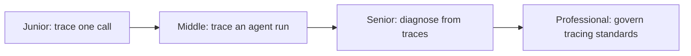
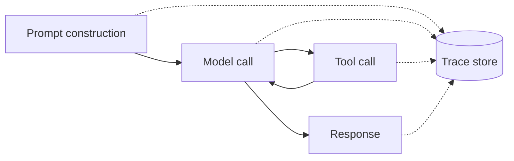

# Observability

> See what an LLM or agentic system actually did — every prompt, model call, tool call, and their cost, latency, and outcome — as one connected trace, not scattered log lines.

Standard application observability (metrics, logs, distributed traces across services) is assumed knowledge here. LLM observability builds on top of it: the same trace-and-span model, applied to a new kind of expensive, non-deterministic, multi-step call whose failure modes (a wrong answer, a refusal, a runaway tool-call loop) don't show up as an HTTP 500.

A single request through an LLM app touches several stages, and each one is a candidate for its own span:

This is a static view of *what* gets recorded. `middle.md` covers the time-ordered version of the same request — the order spans open and close, and how they nest into one trace tree.

## Levels

| Level | Guide | You are done when |
|---|---|---|
| Junior | [Trace a single call](junior.md) | You can instrument one LLM call and read the resulting trace back to answer a concrete question about what happened and what it cost. |
| Middle | [Trace an agent run](middle.md) | You can structure a multi-step agent run — several model calls and tool calls — as one coherent trace tree instead of disconnected log lines. |
| Senior | [Diagnose from traces](senior.md) | You can find a production incident's root cause from trace evidence alone, and state the invariants a tracing setup must guarantee to make that possible. |
| Professional | [Govern tracing standards](professional.md) | You can run a shared tracing schema, dashboards, on-call runbooks, and cross-team cost attribution as an org-wide operating model. |

## Practice rule

Instrument before you need it. A trace you didn't capture is evidence you can never gather retroactively — by the time a quality regression or cost spike gets noticed, the request that caused it already happened. Capture prompt, completion, tokens, latency, and cost on every call by default, then decide what to sample or redact as volume grows, rather than the other way around.

## Related

- [Testing](../testing/README.md) — once you can see what a request did, testing answers *did a change break it*: golden-set regressions, tool-calling correctness, CI gates.
- [Evaluation](../evaluation/README.md) — evaluation answers *how good is it, on what dimensions, versus what baseline*, often scoring the same traces this topic teaches you to capture.

---

*Part of [Engineer Knowledge](../../../README.md) → [AI Engineering](../../README.md) → [AI Evaluation](../README.md).*
