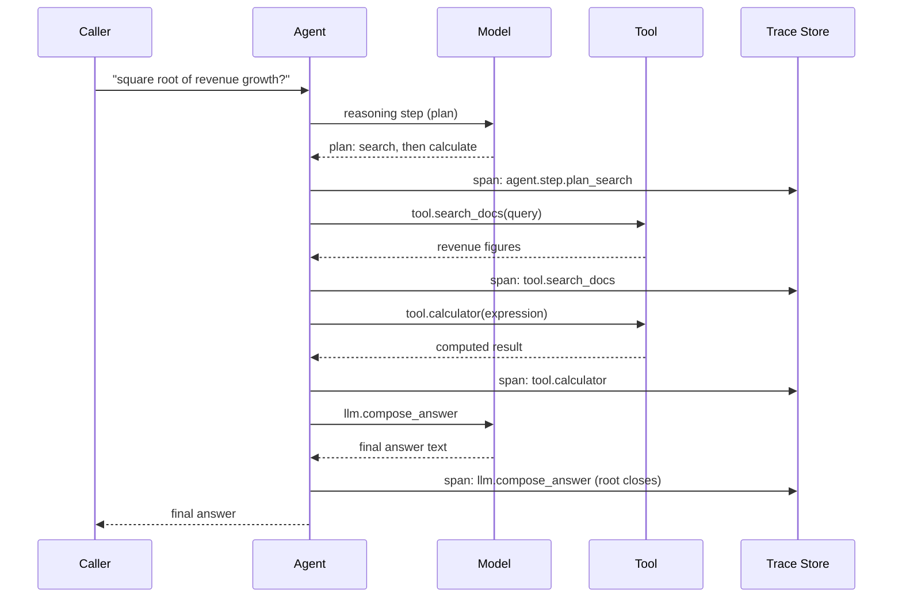

# Observability — Middle

<!-- level-focus -->
At middle level, focus on this question:

> When a single call becomes a multi-step agent run — search a doc store, call a calculator tool, compose a final answer — how do you structure tracing so the whole run shows up as one coherent tree instead of disconnected log lines, and what do you do as trace volume makes capturing everything expensive?

Use the smallest realistic scenario that exposes the decision and its failure behavior.

---

## Core Concept 1 — From One Span to a Trace Tree

A junior-level trace has one span: one call in, one completion out. An agent run doesn't work that way. Answer "what's the square root of last quarter's revenue growth?" and a single request might do: a reasoning step, a tool call to search docs for the revenue figure, a second reasoning step, a tool call to a calculator, and a final model call that composes the answer. That's five spans, not one — and if each is logged as an independent row with its own timestamp, an on-call engineer trying to reconstruct what happened has to manually stitch them together by eyeballing timestamps and hoping nothing else interleaved.

The fix is a **parent trace** containing **child spans**, one per model call and one per tool invocation, all sharing a single `trace_id` (sometimes called a run ID or session ID). The trace becomes a tree: the top-level agent run is the root, and each reasoning step and tool call is a child (or grandchild, if a tool call triggers another sub-call) of that root. This is the same parent/child span model standard distributed tracing already uses across microservices — applied here across steps of one agent's reasoning instead of across service boundaries.

## Core Concept 2 — Span Naming and Tagging Conventions

Without a naming convention, a trace tree full of spans called `call_1`, `call_2`, `step` is barely more useful than flat log lines. A workable pattern:

| Span type | Name pattern | Example |
|---|---|---|
| Top-level agent run | `agent.<agent_name>` | `agent.support_bot` |
| A reasoning/planning step | `agent.step.<purpose>` | `agent.step.plan_search` |
| A model call | `llm.<purpose>` | `llm.compose_answer` |
| A tool invocation | `tool.<tool_name>` | `tool.search_docs`, `tool.calculator` |

Alongside the name, tag every span with: `run_id` (ties every span in this run together — usually the same value as the trace's own ID), `session_id` (if this run is one turn in a multi-turn conversation), `user_id` or `tenant_id` (for filtering and cost attribution later), and `model` / `tool_name` where applicable. The naming convention matters less than consistency — a team that picks `tool.<name>` and sticks to it can build a dashboard that groups "time spent in tools" across every agent; a team where every engineer names spans freehand cannot.

## Core Concept 3 — Propagating the Run ID

The run ID has to flow through every function call, tool invocation, and model call that's part of the same agent run, or child spans arrive at the trace store with no way to attach to their parent. With Langfuse, this is explicit nesting:

```python
from langfuse.decorators import observe, langfuse_context

@observe()
def answer_question(question: str) -> str:
    # root span, run_id assigned automatically as the trace id
    plan = plan_steps(question)              # nested @observe() span
    for step in plan:
        if step.type == "search":
            search_docs(step.query)           # nested @observe() span
        elif step.type == "calculate":
            calculator(step.expression)       # nested @observe() span
    return compose_answer(question, plan)     # nested @observe() span

@observe()
def search_docs(query: str) -> list[str]:
    ...

@observe()
def calculator(expression: str) -> float:
    ...
```

Each nested `@observe()`-decorated function automatically becomes a child span of whichever span was active when it was called — the SDK propagates the run's context implicitly through the call stack. With raw OpenTelemetry, the same idea is explicit: a `Context` object carrying the current span is propagated via `context.attach()`/`context.detach()`, or automatically by the tracing SDK's instrumentation if you're using a framework integration. Either way, the invariant is the same: **every span opened during this run must be a descendant of the run's root span**, not a sibling trace with a matching `run_id` field bolted on after the fact — a matching field lets you filter and group after the fact, but only true parent/child nesting lets a tool render the run as a tree.

## Core Concept 4 — One Agent Run, Traced



The takeaway: every step that does real work — a reasoning call, each tool invocation, the final composition — records its own span to the trace store as it completes, but all of them nest under the same root. Opening the trace afterward shows the full tree in the order it actually executed: which reasoning step triggered which tool call, how long each took, and where in the sequence the run spent its time and money. Without this structure, you'd have four or five isolated records with no visible relationship, and reconstructing "which tool call happened because of which reasoning step" would require guessing from timestamps alone.

## Core Concept 5 — What to Capture as Volume Grows

A junior-level single-call service can afford to log full prompts and completions on every request. An agent run that fans out into five-plus spans per request, running thousands of times a day, cannot always afford the same policy without cost and storage consequences. The trade-off is real, not cosmetic:

| Strategy | What you get | What you give up |
|---|---|---|
| Full completion on every span | Complete reproducibility, easiest debugging | Highest storage cost; PII in raw text stored indefinitely unless separately handled |
| Truncate completions beyond N characters | Most debugging value retained; bounded storage per span | Long completions get cut — occasionally the truncated part is exactly what mattered |
| Sample a percentage of full traces, keep aggregates for the rest | Storage cost roughly fixed regardless of traffic growth | Any specific incident has a chance its trace wasn't sampled |
| Log structured metadata only (tokens, cost, latency, `finish_reason`), drop raw text | Cheapest, safest by default | Cannot inspect *why* a specific bad output happened after the fact |

There's no single correct choice — it depends on traffic volume and what an incident review actually needs. A common working default: capture full traces (100%) in a lower environment and during a rollout's first days in production, then move to sampling (for example, always keep traces on error or low-confidence outputs, sample a smaller percentage of otherwise-normal successful traces) once the failure surface is understood. Deciding this by volume alone and forgetting the PII angle is a mistake covered in Common Mistakes below — see also the redaction and retention guidance senior- and professional-level teams formalize once this trade-off is made at scale.

## Real-World Examples

- **A trace tree replaces an hour of log-grepping.** A support-bot agent occasionally returns an answer that references the wrong customer's order. Before structured tracing, diagnosing this means grepping application logs across the request's timestamp window and guessing which of several concurrent requests' log lines belong together. After adding parent/child spans keyed by `run_id`, the same investigation is one trace: it shows the exact tool call that fetched order data, with the exact query it was given, in under a minute.
- **Untagged spans block a "time in tools vs. time in the model" dashboard a team wants to build.** An agent platform has tracing in place, but spans were named freehand by whichever engineer wrote each tool integration — `fetch1`, `search_step`, `calc_call`. Building a dashboard grouping "total time spent across all tool calls" requires a one-off mapping table before the naming convention from Core Concept 2 is retrofitted.
- **A team learns their volume policy the hard way.** A team logs full completions for every span with no sampling, and their tracing bill triples in a month after an agent workflow grows from two steps to six. Moving to sampled full-capture for successful runs, with 100% capture on error/low-confidence outputs, cuts the bill without losing coverage on the traces that actually matter for debugging.

## Common Mistakes

- **Tagging spans with a matching `run_id` field but not actually nesting them as parent/child.** A flat list of same-`run_id` spans can be filtered and grouped, but only true nesting lets a tool reconstruct the tree and show *which step caused which*.
- **Naming spans freehand per engineer.** Makes cross-agent dashboards and alerting impossible without a manual remapping step, as in the second Real-World Example above.
- **Deciding the volume/sampling trade-off only by cost, ignoring PII.** A high-sampling-rate policy chosen purely to save storage can still be storing sensitive raw text at scale — volume and content sensitivity are two separate decisions, both covered further at senior and professional level.
- **Losing the run ID across an async boundary.** If a tool call is dispatched to a queue or a separate worker process, the run ID has to be explicitly passed along (as a message attribute, not assumed context) or the worker's spans arrive as an orphaned, disconnected trace.
- **Truncating completions without marking that truncation happened.** A silently truncated completion looks, on casual inspection, like the model's actual full output — mark truncated fields explicitly so nobody mistakes a cut string for a complete one.

---

## Apply it

1. Take (or build) a small agent that performs at least two distinct steps against real components — for example, search a small local document set, then call a calculator or another deterministic tool, then compose a final answer with a model call.
2. Instrument it so every reasoning step and tool call is a child span of one root trace per run, following the naming convention in Core Concept 2.
3. Tag every span with a `run_id`, and confirm in your tracing tool's UI that a single run renders as one tree, not several unconnected entries.
4. Run the agent three times with different questions, then use the trace view to answer: which run spent the most time in tool calls versus model calls, without reading any code.
5. Pick a volume policy from Core Concept 5's table appropriate for this agent's expected traffic, and write one sentence justifying it.

## Verify your work

- A single agent run renders as one tree in your tracing tool, with the correct parent/child relationships between reasoning steps and tool calls.
- Every span follows the naming convention from Core Concept 2, and you can filter "all tool spans" or "all model spans" across the whole run using the name pattern alone.
- The `run_id` (or trace ID) is present and identical across every span belonging to the same run, including any span produced inside a tool call.
- You can answer "which step took the longest" and "which step cost the most" using only the trace view.
- You can state, for this specific agent, which volume/sampling strategy you chose and why — not just "log everything" by default.

## Review questions

- Why does tagging spans with a matching `run_id` field fall short of true parent/child nesting?
- What specifically breaks if a tool call's span isn't tagged with the run's ID before it's dispatched to an async worker?
- Why can a naming convention chosen freehand per engineer block a dashboard that a consistent convention would make trivial?
- Why are the volume/sampling decision and the PII/redaction decision two separate questions, even though both affect what gets stored?

---

*Continue to [`senior.md`](senior.md). See also [Testing — Middle](../testing/middle.md) for how the same multi-step run gets covered by regression tests. Part of [Observability](README.md) → [AI Evaluation](../README.md).*
