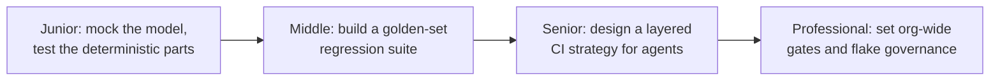
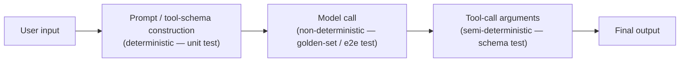

# Testing

> Catch regressions in non-deterministic prompt and agent logic — without asserting exact-match output, and without making every PR wait on a real model call.

The four levels climb one ladder. Junior means you can write a unit test for prompt-construction or routing logic that never touches a real model, asserting only what's deterministic: the rendered prompt, the selected tool schema, the chosen model and parameters. Middle means you can build a golden-set suite that checks *properties* of real model output against a fixed, representative set of inputs, and keep that set from going stale. Senior means you can design the layered strategy — what runs on every commit, what runs on every PR, what runs nightly, what runs only before release — that catches real regressions without making the fast path slow or expensive. Professional means you can set the org-wide contract for what "tested" means before an AI feature ships, including how flaky, non-deterministic assertions are governed instead of quietly ignored.

Each stage of a single LLM request needs a different kind of test, because each stage has a different amount of determinism. Prompt construction is ordinary code — test it like ordinary code, with a mock in place of the model. The model call itself is the one place true non-determinism enters, so testing it means checking properties and thresholds, not exact values. Tool-call arguments sit in between: constrained enough at low temperature to test with reasonable confidence, but never deterministic enough to skip tolerance entirely.

## Levels

| Level | Guide | You are done when... |
|---|---|---|
| Junior | [junior.md](junior.md) | You can write a unit test that mocks the model client and asserts only on the deterministic request it builds — prompt, tools, model, params — never on model output. |
| Middle | [middle.md](middle.md) | You can build and maintain a golden-set regression suite that checks output *properties*, catches a real regression on deploy, and doesn't quietly go stale. |
| Senior | [senior.md](senior.md) | You can design a layered testing strategy for a full agent workflow that's fast enough for every PR yet still catches what only the real model exposes. |
| Professional | [professional.md](professional.md) | You can set the org-wide gate that decides whether a prompt or model change is allowed to ship, and a governance process for flaky non-deterministic tests that doesn't let them rot into ignored noise. |

## Practice rule

Never assert exact model output. Before writing an assertion, name which layer is supposed to catch the failure it's guarding against — unit (wrong prompt/schema/route), golden-set (behavior regression against a property), or end-to-end (something only the real model's actual behavior exposes) — and assert at that layer, not one you happen to have open.

## Related

- [AI Evaluation — domain index](../README.md)
- [Observability](../observability/README.md) — testing tells you *whether* a change broke something; observability's traces are what you read to find out *why* a golden-set case failed.
- [Evaluation](../evaluation/README.md) — testing asks "did this regress against a known-good property," a pass/fail question; evaluation asks "how good is this, on what dimension, against what baseline" — a measurement question. A golden-set regression suite and an offline evaluation pipeline often share the same input set but answer different questions.
