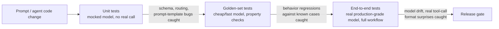

# Testing — Senior

<!-- level-focus -->
At senior level, focus on this question:

> How do you design a testing strategy for a full agent workflow — tool calls plus multi-step reasoning — that's fast enough to run on every PR, yet still catches the regressions that only the real model exposes?

Use the smallest realistic scenario that exposes the decision and its failure behavior.

---

## Core Concept 1 — Name the Invariants Before Designing the Layers

A middle-level pass gets you a golden-set suite for one prompt or one agent behavior. At senior level, the question changes: you're not testing one behavior anymore, you're designing the test *strategy* for a whole agent workflow — a sequence of model calls, tool calls, and branching decisions — and that strategy has to hold as invariants regardless of which engineer touches which part of it:

| Invariant | What it rules out |
|---|---|
| A broken tool-call schema is always caught before merge | A malformed argument, wrong type, or missing required field reaches a real tool (and its real side effect) for the first time in production |
| A behavior regression against a known property is caught on every relevant PR, not just eventually | A prompt edit silently drops a required constraint and ships because nothing ran the check until the next scheduled nightly run, days later |
| A full, real-model, end-to-end run happens somewhere before release, even if not on every PR | The team ships an agent workflow that has only ever been exercised against mocks and a cheap stand-in model, never against the model actually running in production |
| No layer's "green" is trusted to mean more than what it actually tests | A team treats "unit tests pass" as "the agent works," when the unit layer never touched a real model call at all |

An invariant here isn't a description of best practice — it needs a mechanism enforcing it: a CI gate wired to block merge, a scheduled job with an owner who's notified on failure, a checklist a release can't pass without. A strategy that "should" catch a schema bug because someone usually reviews tool-call code by eye is not the same as a strategy that mechanically catches it every time.

This matters most for genuinely agentic workflows — multiple tool calls chained across several reasoning steps, where a bad decision at step two only surfaces as a wrong answer at step five. See [agent architectures](../../ai-agent/agent-architectures/) for how that step structure is built; this guide is about how you test it once it exists.

## Core Concept 2 — The Three Layers, and What Each One Actually Covers

Each arrow label is what that layer catches that the layer before it can't. Read right to left for what each layer *misses*: unit tests mock the model away entirely, so they cannot catch anything about how the model actually behaves — only whether the deterministic code around it is correct. Golden-set tests against a cheap stand-in model catch real behavioral properties, but a cheap model's failure modes (and its tool-call formatting habits) are not guaranteed to match the production model's. End-to-end tests against the real model catch what nothing upstream can, but they're too slow and too expensive to run on every commit — which is exactly why the layers exist as a sequence instead of everyone just running the expensive one.

The mistake to avoid is not choosing one layer — it's assuming any single layer's pass is a proxy for the others. A green unit suite says nothing about model behavior. A green golden-set suite against a cheap model says nothing about how the production model specifically behaves under real load. Only the combination, run at the right cadence, backs the invariants in Core Concept 1.

## Core Concept 3 — Wiring the Layers to a Trigger Schedule

The layered model only works if each layer runs at a cadence its cost can sustain:

| Trigger | Layer | Typical speed | Typical cost | Blocks merge? |
|---|---|---|---|---|
| Every commit / every PR | Unit tests, mocked model | Seconds to under a minute | Free | Yes |
| Every PR touching prompt or agent logic | Golden-set property tests, cheap/fast model | A few minutes | Low — cents to a few dollars per run | Yes |
| Nightly | Golden-set tests, production-grade model | 10–30 minutes | Moderate | No — fails loudly, alerts the owning team, doesn't block same-day merges |
| Pre-release or explicit trigger | Full end-to-end agent workflow, production-grade model, statistical pass rate over N runs | 30–90 minutes | Higher — tens to low hundreds of dollars depending on workflow length | Yes, for the release itself |

The ordering matters as much as the schedule: unit tests are cheap enough to gate every commit, so they should. A full real-model e2e suite is not cheap enough to gate every commit, so it doesn't — but it still has to gate *something*, which is why it gates release instead of running nowhere at all. A team that skips the nightly and pre-release layers because "the PR gate already passed" has quietly downgraded "tested" to mean only what the cheapest layer checks.

## Core Concept 4 — The Failure Mode: Over-Trusting the Fast Layer

The most common way this goes wrong in practice is not skipping a layer outright — it's writing the fast layer's mocks to match what the developer *expects* the model to produce, rather than what the model *actually* produces under real conditions.

A concrete version: an agent workflow calls a `search_orders` tool, and the mock used in unit and golden-set tests always returns a clean, well-formed tool call — `{"name": "search_orders", "arguments": {"customer_id": "C-1029"}}`. Every layer that uses this mock passes. In production, under load, the real model occasionally does something the mock was never written to produce: it wraps the arguments in a markdown code fence before the JSON, or emits two tool calls in a single turn when the workflow's parsing logic assumes exactly one, or uses `customerId` instead of `customer_id` in a small fraction of responses. None of this is a bug in the mock — the mock is doing exactly what it was written to do. It's a bug in what the mock was written to represent: a hand-authored idea of "what the model produces," not a sample of what the model actually produces.

This is why Core Concept 1's third invariant — a real end-to-end run happens somewhere before release — is not optional. It's the layer that exercises the real model's actual output distribution, including the format quirks no one thought to hand-write into a mock. A workflow that has only ever run against mocks and a cheap stand-in has, from the strategy's point of view, never actually been tested against what it will face in production.

## Core Concept 5 — Cross-Component Scenario: The Suite That Was Green for Weeks, Then Wasn't

An agent workflow's fast layers (unit and golden-set-against-cheap-model) stay green for weeks. Then the nightly golden-set run against the production model starts failing intermittently — roughly one run in five, on the same handful of cases, with no code change in the window that failures started.

Three plausible causes, and the evidence that would distinguish them:

| Hypothesis | Evidence that confirms it | Evidence that rules it out |
|---|---|---|
| The model provider updated the model behind the same alias (a version pinned by name, not by a fixed snapshot) | Provider's changelog or model-version metadata shows an update in the failure window; the same prompt against a pinned older snapshot still passes | Provider confirms no update; failures persist against an explicitly pinned older model version too |
| A new tool or tool-argument shape was added to the workflow, but the mock and golden-set fixtures were never updated to reflect it | The failing cases all involve the new tool; a fixture diff shows the mock's tool-call shape doesn't match the new schema | Failures are spread across tools that haven't changed recently |
| The failure rate is genuine model non-determinism at the edge of a borderline case — not a regression at all | The failing cases score just above/below an LLM-as-judge threshold on repeated runs, with no consistent pattern in *which* run fails | Failures are deterministic given the same input — same case fails every single time, not intermittently |

Pulling the actual failure pattern — which cases, how often, since when — before guessing at a cause turns this from a debugging session into evidence-gathering. A model-version change explains a *step* in failure rate starting on a specific date; a stale fixture explains failures *clustered on one tool*; genuine borderline non-determinism explains failures that are *intermittent on the same case* rather than consistently reproducible. Only one of these three needs a code fix; the third needs the statistical-pass-rate policy from Core Concept 6, not a fix at all.

For debugging any of these, a trace of the actual failing runs — the exact prompt sent, the exact tool call the model made, token counts, latency — is what separates a hypothesis from a confirmed cause. See [observability — middle](../observability/middle.md) for building that trace.

## Core Concept 6 — Handling Flakiness Without Guessing

Because the model layer is genuinely non-deterministic, "flaky" cannot simply mean "ignore it" — some of what looks like flakiness is the expected behavior of a system with real variance, and the test needs to be designed for that variance rather than treated as broken:

- **Structural checks stay single-run.** Anything checking schema validity, presence of a required field, or absence of a banned pattern is not inherently flaky — a real regression there should fail every time, and if it doesn't, the check itself is underspecified, not the model.
- **LLM-as-judge and other threshold-based scores use a pass rate over N runs, not a single pass/fail.** A rubric score that's supposed to clear 3 out of 5 but sometimes lands at 2.8 needs a policy — for example, run the case 5 times and require at least 4 of 5 to clear the threshold — rather than a single borderline run deciding the outcome.
- **A borderline result gets one retry before it counts as a failure**, not an indefinite retry loop that eventually happens to pass. A test that retries until green isn't testing anything anymore.

The trap to design against explicitly: a test that "just flakes sometimes" and gets silently skipped, disabled, or ignored in CI review stops being a test at all — it's ceremony. Every flaky case needs one of two outcomes, deliberately chosen: it gets redesigned as a structural check that shouldn't be flaky in the first place, or it gets a documented statistical policy (pass rate over N runs) that makes its pass/fail criterion well-defined despite the model's real variance. "We know it's flaky, we don't look at it" is not a third option — see `professional.md` for the org-level governance that keeps this from happening at scale.

## Real-World Examples

- **A hand-written mock never exercises a real format quirk.** An agent's unit and golden-set layers stay green through a full development cycle because the mock always returns clean, single-call, correctly-cased tool arguments. The first production incident traces to the model occasionally wrapping tool-call JSON in a markdown fence — a format the mock, and therefore every fast-layer test, never produced.
- **Arithmetic ends a guessing match.** A nightly suite starts failing on five specific cases, all involving the same recently-added tool. Diffing the tool's fixture against its current schema shows the fixture was never updated after the schema change — not a model issue at all, and not something the intermittent-failure-pattern hypothesis would have explained.
- **A genuinely borderline case gets a policy instead of a shrug.** An LLM-as-judge faithfulness check on a summarization case hovers right at the pass threshold across runs. Moving it to a 4-of-5 pass-rate policy turns an ambiguous single-run flake into a well-defined, stable signal — without pretending the model's real variance isn't there.

## Common Mistakes

- **Treating a green fast layer as proof the workflow works.** Unit and cheap-golden-set layers verify what they test — deterministic code and cheap-model behavior — and nothing about the production model's actual output distribution.
- **Hand-writing mocks from what a developer expects rather than sampling real model output.** Produces tests that pass reliably and catch nothing about real formatting variance.
- **Guessing at the cause of an intermittent nightly failure instead of pulling the actual failure pattern first.** Wastes time chasing a model-drift theory when the real cause is a stale fixture, or vice versa.
- **Applying a single-run pass/fail to a threshold-based LLM-as-judge assertion.** Manufactures flakiness the assertion design could have absorbed with a pass-rate-over-N policy.
- **Letting a flaky test get silently skipped instead of redesigned or given a statistical policy.** The test still runs, still shows green or gets ignored, and stops meaning anything long before anyone notices.

---

## Apply it

1. For an agent workflow you own (or a realistic one you design), write down the four invariants from Core Concept 1 in your own words, specific to that workflow.
2. Design the trigger table from Core Concept 3 for that workflow: what runs on every commit, every PR, nightly, and pre-release — with your own realistic speed and cost estimates.
3. Find (or construct) one place in the workflow's test suite where a mock was hand-written rather than sampled from real model output, and identify one real-model behavior it would miss.
4. Walk through the Core Concept 5 diagnostic table against a hypothetical intermittent nightly failure in your workflow, and state what evidence would distinguish each of the three causes.
5. Pick one borderline, threshold-based assertion in your suite and redesign its pass/fail criterion as a pass-rate-over-N policy instead of a single run.

## Verify your work

- You can state, for each layer in your strategy, specifically what it catches and specifically what it cannot — not just "it tests the agent."
- Your trigger schedule blocks merge only where the layer is cheap enough to sustain that, and still guarantees a real-model run happens somewhere before release.
- You can name a concrete real-model behavior your fast-layer mocks do not currently exercise.
- Given an intermittent nightly failure, you can state what evidence would distinguish a model-version change, a stale fixture, and genuine borderline non-determinism.
- No assertion in your suite relies on a single non-deterministic run to decide pass/fail without a documented statistical policy behind it.

## Review questions

- Why is a green unit-test suite not evidence that an agent workflow's real model behavior is correct?
- What specifically does a hand-written mock get wrong that sampling real model output would catch?
- Given an intermittent nightly failure, what three causes should you consider, and what evidence distinguishes them?
- Why does a single-run pass/fail on an LLM-as-judge threshold manufacture flakiness that a pass-rate-over-N policy would avoid?
- What does "no layer's green is trusted to mean more than what it actually tests" rule out in practice?

---

*Part of [Testing](README.md) → [AI Evaluation](../README.md). Continue to [professional.md](professional.md).*
