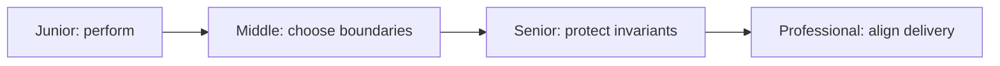

# AI Model

> Choose, understand, adapt, and operate the models behind an AI system — from what pretraining actually produces through picking the right model for a job, fine-tuning when prompting isn't enough, and deciding when extended reasoning is worth its cost.

The levels form one path. Start where the actions are unfamiliar and move forward when you can produce the required evidence without copying the example.

## Topics

| # | Topic | What you'll learn |
|---|-------|-------------------|
| 01 | [Pretrained Models](pretrained-models/junior.md) | What pretraining produces, the pretrain → SFT → RLHF/DPO pipeline, base vs instruct models, and open-weight vs closed models. |
| 02 | [Choosing the Right Model](choosing-the-right-model/junior.md) | A decision framework across capability, latency, cost, context length, and compliance — and how to run a bake-off instead of guessing. |
| 03 | [Fine-Tuning](fine-tuning/junior.md) | When fine-tuning beats prompting or RAG, SFT vs LoRA/QLoRA vs DPO, dataset design, and diagnosing a regression. |
| 04 | [Reasoning Models](reasoning-models/junior.md) | What extended test-time reasoning buys you, when it's worth the latency/cost, and how to route between fast and reasoning models. |

## How to use this section

Each topic has four depth levels — **junior → middle → senior → professional**. Start at your level and climb. Pretrained Models is the foundation the other three build on: you can't choose a model, fine-tune one, or reason about reasoning-mode trade-offs without first knowing what stage of training produced the model you're holding. Choosing the Right Model is the general decision framework; Fine-Tuning is the lever you reach for when no off-the-shelf model and no amount of prompting clears the bar; Reasoning Models is a specific, high-stakes instance of the same choose-the-right-tool decision, applied to test-time compute instead of model selection.

---

> Part of the [AI Engineering](../README.md) domain, itself part of the [Engineer Knowledge](../../README.md) roadmap.
