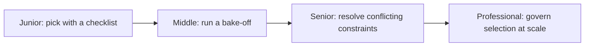
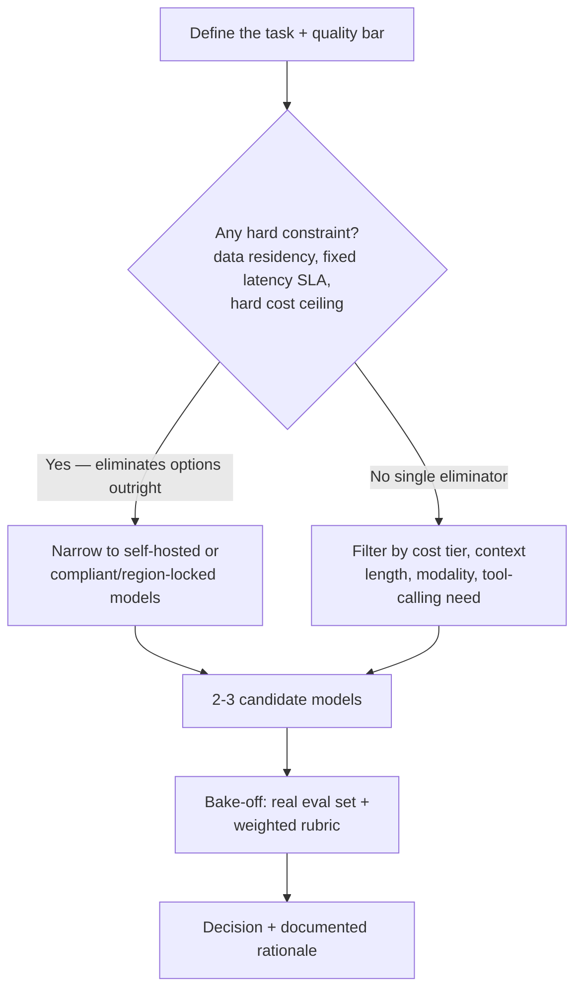

# Choosing the Right Model

> The most capable model is rarely the right model — the right model is the cheapest, fastest one that clears your actual quality bar under your actual constraints.

## The core decision, end to end

Model selection is not "which model is smartest." It's a filter applied under constraints, followed by a measurement, followed by a decision you can defend with evidence:

A hard constraint (data must not leave a jurisdiction, a voice interface with a 2-second SLA no frontier model can meet) prunes the candidate list before quality or cost ever gets compared — arguing about which model scores highest on a rubric is wasted effort if the top scorer was never eligible. Once the candidate list is genuinely open, the decision comes down to running the same real inputs through 2-3 candidates and scoring them, not trusting a marketing page or a generic leaderboard that was never measuring your task.

## Levels

| Level | Guide | You are done when... |
|---|---|---|
| Junior | [junior.md](junior.md) | You can pick a model for a single well-specified task using a checklist (task type, quality bar, latency, budget) and explain the choice in one paragraph |
| Middle | [middle.md](middle.md) | You can design a weighted rubric, run 2-3 candidates through the same real eval set, and justify the winner with scores instead of opinion |
| Senior | [senior.md](senior.md) | You can resolve a genuine conflict between cost ceiling, quality bar, and latency SLA using measured evidence, and know when self-hosting beats an API |
| Professional | [professional.md](professional.md) | You can run an org-wide approved-model list, exception process, and cost/quality review cadence that survives vendor deprecations and new releases |

## Practice rule

Before comparing quality, name every hard constraint — data residency, a latency SLA, a cost ceiling — that can eliminate a model regardless of how well it scores. Then never trust a leaderboard or a vendor's marketing claim for the remaining candidates: run your own inputs through them and score the outputs yourself. A benchmark number that wasn't measured on your task is not evidence about your task.

## Related

- [Pretrained Models](../pretrained-models/README.md) — know what pipeline stage produced a model (base vs. instruct, RLHF'd or not) before you can meaningfully compare it to another candidate.
- [Fine-Tuning](../fine-tuning/README.md) — the next lever when a bake-off shows no available model clears the quality bar at any acceptable cost or latency.
- [Reasoning Models](../reasoning-models/README.md) — choosing between a standard and a reasoning-mode model is a specific instance of this same decision framework, with latency and cost trade-offs that are usually larger.
- [AI Evaluation](../../ai-evaluation/README.md) — the evaluation methodology a bake-off's rubric and eval set depend on.
