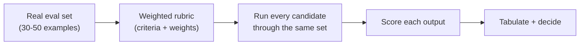

# Choosing the Right Model — Middle

<!-- level-focus -->
At middle level, focus on this question:

> When choosing among 2-3 candidate models for a real product feature, how do you design a scoring rubric and run a head-to-head bake-off, so the decision rests on scores measured against your own task rather than a vendor's marketing claim or a generic leaderboard?

Use the smallest realistic scenario that exposes the decision and its failure behavior.

---

## Core Concept 1 — Why Leaderboards Don't Transfer to Your Task

A public leaderboard measures broad capability across a fixed, published set of problems — general knowledge, math, coding puzzles, open-ended reasoning. Your task is a narrower, specific distribution: your inputs, your formatting requirements, your domain vocabulary. A model that ranks first on a general leaderboard can still lose to a cheaper model on your specific task, because the leaderboard never measured anything resembling what you're actually asking the model to do. Two concrete reasons rank order doesn't transfer:

- **Distribution mismatch.** A model tuned to excel at competition-style math problems has no particular advantage at extracting structured fields from noisy customer emails — those are different skills, scored by different benchmarks, and a leaderboard blends dozens of skills into one number that hides how any single model does on yours.
- **Format and tool-calling reliability aren't leaderboard metrics.** Two models can have similar general reasoning scores while differing sharply in how reliably they produce well-formed JSON or correctly-structured tool calls — a property that matters enormously for a production integration and rarely appears on a general leaderboard at all.

The only leaderboard that matters for a selection decision is the one you build yourself, from your own inputs.

## Core Concept 2 — Designing a Bake-Off

A bake-off has four components, built in order:



1. **Assemble a real eval set.** Pull 30-50 representative examples from actual production traffic or logs, not invented ones — invented examples tend to be cleaner and more cooperative than real inputs, which hides exactly the failure modes a bake-off exists to catch. Deliberately include a handful of known edge cases (an unusually long input, an ambiguous request, a malformed field) rather than only the easy majority case.
2. **Define a weighted rubric.** List the criteria that actually matter for this feature and assign each a weight that reflects its real importance, not equal weights by default. A feature where format-breakage causes a downstream parsing failure should weight format adherence heavily; a feature that's purely advisory to a human reader can weight tone or fluency higher.
3. **Pick 2-3 candidates spanning cost tiers.** Include at least one small/fast-class model and one higher-capability model — comparing two similarly-priced models tells you little about whether you're over-paying; comparing across tiers tells you whether the extra cost buys anything on this specific task.
4. **Run the identical eval set and prompt through every candidate**, then score each output against the rubric. Where practical, score without knowing which model produced which output — knowing the vendor biases the score toward whichever model you expected to win.

## Core Concept 3 — Worked Example: Customer Email Reply Drafting

A team is building a feature that drafts a reply to an incoming customer email for a support agent to review and send. They compare a small/fast-class model, a mid-tier model, and a frontier-class model.

**Rubric:**

| Criterion | Weight | What it measures |
|---|---|---|
| Factual correctness | 35% | Reply doesn't invent order details, refund amounts, or policy that wasn't in the input |
| Tone and completeness | 25% | Reply addresses every question the customer asked, in an appropriate tone |
| Format adherence | 20% | Reply fits the required structure (greeting, body, sign-off) the downstream template expects |
| Latency (p95, measured) | 10% | Time to generate a draft under realistic concurrent load |
| Cost per request at expected volume | 10% | Measured cost, not list price, at the team's expected daily volume |

**Illustrative scores (1-10 scale, weighted):**

| Model | Factual (35%) | Tone (25%) | Format (20%) | Latency (10%) | Cost (10%) | Weighted total |
|---|---|---|---|---|---|---|
| Small/fast-class | 7.5 | 7.0 | 8.5 | 9.5 | 9.5 | 7.7 |
| Mid-tier | 8.5 | 8.5 | 9.0 | 8.0 | 6.5 | 8.3 |
| Frontier-class | 9.5 | 9.0 | 9.0 | 5.0 | 2.0 | 7.9 |

In this illustrative run, the mid-tier model wins on the weighted total — the frontier-class model scores highest on factual correctness and tone individually, but its latency and cost penalties (weighted at only 20% combined here, but decisively bad on both) pull its total below the mid-tier candidate. The small/fast-class model is competitive but loses enough on factual correctness — the highest-weighted criterion — to fall behind. This is the point of weighting: without weights, three raw averages might look close; the weights make explicit which criterion actually decides the outcome, and why.

## Core Concept 4 — Under- and Over-Application Signals

**Under-application** — shipping a model choice with no comparison at all, on the reasoning "everyone uses this vendor" or "we already have an API key for this one." This isn't a decision, it's an accident that happens to have a vendor name attached; it produces no evidence to defend the choice later when cost or quality is questioned.

**Over-application** — running a multi-week, many-candidate bake-off for a low-stakes, low-volume, easily-reversible feature. If a feature processes a few dozen requests a day and a bad output has low consequence (an internal tool, not a customer-facing message), a same-day manual spot-check (junior-level Core Concept 4) is proportionate; the full rubric-and-scoring process is worth its cost when volume, consequence of a bad output, or the cost delta between candidates is large enough to matter.

The signal to watch: bake-off effort should scale with (request volume) × (cost per request) × (consequence of a wrong output). A feature that's high on all three deserves a full bake-off; a feature that's low on all three doesn't.

## Core Concept 5 — Isolating Model Choice Behind an Interface

Model-specific call code scattered across every place a feature invokes a model makes a future swap expensive — a new candidate winning a later bake-off then means editing every call site, not just a configuration value. Isolate the choice behind a single adapter:

```text
// Call sites depend on this interface, not on any specific vendor SDK.
interface DraftGenerator {
    generate(input: EmailThread): DraftReply
}

// One implementation per candidate model, isolated behind the interface.
class MidTierDraftGenerator implements DraftGenerator { ... }
class SmallFastDraftGenerator implements DraftGenerator { ... }
```

This also matters because tool-calling and structured-output behavior differs across providers — one vendor's SDK may return a slightly different tool-call schema or error shape than another's. Isolating that translation inside the adapter keeps the difference from leaking into every call site, and is what makes it cheap to re-run the bake-off again in six months without a large refactor.

## Core Concept 6 — Verification at Two Levels

**Unit level — the rubric scores themselves.** Thirty to fifty examples is directional evidence, not statistical proof; treat a narrow win (a fraction of a point on a 10-point weighted scale) as a tie requiring either a larger eval set or a tie-breaking criterion, not a confident result. A wide win (a full point or more) is more trustworthy at this sample size.

**Integrated-flow level — a canary in the real pipeline.** A rubric score, however carefully measured, is still an offline approximation. Before fully switching, run the chosen candidate as a canary against a small slice of real traffic (5-10%) and measure two things the offline bake-off cannot: actual latency percentiles under real concurrent load, and actual cost per request at real volume, including any retries. A model that scored well offline but shows a much higher real-world retry rate (for example, from malformed tool calls under production input variety that the 30-example eval set didn't happen to include) is a signal to expand the eval set before rolling out further, not to ignore the discrepancy.

## Real-World Examples

- **A team assumes the newest, most-hyped model is the safe default for a tool-calling workflow**, without running a bake-off. In production, the model's tool calls are occasionally malformed — a JSON field missing a value it wasn't strictly required to omit — and the workflow's retry logic masks the problem until retry volume itself becomes a meaningful chunk of the cost. A bake-off scoring tool-call validity as an explicit rubric criterion would have surfaced this before rollout, and a smaller model with a lower raw-reasoning score but a near-zero malformed-call rate turns out to be the better production choice.
- **A team picks a model based on its rank on a public summarization leaderboard**, then runs a bake-off on their own support emails as a formality before rollout. The bake-off shows a cheaper candidate tying on quality for their specific email domain, because the leaderboard's summarization examples were long-form articles, not short transactional emails — a genuinely different distribution the leaderboard rank never captured.
- **A team runs a bake-off and picks the highest-scoring model, then discovers in canary rollout that its real p95 latency under concurrent production load is far worse than the latency observed running examples one at a time during the offline bake-off.** The offline score didn't account for the model provider's behavior under concurrent load, which the canary step exists specifically to catch.

## Common Mistakes

- **Comparing models only on raw quality, with cost and latency as an afterthought.** If cost and latency aren't rubric criteria with real weights, the "winner" isn't actually the best choice for the feature — it's just the best writer.
- **Using equal weights for every criterion by default.** Equal weighting is itself a decision, and rarely the correct one; it should be a deliberate choice, not a default avoided by thinking about it.
- **Trusting a narrow score difference as a confident result.** A tenth-of-a-point win on a 30-example eval set is noise, not signal, at that sample size.
- **Skipping the canary step because the offline bake-off already "decided."** Offline scoring cannot see real concurrent-load latency or real retry rates; both can invalidate an offline winner.
- **Leaving model-specific code scattered across call sites.** Makes every future re-evaluation expensive enough that teams stop doing them, and the model choice quietly goes stale.

---

## Apply it

1. Pick a real feature (or a realistic one) that calls a model, and pull 30-50 real or realistic examples of its input.
2. Write a weighted rubric with at least four criteria, including cost and latency as explicit, weighted rows — not just quality.
3. Select 2-3 candidate models spanning at least two cost tiers, and run every example through every candidate with the same prompt.
4. Score each output against the rubric (blind to which model produced it, if practical), tabulate the weighted totals, and identify the winner.
5. Design the canary step you'd run before fully switching: what real-traffic percentage, for how long, and which two metrics (beyond the rubric) you'd measure that the offline bake-off couldn't.

## Verify your work

- Your rubric has explicit, non-equal weights you can justify for this specific feature.
- Your eval set includes at least a few real edge cases, not only the easy majority case.
- You can state the weighted-total gap between your top two candidates, and whether that gap is wide enough at your sample size to trust.
- You have a specific canary plan (traffic percentage, duration, metrics) rather than "we'll monitor it."
- You can name one thing the offline bake-off cannot measure that the canary step is specifically designed to catch.

## Review questions

- Why can a model that ranks highest on a public leaderboard still lose a bake-off on your specific task?
- What does weighting a rubric's criteria accomplish that an unweighted average score does not?
- Why should candidate models span multiple cost tiers rather than comparing two similarly-priced options?
- What can a canary rollout reveal that an offline bake-off on 30-50 examples cannot?
- What is the practical cost of leaving model-specific call code scattered across a codebase instead of behind a single interface?
