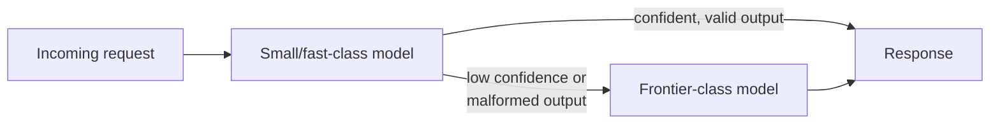

# Choosing the Right Model — Senior

<!-- level-focus -->
At senior level, focus on this question:

> When a cost ceiling, a quality bar, and a hard latency SLA conflict — no single model in the lineup satisfies all three — how do you resolve the conflict with measured evidence (latency percentiles, cost per request at real volume, quality score against the actual task) instead of opinion, and defend the trade-off you choose?

Use the smallest realistic scenario that exposes the decision and its failure behavior.

---

## Core Concept 1 — Naming the Conflict Precisely

A middle-level bake-off assumes the winning model just needs to score highest on the rubric. At senior level, the harder and more common situation is that the three axes that matter don't have a shared winner:

- **Quality bar** — the minimum rubric score the task requires to be useful, established the same way as at middle level.
- **Cost ceiling** — a hard budget, monthly or per-request, that isn't negotiable past a point (a fixed departmental budget, a per-unit-economics constraint on a customer-facing feature).
- **Latency SLA** — a hard response-time target, often p95 or p99, not an average (a voice interface, a synchronous checkout flow, an interactive chat UI).

The senior-level failure mode is treating this as "just run the bake-off again" when the actual problem is structural: the model that clears the quality bar is priced above the ceiling or misses the SLA; the model within budget and inside the SLA doesn't clear the quality bar. No amount of re-running the same three candidates resolves that — the conflict requires either new evidence, a different architecture, or a deliberate, documented trade-off.

## Core Concept 2 — Evidence to Gather Before Deciding

Three measurements resolve the argument that opinion cannot:

- **Measured latency distribution, not a vendor's published average.** A vendor's "average latency" figure is measured under conditions you don't control and rarely reflects p95/p99 under your own concurrent load. Measure p50, p95, and p99 against your own realistic concurrent request volume — an SLA is almost always a percentile target, and averages hide exactly the tail that breaches it.
- **Measured cost per request at expected volume, including retries.** List price per token, multiplied by expected successful requests, undercounts real cost the moment retries, failed calls, or multi-turn tool-calling loops are part of normal operation. A model with a higher malformed-tool-call rate can cost more in practice than its per-token price suggests, once retry volume is counted.
- **Quality score against a held-out set, not the set used to tune the prompt.** If the same 30 examples used to iterate the prompt are also used to score the final candidates, the score is inflated — the prompt has been implicitly fit to those exact examples. Hold out a separate sample, drawn the same way, that was never used during prompt iteration.

**Illustrative example** (numbers are hypothetical, for teaching the comparison — measure your own):

| Model | Quality score (held-out set) | Cost per request at volume | p95 latency | SLA (500ms) |
|---|---|---|---|---|
| Frontier-class | 9.2 / 10 | $0.018 (over $0.010 ceiling) | 1.8s | Fails |
| Mid-tier | 7.9 / 10 (below 8.5 bar) | $0.004 (within ceiling) | 420ms | Passes |
| Small/fast-class | 6.8 / 10 (below 8.5 bar) | $0.001 (within ceiling) | 180ms | Passes |

None of the three jointly satisfies all constraints: the frontier model clears quality but fails cost and latency; the other two fail quality. This table is the deliverable of the evidence-gathering step — not a recommendation yet, but a precise statement of exactly where the conflict lives, which is what makes the next step (Core Concept 3) something other than a guess.

## Core Concept 3 — Levers Beyond "Pick a Different Model"

A three-way conflict like the one above usually isn't solved by re-picking from the same candidate list. The real levers:

- **Task routing / cascading.** Send every request to the fast, cheap model first; escalate only the requests it's uncertain about (low-confidence output, a validation check that fails, an explicit "I'm not sure" signal) to the higher-quality model. Average latency and average cost stay close to the cheap model's numbers, because only a minority of requests pay the frontier model's cost and latency; the frontier model's higher quality is spent only where it's needed.
- **Reduce latency without changing the model** — shorter prompts, capped output length, streaming the response so time-to-first-token (what a user perceives) is much lower than total completion time, or parallelizing independent sub-calls.
- **Reduce cost without changing the model** — caching repeated or near-duplicate requests, batching non-interactive requests, or provider-side prompt-caching features that discount repeated prefix tokens.
- **If no available model clears the quality bar at any acceptable cost or latency**, the next lever is not a fourth model — it's [fine-tuning](../fine-tuning/README.md) a smaller model specifically on this task's failure patterns, which can close a quality gap a cheap general-purpose model can't close through prompting alone.
- **If the specific gap is multi-step reasoning rather than general quality**, a [reasoning-mode model](../reasoning-models/README.md) is a narrower, more targeted lever than a blanket switch to the largest frontier model — it trades latency for reasoning depth specifically, rather than paying for general capability the task doesn't need.
- **Relax the constraint deliberately, if it's actually soft.** A "500ms SLA" that turns out to be a target rather than a contractual requirement can sometimes be relaxed for a lower-traffic tier of users, turning an unsolvable three-way conflict into a solvable two-way one. This is a legitimate lever only if the constraint's owner agrees it's soft — treating a hard constraint as negotiable without checking is how outages happen.

Cascading is the highest-leverage lever precisely because it doesn't ask "which one model wins" — it accepts that different requests have different real difficulty, and pays for extra capability only on the fraction that needs it.

## Core Concept 4 — Self-Hosting Open-Weight vs. API Access

A second axis of the same decision, orthogonal to which model's outputs are best: who runs the inference.

**Self-hosting an open-weight model** (a Llama or Mistral-class model on owned or reserved GPU infrastructure):

- You own GPU capacity planning, autoscaling for load spikes, model-serving stack operation, quantization decisions, and security patching of the serving stack itself.
- No per-token vendor cost — at high, sustained volume this can be substantially cheaper than API pricing, because the marginal cost of one more request approaches the infrastructure's amortized cost rather than a per-token vendor markup.
- Full data control: nothing leaves your infrastructure, which matters directly for the data-residency constraint in Core Concept 5.
- The real cost is operational: a serving stack that degrades gracefully under load, that someone is on call for, and that gets patched — this is a genuine, ongoing engineering commitment, not a one-time setup cost.

**API access** (to either a frontier model or a vendor-hosted open-weight model):

- Zero infrastructure operations — no GPU capacity planning, no serving-stack patching.
- Cost scales linearly with usage and, at high volume, can come to dominate the feature's operating cost.
- Vendor dependency: model deprecation timelines, rate limits, and terms-of-service changes are outside your control and can force an unplanned migration.
- Less data control — a request leaves your infrastructure and is processed on the vendor's, which is a hard blocker if regulated data cannot leave a jurisdiction or a specific vendor boundary.

**The crossover point is a real calculation, not an assumption**: estimate monthly token volume, compute API cost at that volume from the provider's pricing, and compute the amortized cost of reserved GPU capacity sized for that volume plus its peak. At low-to-medium volume, API access is very often cheaper, because idle GPU capacity between requests costs more than paying per token only for what's used. At high, sustained, predictable volume, self-hosting can become cheaper — but only if the team can actually operate GPU infrastructure reliably; an unreliable self-hosted deployment that pages someone every week is not a win even if its raw dollar cost is lower.

## Core Concept 5 — Data Residency as a Hard Eliminator

An API call sends your request payload to the vendor's infrastructure — potentially in a different jurisdiction than your data is permitted to leave, and potentially retained by the vendor under terms your compliance obligations don't allow. If the data involved (regulated personal data, data under a specific data-processing agreement, data restricted by a jurisdiction's data-localization law) cannot leave a given boundary, this eliminates every external API from consideration outright, regardless of how well it would otherwise score on quality, cost, or latency.

The senior-level discipline is to resolve this question **before** running the bake-off, not after picking a winner — discovering a compliance blocker after a team has already invested in evaluating and integrating a model that turns out to be ineligible wastes the evaluation and, worse, creates pressure to ship a non-compliant integration under deadline. When residency is a hard constraint, the eligible candidate set is narrowed to self-hosted open-weight models or a vendor's region-locked, compliance-certified deployment — and the bake-off in Core Concept 2 runs only against that narrowed set.

## Core Concept 6 — Cross-Component Scenario

A team builds a customer-support voice agent that must: call internal tools (order lookup, refund issuance) via function calling, respond within a 2-second SLA to keep the voice interaction natural, stay under a fixed monthly cost ceiling at expected call volume, and never send customer PII outside the company's compliant cloud region.

Evidence gathering: the frontier-class model with tool calling measures a p95 of 2.3 seconds under realistic concurrent load — fails the SLA outright. A small/fast-class model measures a p95 of 380ms, comfortably inside the SLA, but its tool-call output is malformed (an invalid JSON field, a missing required parameter) often enough that the downstream integration's retry rate meaningfully hurts both effective latency and cost when retries are counted. The residency constraint independently rules out sending PII-bearing requests to any external API at all, regardless of the above.

Resolution combines three of the levers from Core Concepts 3-4: a self-hosted open-weight model, deployed inside the compliant region, satisfies the residency constraint without touching an external API for any PII-bearing call. A cascading architecture routes the common case to the fast self-hosted model and escalates only requests where the tool-call output fails validation to a slower, more careful retry path — keeping average latency low while bounding the tail. The resolution is not "which single model wins" — it's an architecture assembled from routing, self-hosting, and a validation-triggered retry, evidenced by the measured p95s and the retry-rate data, not by picking whichever model looked best in isolation.

## Core Concept 7 — Questions That Expose Weak Assumptions

- "Did we measure p95/p99 latency under our own realistic concurrent load, or are we trusting a vendor's published average?" A published average routinely looks nothing like a measured tail under real concurrency.
- "Does our cost estimate include retries and failed calls, or only successful first-attempt requests?" Retry-heavy integrations can cost far more in practice than the sticker price implies.
- "Is our residency or compliance constraint an actual verified requirement, or an assumption nobody has confirmed with legal or compliance?" Treating an unverified assumption as a hard constraint can rule out a perfectly good option; treating an actual hard constraint as negotiable can create real legal exposure.
- "Was our quality score measured on a held-out set, or on the same examples used to tune the prompt?" A score measured on the tuning set is inflated and will not hold in production.
- "If the model we're choosing is deprecated in six months, how much of this integration breaks, and do we have a plan?" Surfaces whether the choice created a hidden single point of failure on one vendor's roadmap.

## Real-World Examples

- **A three-way conflict looks unsolvable until cascading is proposed.** A team stares at a table like the one in Core Concept 2 and concludes no available model works, until someone points out that most requests are easy and only a minority need the frontier model's quality — cascading resolves the conflict architecturally rather than by finding a fourth model that doesn't exist.
- **A self-hosting decision made on stale unit economics.** A team calculates that self-hosting is cheaper at their current volume, ships it, and finds the on-call burden from serving-stack incidents outweighs the dollar savings within a quarter — the crossover calculation from Core Concept 4 was correct on cost alone but never weighted the team's actual capacity to operate GPU infrastructure reliably.
- **A residency constraint discovered late forces a costly rework.** A team completes a full bake-off and integration against an external API, only to have a compliance review flag that the data involved cannot leave the company's region — the evaluation work has to be redone against a narrowed, self-hosted candidate set that should have been established before the bake-off started.

## Common Mistakes

- **Treating a three-way conflict as a signal to keep re-running the same bake-off.** If no candidate in the current list satisfies all three constraints, the fix is a new lever (routing, self-hosting, fine-tuning) or a renegotiated constraint — not repeating the same comparison.
- **Trusting a vendor's published latency figure instead of measuring your own p95/p99 under real concurrent load.**
- **Computing cost from list price and successful requests only, ignoring retries.**
- **Resolving data residency after picking a winning model instead of before running the bake-off.**
- **Assuming self-hosting is automatically cheaper at any volume, without an actual crossover calculation weighted by the team's operational capacity.**
- **Scoring quality on the same examples used to tune the prompt**, producing a number that won't hold once the model sees real, unseen traffic.

---

## Apply it

1. Take a real (or realistic) feature with at least two of: a cost ceiling, a quality bar, and a latency SLA that plausibly conflict, and build the evidence table from Core Concept 2 — measured or best-estimated quality, cost, and p95 latency for 2-3 candidates.
2. Identify precisely where the conflict lives (which constraint each candidate fails) and write it down as a sentence, not just a table.
3. Propose which lever from Core Concept 3 resolves it — routing, cost/latency reduction without a model change, fine-tuning, or a reasoning-mode model — and justify why that lever fits this specific conflict better than picking a different single model.
4. Run the self-hosting vs. API crossover calculation from Core Concept 4 for this feature's expected volume, and state which side of the crossover it falls on and how confident you are in that estimate.
5. Run the five weak-assumption questions from Core Concept 7 against your own analysis and write down which one exposed the shakiest part of it.

## Verify your work

- You have a table (not a paragraph) naming which specific constraint each candidate model fails, built from measured or clearly-labeled-as-estimated numbers.
- Your latency evidence is a percentile (p95 or p99) under realistic concurrent load, not an average or a vendor's published figure.
- Your cost evidence includes an estimate of retry/failure volume, not only successful first-attempt requests.
- You resolved (or explicitly flagged as unresolved and pending) the data-residency question before finalizing a candidate list.
- You can state, with a number, where your feature's expected volume falls relative to the self-hosting/API crossover point, and what would have to change for that answer to flip.

## Review questions

- Why can't a three-way conflict between cost, quality, and latency usually be solved by re-running the same bake-off with the same candidates?
- What does cascading (routing between a fast and a frontier model) accomplish that picking a single "best" model cannot?
- Why does a vendor's published average latency figure often fail to predict your own measured p95 under real concurrent load?
- What makes self-hosting an open-weight model cheaper at high volume, and why is that calculation incomplete without weighting the team's operational capacity?
- Why must a data-residency constraint be resolved before running a bake-off rather than after selecting a winner?
