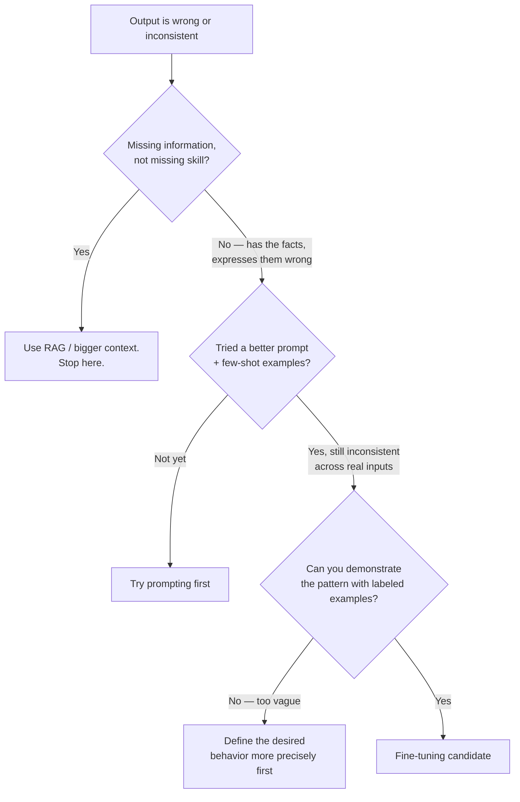

# Fine-Tuning — Junior

<!-- level-focus -->
At junior level, focus on this question:

> Given a specific feature request that someone claims "needs fine-tuning," can you run it through a decision checklist and correctly decide whether the real problem is a knowledge gap (fix with RAG or a bigger context), a small behavior gap (fix with prompting), or a genuine behavior/format gap that fine-tuning is suited for — and explain your reasoning?

Use the smallest realistic scenario that exposes the decision and its failure behavior.

---

## Core Concept 1 — Vocabulary: Prompting, RAG, and Fine-Tuning

Three different tools get reached for interchangeably by people who haven't separated what each one actually changes:

- **Prompting** — changing the instructions given to the model at inference time: a better system prompt, few-shot examples showing the desired input/output pattern, more explicit formatting instructions. Nothing about the model itself changes; you're only changing what you ask it and how.
- **RAG (Retrieval-Augmented Generation)** — at inference time, retrieving relevant documents or data from an external source (a search index, a database, a vector store) and inserting them into the prompt so the model can answer using content it was never trained on. This gives the model access to information, not a new skill.
- **Fine-tuning** — continuing to train an already-pretrained model's weights on a new, task-specific dataset of examples. This changes the model itself: its weights are different afterward, and its behavior on new, unseen inputs shifts as a result — not just on the exact examples it was trained on.
- **SFT (Supervised Fine-Tuning)** — the most common form of fine-tuning: training on labeled pairs of `(input, desired output)`, so the model's weights are nudged toward producing outputs like the desired ones for inputs like the training inputs.

The line that separates all of this: **prompting and RAG change what the model is told; fine-tuning changes what the model is.**

## Core Concept 2 — The Core Rule: Knowledge Gap vs. Behavior Gap

This is the single most important distinction at junior level, and it resolves most "should we fine-tune?" questions before any training happens:

| Symptom | What's actually missing | Right fix |
|---|---|---|
| "It doesn't know our return policy" | Knowledge — a fact the model was never shown | RAG: retrieve the policy document and put it in the prompt |
| "It doesn't know about a product we launched last month" | Knowledge — recent, model wasn't trained on it | RAG or a bigger context window with the product data included |
| "It answers correctly but never follows our exact JSON schema" | Behavior — how it formats a correct answer | Prompting first (show the schema, give an example); fine-tuning if prompting still fails at scale |
| "It answers correctly but the tone doesn't match our brand voice, no matter how the prompt is worded" | Behavior — style, consistently, across many inputs | Fine-tuning candidate |
| "It refuses a category of requests it shouldn't, or is inconsistent about a classification task across thousands of examples" | Behavior — a decision pattern | Fine-tuning candidate, if prompting and few-shot examples plateau |

Fine-tuning on a handful of examples does not reliably teach new facts, because the model sees each training example only a small number of times during a short training run — nowhere near the scale of repetition and reinforcement pretraining used to embed general world knowledge. A team that fine-tunes on 200 examples of "the return window is 30 days" to fix a wrong answer usually finds the model still gets *other* facts about the return policy wrong, because fine-tuning nudged output style toward the training examples, not toward "know the return policy." RAG fixes that class of problem directly, because it puts the correct fact in front of the model at answer time, every time.

## Core Concept 3 — The Decision Checklist

Work through these questions in order. Stop and act as soon as one gives you a clear answer:

1. **Is the model's output wrong because it lacks information it was never given?** If yes → RAG (or a bigger context window if the missing information is small and stable). Do not fine-tune.
2. **Is the model's output wrong or inconsistent in *how* it's expressed — format, tone, structure, reasoning pattern — even when it has the right information?** If yes, continue.
3. **Have you tried fixing it with a better system prompt and 3-5 few-shot examples showing the exact desired output?** If you haven't tried this yet, try it first — it's cheaper than fine-tuning by orders of magnitude and often sufficient.
4. **After a real prompting attempt, is the behavior still inconsistent across a representative sample of real inputs (not just the 3-5 examples you tuned the prompt against)?** If prompting holds up across a broader sample, stop — you're done, no fine-tuning needed.
5. **If it's still inconsistent, is the desired behavior narrow and specific enough to demonstrate with a labeled dataset of input/output examples?** If yes, you have a fine-tuning candidate. If you cannot describe the desired behavior as a pattern you could demonstrate with examples, the request is too vague to fine-tune against yet — go back and define it first.

## Core Concept 4 — Worked Example

**Feature request as received:** "Our support bot gives correct answers but customers keep complaining the tone feels robotic and it doesn't follow our macro format. Can we fine-tune it?"

Walking it through the checklist:

1. *Is the output wrong because of missing information?* No — the request explicitly says answers are correct. Skip RAG.
2. *Is it a how-it's-expressed problem?* Yes — tone and format, not content.
3. *Has a better prompt been tried?* Checking with the team: no, the current system prompt is three sentences with no examples of the desired macro format or tone.
4. Action before fine-tuning: write a system prompt that includes the actual macro format (headers, closing line, tone guidance) and 4 few-shot examples of real questions answered in the target tone and format. Test it against 30 real historical support questions, not just the 4 examples used to write the prompt.
5. Result of that test: 24 of 30 responses now match the desired tone and format acceptably; 6 don't, and they cluster around a specific ticket category (billing disputes) where the desired tone is noticeably different from the general support tone.
6. Decision: prompting solved the general case. The remaining 6/30 failures are narrow and specific enough (billing-dispute tone) to describe with labeled examples — this is now a much smaller, well-defined fine-tuning candidate (or, cheaper still, a category-specific system prompt for billing tickets, which should be tried before fine-tuning too).

The decision that emerged is not "fine-tune the support bot." It's "prompting fixes 80% of the problem for free; the remaining narrow slice may not even need fine-tuning if a second, category-specific prompt handles it." This is the outcome the checklist is supposed to produce: most requests that start as "we need to fine-tune" get resolved by prompting or RAG once you separate what's actually missing.

## Common Mistakes

1. **Fine-tuning to fix a knowledge gap.** Training on examples containing correct facts does not reliably make the model recall those facts on new questions — it's optimizing for output pattern, not factual recall. RAG is nearly always cheaper and more effective for "the model doesn't know X."
2. **Skipping the prompting attempt entirely.** Jumping straight to fine-tuning without first trying a rewritten system prompt and few-shot examples means you can't tell whether the problem needed fine-tuning at all, or would have been solved in ten minutes.
3. **Testing the prompt only against the examples used to write it.** A prompt that looks perfect against the 3 examples you tuned it with can still fail broadly — always test against a separate, larger sample of real inputs before concluding prompting failed.
4. **Treating "needs fine-tuning" as a single yes/no answer for a whole feature**, instead of narrowing it to the specific slice of inputs where prompting genuinely plateaus (as in Core Concept 4, where only the billing-dispute cases remained).
5. **Confusing an instruction-following gap with a genuine behavior gap.** If the model ignores an explicit instruction that's actually in the prompt, first check whether the instruction is buried, contradicted elsewhere in the prompt, or ambiguous — a clearer prompt often fixes this before fine-tuning is even a candidate.

## Apply it

1. Take a real or realistic feature request from your own backlog phrased as "the AI should do X better." Write down the exact current output for 5 representative inputs.
2. Run it through the Core Concept 3 checklist step by step, writing your answer to each question.
3. If the checklist points to RAG, describe in one sentence what source of truth you'd retrieve from.
4. If the checklist points to prompting, write an improved system prompt with at least 3 few-shot examples, and test it against 10 inputs you did *not* use while writing the prompt.
5. If, after a real prompting attempt, a specific narrow slice of inputs still fails consistently, describe that slice precisely enough that you could write 20 labeled examples demonstrating the desired output for it.

## Verify your work

- You can state, for your feature request, whether the root problem is missing information or inconsistent expression — and name the one sentence of evidence that supports it.
- If you tried prompting, you tested the improved prompt against inputs it wasn't tuned on, not just the examples used to write it.
- You can name the specific narrow slice of inputs (if any) that still fails after prompting, rather than describing the whole feature as "still broken."
- You did not write a single line of a training script before completing the checklist.

## Review questions

- Why does fine-tuning on examples containing a correct fact not reliably teach the model that fact for future questions?
- What is the practical difference between "the model doesn't know X" and "the model knows X but won't express it the way I need"?
- Why should a prompting fix be tested against inputs that were not used to write the prompt?
- In the Core Concept 4 example, why did the checklist result in "prompting solves most of it" instead of "fine-tune the whole bot"?
