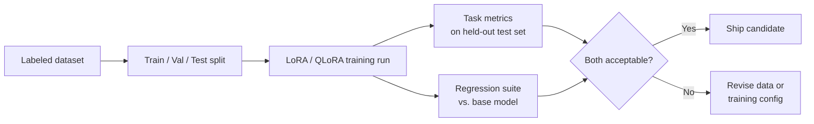

# Fine-Tuning — Middle

<!-- level-focus -->
At middle level, focus on this question:

> For a narrow, well-defined task — support-ticket classification, or adapting a model's output to a specific brand voice — how do you design the dataset schema, size, split, and evaluation plan so the fine-tuned model's improvement is real and measurable, not an illusion produced by testing on training data?

Use the smallest realistic scenario that exposes the decision and its failure behavior.

---

## Core Concept 1 — Choosing How to Fine-Tune: Full, LoRA, or QLoRA

Once junior-level triage confirms fine-tuning is the right tool, the next decision is *how much of the model to actually train*:

| Approach | What it trains | Infra needed | When it fits |
|---|---|---|---|
| **Full fine-tuning** | Every weight in the model | Multiple high-memory GPUs, often across nodes, for anything beyond a small model | Deep behavior change, large labeled dataset, budget for dedicated training infra, and a real need to own the entire model |
| **LoRA (Low-Rank Adaptation)** | A small pair of low-rank matrices inserted alongside the original (frozen) weights — typically well under 1% of the original parameter count | Often a single GPU with enough memory to hold the frozen base model plus the small adapter | Narrow behavior change (style, format, a specific task) where the base model's general capability should stay intact |
| **QLoRA** | Same as LoRA, but the frozen base model is loaded in a quantized (lower-precision, e.g. 4-bit) form during training | A single consumer or mid-range GPU — dramatically less memory than LoRA on the full-precision base model | Same use case as LoRA, when GPU memory is the binding constraint (e.g., fine-tuning a large open-weight model like Llama or Mistral without multi-GPU infrastructure) |

The practical default for a narrow, task-specific fine-tune — brand-voice adaptation, ticket classification, a fixed output format — is LoRA or QLoRA, not full fine-tuning. The base model already has the general language capability; the task only needs a small, targeted nudge, and training a full copy of the weights for that nudge burns far more compute and GPU memory than the task requires while increasing the risk of catastrophic forgetting (Core Concept 4 in the senior guide). Full fine-tuning earns its cost when the required behavior change is broad enough that a low-rank adapter can't represent it, or when the organization specifically needs to own and redistribute a fully independent model.

## Core Concept 2 — Dataset Schema for a Narrow Task

A fine-tuning dataset is a list of labeled examples in a consistent schema. Two concrete schemas for the two tasks named in this guide's scope:

**Support-ticket classification (SFT on input → structured output):**

```json
{
  "input": "Customer message: 'My order #48213 hasn't arrived and it's been 12 days. I want a refund.'",
  "output": {
    "category": "shipping_delay",
    "subcategory": "refund_requested",
    "priority": "high"
  }
}
```

**Brand-voice style adaptation (SFT on input → rewritten output):**

```json
{
  "input": "Draft response: 'Your request has been denied due to policy violation.'",
  "output": "Thanks for reaching out — after reviewing your request, this falls outside what our policy allows, so we're not able to approve it this time. Let us know if you'd like to talk through alternatives."
}
```

Both examples share the same shape: a realistic input, and the exact output the model should produce for it. The output is written by a human (or reviewed and corrected by one) — this is what makes it "supervised."

## Core Concept 3 — Dataset Quality Over Quantity

A fine-tuning dataset's value is dominated by quality, not size, past a fairly small threshold. Four concrete quality controls:

- **Deduplication.** Near-duplicate examples (the same ticket rephrased slightly, or the same brand-voice rewrite pattern repeated) inflate the apparent dataset size without adding new signal, and can cause the model to overfit to the specific phrasing that happens to repeat. Deduplicate on semantic similarity, not just exact string match — two tickets with different wording but the same underlying complaint are still a near-duplicate for this purpose.
- **Label noise.** A dataset labeled by multiple people (or a single person on a bad day) accumulates inconsistent labels — the same kind of ticket categorized as `shipping_delay` in one example and `logistics_issue` in another. Label noise teaches the model that the boundary between categories is fuzzier than it should be, directly hurting classification consistency. Spot-check a random 5-10% sample of labels against a written labeling guideline before training, not after.
- **Representative coverage of the production distribution.** A classification dataset drawn disproportionately from easy, common cases (the top 3 ticket categories) but sparse on rare-but-real categories will fine-tune a model that's confidently wrong the moment a rare category appears in production. Sample the dataset to reflect the actual frequency distribution of categories in real traffic, or deliberately oversample rare categories and account for that when interpreting per-category metrics.
- **Realistic inputs, not synthetic-sounding ones.** A dataset of clean, well-formatted example tickets that don't resemble the typos, run-on sentences, and mixed-language snippets of real customer messages will fine-tune a model that performs well on the eval set and degrades in production the moment it meets real input.

As a starting size for a narrow, single-task LoRA fine-tune, a few hundred to a few thousand high-quality, deduplicated, representative examples is a realistic illustrative range for many text-classification or style-adaptation tasks — this is a rough planning number to size a first data-collection effort, not a benchmark result, and it varies with how narrow the task is and how far the base model's existing behavior already is from the target.

## Core Concept 4 — Train / Validation / Test Split

Three disjoint splits, each serving a different purpose:

| Split | Typical share | Purpose |
|---|---|---|
| **Train** | ~70-80% | The examples actually used to update the model's weights |
| **Validation** | ~10-15% | Used during training to tune hyperparameters (learning rate, number of epochs, LoRA rank) and to decide when to stop training before the model starts overfitting |
| **Test (held-out)** | ~10-15% | Never touched until training is finished — the only number that tells you how the model performs on data it has never seen in any form |

The split must happen *before* deduplication interacts with it in a way that leaks information — if a near-duplicate of a test example ends up in the training set, the test score overstates real performance because the model has effectively seen that example already. Split first by a stable key (ticket ID, or a hash of the input) so re-running the pipeline doesn't silently reshuffle examples across splits between experiments.

## Core Concept 5 — Evaluation Plan: Task Metrics and Regression Testing

A complete evaluation plan measures two different things, and conflating them is the most common middle-level mistake:

1. **Task-specific metrics on the held-out test set** — for classification, precision/recall/F1 per category (not just overall accuracy, which hides poor performance on rare categories behind good performance on common ones); for style adaptation, a rubric-based score (a human or LLM-judge rating on defined dimensions like tone match, factual preservation, and length) rather than a single vague "does it sound right" judgment.
2. **Regression testing against the base model's general capability** — running the fine-tuned model against a separate suite that has nothing to do with the fine-tuning task (general instruction-following, basic reasoning, safety behavior) and comparing against the base model's scores on the same suite. This is the check for catastrophic forgetting (covered in depth at senior level): a model that gets dramatically better at ticket classification but noticeably worse at general reasoning has traded one capability for another, and that trade needs to be a conscious decision, not a surprise discovered after deployment.



A fine-tuned model only ships when both evaluations pass: good on the target task, and no unacceptable regression on general capability. Shipping on task metrics alone is exactly how a classification fine-tune quietly degrades a model's ability to hold a normal conversation elsewhere in the same product.

## Core Concept 6 — Cross-Component Scenario: Ticket Classification End to End

A team wants to fine-tune a model to classify support tickets into 12 categories, replacing a slower LLM-prompting-only pipeline that's inconsistent on edge cases.

1. **Data pipeline** — historical tickets are pulled from the support system, and a labeling team (or the original agents' resolution notes) assigns each a category. This pipeline needs deduplication and a labeling guideline before any training happens (Core Concept 3).
2. **Split** — 3,000 labeled tickets are split 75/12.5/12.5 by a hash of the ticket ID, stratified so each category appears in train, validation, and test roughly proportional to its real frequency (Core Concept 4).
3. **Training** — a QLoRA fine-tune of an open-weight instruct model, chosen because the team has a single GPU available and doesn't need to own a fully independent model (Core Concept 1).
4. **Task evaluation** — per-category precision/recall on the held-out test set; the team specifically checks the three rarest categories, because overall accuracy alone would hide a rare category being classified into the wrong bucket almost every time.
5. **Regression evaluation** — the same model is run against a general instruction-following suite unrelated to ticket classification, comparing its scores to the un-fine-tuned base model's scores on the same suite, to catch any broad capability loss.
6. **Integrated-flow check** — before shipping, the fine-tuned classifier is run against a day of live traffic in shadow mode (classifying real incoming tickets without acting on the result), and its outputs are spot-checked by a human reviewer against what an agent would have assigned — this catches distribution mismatches between the historical training data and current ticket patterns that the held-out test set (drawn from the same historical period) cannot catch.

## Real-World Examples

- **Overall accuracy hides a rare-category failure.** A classification fine-tune reports 94% overall accuracy on the held-out test set, which looks like a clear win — but per-category recall shows one rare category (about 2% of traffic) is classified correctly only 20% of the time, because it was underrepresented in training data. The team's dataset-sampling fix (Core Concept 3) is to specifically oversample that category in the next training round and track its recall as its own metric going forward, not folded into the overall number.
- **A style-adaptation fine-tune passes its rubric but a regression check catches an unrelated loss.** A brand-voice fine-tune scores well on the tone rubric, but the regression suite shows the model's ability to follow multi-step formatting instructions (unrelated to tone) has measurably degraded compared to the base model — a sign the LoRA rank chosen for training was too aggressive for how narrow the task actually was. Lowering the adapter's rank and re-running preserves the tone improvement while closing most of the regression.
- **Shadow-mode testing catches what the held-out test set can't.** A ticket classifier that scores well on a held-out test set drawn from six-month-old historical tickets performs noticeably worse in shadow mode against current live traffic, because a new product line launched in the interim introduced a ticket pattern the training data never saw — a distribution-shift signal (developed further at senior level) that only surfaces by testing against current traffic, not historical data.

## Common Mistakes

- **Reporting only overall accuracy on an imbalanced classification task.** Hides poor performance on rare-but-real categories behind strong performance on common ones.
- **Splitting train/test after deduplication touches the full dataset**, letting a near-duplicate of a test example leak into training and inflate the test score.
- **Evaluating only the target task and never running a regression suite**, shipping a model that improved at one thing while quietly losing general capability elsewhere.
- **Defaulting to full fine-tuning for a narrow task** that a LoRA or QLoRA adapter would have handled with a fraction of the infrastructure and a lower risk of catastrophic forgetting.
- **Treating a held-out test score from historical data as proof the model is ready for current production traffic**, without a shadow-mode or live-sample check for distribution shift.

---

## Apply it

1. Pick a narrow task (ticket classification or a style-adaptation task) and write its dataset schema as a concrete JSON example, matching the shape in Core Concept 2.
2. Define your quality controls: how you'd deduplicate, how you'd check for label noise, and how you'd verify the dataset's category or style distribution matches production.
3. Decide train/validation/test split percentages and the stable key you'd split on, and state why that key prevents leakage.
4. Write your evaluation plan as two explicit parts: the task-specific metric(s) and the regression suite you'd run against the base model, matching Core Concept 5.
5. Describe the one integrated-flow check (shadow mode, live sampling, or equivalent) you'd run before shipping, and what it would catch that the held-out test set cannot.

## Verify your work

- Your dataset schema example is concrete — a real input and a real, correctly labeled output, not a placeholder.
- You can name the specific per-category or per-dimension metric you'd track, not just an aggregate score.
- Your train/test split is keyed on something stable enough that re-running the pipeline won't silently reshuffle examples across splits.
- Your evaluation plan includes a regression check against the base model's general capability, not only the target-task metric.
- You can name one thing a held-out test set drawn from historical data cannot catch, and how your integrated-flow check would catch it.

## Review questions

- Why does LoRA or QLoRA fit a narrow, task-specific fine-tune better than full fine-tuning in most cases?
- Why can a dataset with duplicate or near-duplicate examples across the train and test split produce a misleadingly high test score?
- Why is overall accuracy an unreliable metric for a classification task with imbalanced categories?
- What does a regression suite check for that a task-specific evaluation cannot, and why does skipping it risk shipping a model that quietly lost capability elsewhere?
