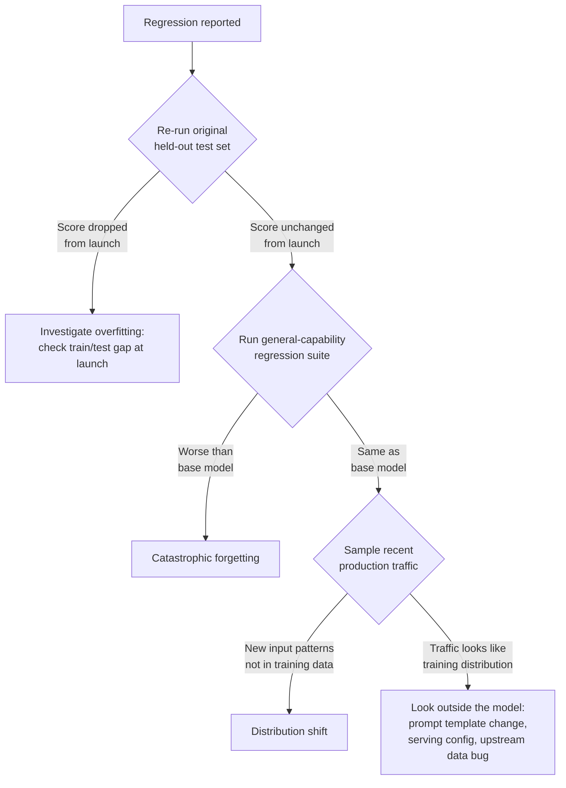

# Fine-Tuning — Senior

<!-- level-focus -->
At senior level, focus on this question:

> A fine-tuned model that performed well at launch is now producing worse outputs in production. Given the evidence available — training data, evaluation history, and live traffic samples — how do you distinguish overfitting, catastrophic forgetting, and distribution shift, and design a fix that matches the actual diagnosis rather than a generic "retrain it"?

Use the smallest realistic scenario that exposes the decision and its failure behavior.

---

## Core Concept 1 — Three Failure Modes That Look Similar From the Outside

All three failure modes present the same top-level symptom — "the model got worse" — but they have different causes, different diagnostic evidence, and different fixes. Treating them as one problem produces a fix that addresses the wrong cause and either does nothing or masks the real issue temporarily.

| Failure mode | What's actually happening | Diagnostic evidence |
|---|---|---|
| **Overfitting** | The model memorized specific patterns in the training set — including its noise and quirks — rather than learning the general pattern, so it performs well on training-like inputs and poorly on genuinely novel ones | Held-out test performance was already weaker than training performance *at evaluation time*, before deployment; the gap between train and test metrics is large; failures cluster on inputs that differ even slightly in phrasing from training examples |
| **Catastrophic forgetting** | Fine-tuning shifted the model's weights enough that it lost general capability it had *before* fine-tuning, even on tasks unrelated to the fine-tuning objective | The fine-tuned model scores worse than the base model on a general-capability regression suite that has nothing to do with the fine-tuning task; the degradation is present immediately after training, not something that developed over time in production |
| **Distribution shift** | Production input patterns have changed since the training data was collected — new product lines, new phrasing trends, seasonal patterns, a UI change that alters how users phrase requests — so the model is being asked to generalize to a population it was never trained or evaluated against | The model's performance on the *original* held-out test set is unchanged if you re-run it; failures cluster on a specific category or pattern of input that's new or has grown in frequency since the training data was collected; the degradation appeared gradually or after a known external change (a launch, a UI update), not immediately after deployment |

The distinguishing question for each: overfitting is visible *before* deployment if you looked at train/test gap correctly. Catastrophic forgetting is visible *before* deployment if you ran a regression suite. Distribution shift is only visible *after* deployment, because it's a property of production traffic changing, not a property of the model or the original dataset.

## Core Concept 2 — Diagnostic Method: Evidence Before Fix

Given a reported regression, gather evidence in this order before proposing any fix:

The first two branches (re-run the original test set, run the regression suite) use evidence that already exists from training time — this is why senior-level practice keeps that evidence, versioned alongside the model, instead of discarding it after launch. The third branch requires sampling *current* production traffic and comparing it against the training distribution, which is the only way to catch distribution shift, because nothing about the model or the original evaluation artifacts changed.

## Core Concept 3 — Evidence-Gathering in Practice

Concrete steps for each branch:

**Re-running the original held-out test set** costs almost nothing — it's a fixed set of examples and a fixed model checkpoint. If the score matches what was recorded at launch, the model's ability to handle *training-distribution* inputs hasn't degraded; the problem is elsewhere. If it's dropped, something about the deployed model differs from what was evaluated (a serving config change, a checkpoint mismatch), or overfitting was under-detected at evaluation time.

**Running the general-capability regression suite** against both the currently deployed model and the original pre-fine-tuning base model, side by side, isolates whether fine-tuning cost general capability. This only works if that regression suite was defined and run *at training time*, and its baseline scores were recorded — a team that skipped the regression evaluation in the middle-level workflow has no baseline to compare against now, and has to reconstruct one after the fact, which is strictly worse than having kept it.

**Sampling recent production traffic** and comparing it against the training data distribution — by category frequency for a classifier, by topic or phrasing pattern for a generative task — surfaces distribution shift directly. A concrete technique: pull 100-200 recent production inputs, have them labeled the same way the original dataset was labeled (or scored by the same rubric), and compare the category/error distribution against the original held-out test set's distribution. A new category or pattern appearing at meaningful frequency in the sample that was rare or absent in training is direct evidence of shift.

## Core Concept 4 — Designing the Fix for Each Diagnosis

The fixes are not interchangeable — applying the wrong one either doesn't help or actively makes things worse:

| Diagnosis | Fix | Why a different fix doesn't work |
|---|---|---|
| **Overfitting** | Reduce model capacity for the task (lower LoRA rank), add regularization, increase dataset diversity, or reduce training epochs; re-split and re-verify the train/test gap closes | Retraining on more of the *same kind* of narrow data without addressing diversity just re-memorizes a larger version of the same pattern |
| **Catastrophic forgetting** | Lower the learning rate or LoRA rank to make the update more conservative; mix general-capability examples into the fine-tuning set alongside task-specific examples; or reduce training epochs to stop before general capability degrades | Adding more task-specific data makes the target task better but does not address why general capability was lost — the update was too aggressive relative to the base model's existing weights |
| **Distribution shift** | Collect new labeled examples from the current production distribution and retrain or continue training on the updated mix; this is the one diagnosis where "get new data" is the correct fix, not a deflection | Adjusting model capacity or learning rate does nothing, because the model's ability on its original distribution is intact — the distribution itself moved |

Distribution shift is the diagnosis most often mistreated as if it were overfitting, because the surface symptom ("worse in production than in testing") looks identical. The tell is Core Concept 3's evidence: if the original held-out test score is unchanged, no amount of regularization or capacity reduction fixes a problem that isn't actually about the model's fit to its original training data — it's about that training data no longer representing production.

## Core Concept 5 — Cross-Component Scenario: A Classifier's Slow Decline

A support-ticket classifier fine-tuned three months ago (using the pipeline from the middle-level guide) was performing well at launch: 91% weighted F1 on its held-out test set, and a regression suite showing no meaningful loss versus the base model. Over the past six weeks, agents report the classifier is "getting worse," specifically misrouting an increasing share of tickets.

Working through Core Concept 2's evidence order:

1. **Re-run the original held-out test set against the currently deployed model.** Score comes back at 90.5% F1 — essentially unchanged from launch. This rules out both overfitting (which would have shown up as a gap already present at launch, not a slow decline) and any serving-side degradation of the model itself.
2. **Run the general-capability regression suite against the deployed model and the base model.** Scores are statistically indistinguishable from the base model, matching what was recorded at launch. This rules out catastrophic forgetting.
3. **Sample 150 recent tickets and compare their category distribution against the original training data's distribution.** A new category of ticket — related to a subscription-tier change the product team launched five weeks ago — makes up roughly 12% of the recent sample and was entirely absent from the training data three months prior. Misrouted tickets in agent complaints cluster heavily in this new category.

Diagnosis: distribution shift, not overfitting or forgetting — confirmed by evidence, not guessed from the symptom. The fix is to collect and label a batch of the new subscription-tier ticket category, verify it doesn't already exist mislabeled under an adjacent category in the old data, and continue training (or retrain) on the original dataset plus this new slice — not to reduce LoRA rank or add regularization, which would do nothing for a distribution that moved.

## Core Concept 6 — Recovery and Rollback

Every fine-tuned model in production needs a rollback path that doesn't depend on re-diagnosing the problem under pressure:

- **Keep the base (pre-fine-tuning) model deployable at all times**, even after the fine-tuned version ships, so a severe regression has an immediate fallback that's known-good, rather than requiring an emergency retrain before service is restored.
- **Version training data, evaluation results, and model checkpoints together**, so "what did the held-out test score look like at launch" and "what did the regression suite show" are answerable in minutes, not by trying to reconstruct history from memory.
- **Treat a confirmed distribution shift as a trigger for a scheduled evaluation-suite update**, not a one-off patch — if production traffic moved once (a subscription-tier launch), it will move again (the next launch), and the evaluation and training data need a maintenance cadence, not a single correction.

## Real-World Examples

- **A "the model got worse" report turns out to be unchanged model, moved traffic.** As in Core Concept 5, re-running the original held-out test set at an unchanged score immediately rules out overfitting and forgetting, redirecting the investigation to production traffic instead of the model or training process — saving a retraining cycle that would not have addressed the actual cause.
- **A regression suite that was never defined leaves a team unable to answer "did we lose general capability?"** A team fine-tuned a model for a narrow task and shipped it without a regression baseline; when a general-capability complaint surfaces months later, there's no launch-time score to compare against, and the team has to approximate a baseline using the current base model version, which may itself have moved on from what was originally fine-tuned against.
- **An aggressive LoRA rank produces textbook catastrophic forgetting.** A team fine-tunes with a LoRA rank far higher than the narrow task needed, chasing a small task-metric improvement; the regression suite (correctly run before shipping) shows a clear general-capability drop versus the base model. Lowering the rank and accepting a slightly smaller task-metric gain recovers most of the lost general capability.

## Common Mistakes

- **Diagnosing by symptom instead of evidence.** "The model got worse" is consistent with all three failure modes; only re-running the original test set, the regression suite, and a current-traffic sample actually distinguishes them.
- **Applying an overfitting fix (more regularization, lower capacity) to a distribution-shift problem.** Does nothing, because the model's fit to its original data is unchanged — the data it needs to fit has moved.
- **Never keeping a regression-suite baseline from launch**, making a later catastrophic-forgetting diagnosis impossible to confirm with evidence.
- **Retraining on "more data" without checking whether the new data covers the actual shifted distribution.** Adding more of the old distribution's pattern doesn't help if the shift is a genuinely new category or pattern.
- **Treating a distribution-shift fix as a one-time correction.** The traffic that shifted once will shift again; without a recurring evaluation-data refresh, the same diagnosis recurs on a similar timeline.

---

## Apply it

1. For a fine-tuned model you have access to (or a realistic scenario you construct), gather the three pieces of evidence from Core Concept 2: the original held-out test score, a general-capability regression comparison against the base model, and a sample of recent production inputs compared against the training distribution.
2. Based on that evidence alone, write down which of the three failure modes — overfitting, catastrophic forgetting, distribution shift, or none — the evidence actually supports, and name the specific piece of evidence that ruled out each of the other two.
3. Design the fix that matches your diagnosis specifically, using Core Concept 4's table, and write one sentence explaining why a different fix from the table would not have worked here.
4. Confirm a rollback path exists: can the pre-fine-tuning base model be deployed within the time your incident response requires, without an emergency retrain first?
5. Propose a recurring cadence (tied to a concrete trigger — a product launch, a scheduled interval, a monitored input-distribution metric) for refreshing the evaluation and training data, so the next distribution shift is caught proactively rather than reported by users first.

## Verify your work

- You can name, with a specific number or comparison, the evidence that ruled out each of the two failure modes you did not diagnose.
- Your proposed fix matches Core Concept 4's table for your diagnosis, and you can explain in one sentence why a fix from a different row would not address the actual cause.
- You have confirmed — not assumed — that the pre-fine-tuning base model is currently deployable as a rollback.
- Your recurring evaluation-refresh cadence is tied to a concrete, observable trigger, not an open-ended "periodically."

## Review questions

- Why can overfitting and catastrophic forgetting both be ruled out or confirmed using evidence gathered before a model ever reaches production, while distribution shift cannot?
- Why does applying an overfitting fix to a distribution-shift problem fail to help, even though both present as "the model got worse"?
- Why does keeping a general-capability regression baseline from launch matter for diagnosing a regression months later?
- What does it mean for a rollback strategy to not depend on first diagnosing the problem?
