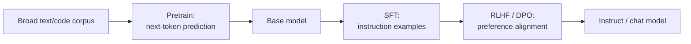

# Pretrained Models — Junior

<!-- level-focus -->
At junior level, focus on this question:

> Given a model's release notes, model card, or API docs, can you identify what pipeline stage produced the specific model you're calling — base or instruct/chat, RLHF'd/DPO'd or not — and explain what that implies for how you should prompt it?

Use the smallest realistic scenario that exposes the decision and its failure behavior.

---

## Core Concept 1 — Vocabulary: What the Pipeline Stages Are

Five terms cover almost every model card:

- **Pretraining** — training a model on a broad corpus of text and code to predict the next token, over and over, at massive scale (hundreds of billions to trillions of tokens). Nothing in this step is task-specific; the model is never told "this is a question" or "this is code." It only ever learns "given these tokens, what token comes next."
- **Base model** — the direct output of pretraining. It completes text. Given `"The capital of France is"`, it predicts `" Paris"` for the same reason it would predict the next word of a news article or a function body: that's the most statistically likely continuation, learned from the corpus.
- **SFT (Supervised Fine-Tuning / instruction tuning)** — a second, much smaller training pass on curated examples of `(instruction, ideal response)` pairs. This is what teaches a model to behave like it's answering a question rather than continuing a document.
- **RLHF (Reinforcement Learning from Human Feedback)** — a further training pass that uses human preference judgments (humans ranking multiple candidate responses) to train a reward model, then uses reinforcement learning to push the model toward responses the reward model scores highly.
- **DPO (Direct Preference Optimization)** — a newer alignment technique that reaches a similar goal to RLHF (aligning outputs with human preferences) but optimizes directly on preference pairs without training a separate reward model or running a full RL loop. It's mentioned on model cards as a simpler, cheaper alternative to RLHF for the same alignment step.

**Alignment** is the umbrella term for the RLHF/DPO step: shaping a model's behavior — tone, refusals, format, helpfulness — using human (or human-derived) preference signal, as opposed to raw next-token statistics.

## Core Concept 2 — Why Next-Token Prediction Alone Produces Broad Capability

It's worth pausing on why pretraining works at all. The objective is narrow — predict one token — but the corpus is not. A corpus broad enough to contain code, math, dialogue, arguments, instructions, and narrative forces the model to build internal representations general enough to predict *all* of those well, not just one. Nobody hand-labels "this is a summarization example" or "this is a translation example" during pretraining. The capability to summarize or translate emerges because doing those things well is exactly what makes next-token prediction accurate on text that contains summaries and translations. This is why a base model — before any task-specific supervision at all — can already complete a translation or continue a proof: it learned the *shape* of those tasks as a side effect of getting really good at predicting what comes next.

## Core Concept 3 — The Pipeline, and What Each Stage Changes



| Stage | Input | What changes behaviorally |
|---|---|---|
| Pretrain | Raw corpus | Nothing to compare against yet — this produces the base model |
| SFT | Curated instruction/response pairs | Model starts responding to instructions instead of just continuing text; learns to stop at a reasonable length |
| RLHF / DPO | Human preference data | Model's tone, helpfulness, and refusal behavior get shaped toward what evaluators preferred; the model develops consistent stances on what it will and won't do |

A model can stop at any point in this chain and still be released. A **base model** is the pretrain output shipped as-is. An **instruct** or **chat model** has been through SFT, and almost always RLHF or DPO on top. Nothing forces a provider to do all three steps before releasing something — which is exactly why you have to check, not assume.

## Core Concept 4 — Real Model Families and Where They Sit

| Family | Provider | Typically released as | Weights |
|---|---|---|---|
| GPT (GPT-4o, o1, o3) | OpenAI | Instruct/chat only, via API | Closed |
| Claude (Sonnet, Opus, Haiku) | Anthropic | Instruct/chat only, via API; alignment uses RLHF plus a published technique called Constitutional AI | Closed |
| Gemini | Google | Instruct/chat only, via API | Closed |
| Llama | Meta | Both a base variant and an instruct-tuned variant per size (e.g., released with 8B/70B/405B parameter versions) | Open |
| Mistral | Mistral AI | Both base and instruct variants for most releases | Open (for many releases) |
| DeepSeek (V3, R1) | DeepSeek | Both base and instruct/reasoning-tuned variants; DeepSeek published a report on the training efficiency of V3, and R1 is publicly documented as leaning heavily on RL for its reasoning behavior | Open |

The practical pattern to notice: providers that publish open weights (Llama, Mistral, DeepSeek) very often ship **both** the base and the instruct-tuned version as separate downloadable models, because different downstream users want different starting points. Providers that are API-only (OpenAI, Anthropic, Google) almost never expose a raw base model at all — you're handed the instruct/chat model and nothing else.

## Core Concept 5 — Reading a Model Card to Find the Stage

You don't have to guess. Model cards and release notes say this directly, usually in the name and in an "intended use" or "training" section:

- **Naming convention** — `Llama-3-8B` vs `Llama-3-8B-Instruct`; `Mistral-7B-v0.3` vs `Mistral-7B-Instruct-v0.3`. The absence of "Instruct" or "Chat" in the name of an open-weight release is itself a signal it's the base model.
- **"Intended use" section** — a base model's card will say something like "designed to be fine-tuned for downstream tasks" or "not trained to follow instructions." An instruct model's card will say "optimized for dialogue/assistant use cases."
- **"Training" section** — look for the phrase "instruction-tuned," "RLHF," "DPO," or "human feedback." Its presence means an alignment pass happened; its absence (combined with a base-sounding name) means it didn't.
- **API-only models** — since you can't inspect weights, the docs are the only signal. A "completions" endpoint using a model without "chat" or "instruct" in its name is very likely calling something closer to base behavior; a "chat completions" endpoint is calling an instruct/RLHF'd model by construction of the API itself.

## Core Concept 6 — What the Stage Implies for Prompting

This is where getting it wrong actually costs you something. Given the same underlying question, the two model types need different prompts and will fail differently if you give them the wrong one:

**Base model, prompted like a chat model:**

```
Prompt: "What is the capital of France?"
Output: "What is the capital of Germany? What is the capital of Spain?
         What is the capital of Italy? ..."
```

The base model isn't ignoring you — it's doing exactly what it was trained to do: predict a statistically likely continuation. A list of similar questions is a very plausible continuation of a document containing one geography question. It has no notion of "answer and stop" because nothing taught it that.

**Base model, prompted correctly (completion-style, often with few-shot examples):**

```
Prompt: "Q: What is the capital of Japan?\nA: Tokyo\n
         Q: What is the capital of France?\nA:"
Output: " Paris"
```

Giving it a pattern to continue gets a base model to behave usefully — this is the core skill of working with base models.

**Instruct/chat model, prompted the same way:**

```
Prompt: "What is the capital of France?"
Output: "The capital of France is Paris."
```

The instruct model responds directly because SFT specifically trained it on `(question, answer)` pairs shaped like this, and RLHF/DPO reinforced giving a complete, well-formed, appropriately-bounded answer.

## Common Mistakes

1. **Assuming a model name alone tells you the stage without checking the docs.** "GPT-4" and similar family names span multiple release variants; the specific endpoint or checkpoint you call is what matters, not the family name.
2. **Prompting a base model like a chat assistant and concluding "the model is broken."** The rambling, non-stopping output in Core Concept 6 is correct base-model behavior, not a bug — the fix is a completion-style or few-shot prompt, not a different model.
3. **Assuming every open-weight release includes RLHF/DPO alignment.** Many open releases ship a base model with no alignment pass at all; check the card, don't assume "open" implies "safety-tuned" or "instruction-following."
4. **Treating "instruct-tuned" and "RLHF'd" as the same claim.** A model can be SFT'd (follows instructions) without a full RLHF/DPO pass (aligned to preference data) — the card's training section usually distinguishes these, and a model with SFT alone tends to follow format less reliably and refuse less consistently than one with both.
5. **Ignoring the "intended use" section because it looks like boilerplate.** It's frequently the single fastest way to confirm base vs. instruct without reading the rest of the card.

## Apply it

1. Find the public model card or release notes for one open-weight family (Llama, Mistral, or DeepSeek) and identify: is there a separate base and instruct variant? What does the card's training section say about SFT and RLHF/DPO?
2. Write down the exact model identifier you'd use to call the base variant and the exact identifier for the instruct variant.
3. Draft a single prompt asking a factual question. Predict, in writing, how the base variant would respond to it versus the instruct variant, before running either.
4. If you have API access to either variant, run your prompt against both and compare the actual output to your prediction. If you don't have access, find a documented example in the model's card or a reputable comparison in the release materials instead.
5. Rewrite your prompt as a completion-style, few-shot prompt suited to the base model, and note what changed in the output.

## Verify your work

- You can point to the specific line in a model card or release note that tells you whether a model is base or instruct.
- You can state, for a model you've used, whether it went through RLHF, DPO, both, or neither, citing the card.
- Your predicted base-model output (rambling/continuing) and instruct-model output (direct answer) match what actually happens when you test both.
- You can rewrite a chat-style prompt into a completion-style prompt that gets a base model to produce a useful, bounded answer.

## Review questions

- What does pretraining alone produce, and why can it already perform tasks like translation or summarization without task-specific training?
- What is the practical difference between SFT and RLHF/DPO in terms of what each one changes about a model's behavior?
- Why does a base model prompted with "What is the capital of France?" often fail to just answer and stop?
- Name two places in a model card or release notes where you can find whether a specific model is base or instruct.
- Why doesn't "this model has open weights" imply "this model went through RLHF or DPO"?
