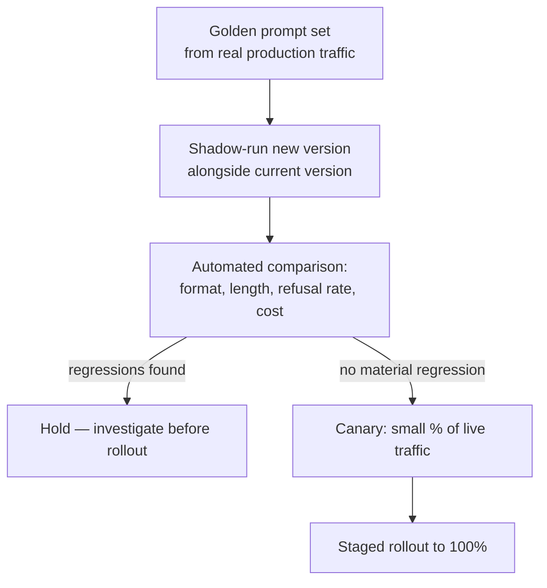

# Pretrained Models — Senior

<!-- level-focus -->
At senior level, focus on this question:

> When a provider ships a new version of a model your production system depends on, what invariants might break, what evidence would tell you before your users do, and what rollout process lets you switch versions without betting the whole system on day one?

Use the smallest realistic scenario that exposes the decision and its failure behavior.

---

## Core Concept 1 — A Model Version Is Not an Interchangeable Part

A middle-level pass treats "which model" as a design decision made once, at build time. At senior level, the organizing fact is that the decision doesn't stay made: every provider — closed and open alike — ships new model versions on an ongoing basis, and each new version is a different model, not a patch. It went through its own pretraining run, its own SFT pass, and its own RLHF/DPO pass, each of which can shift behavior in ways a version-number bump gives you no guarantee about.

Treat a production dependency on a specific model version the way you'd treat a dependency on an external service's API: it has an implicit contract, and that contract can change underneath you. Four invariants are worth naming explicitly, because they're the ones that break silently rather than loudly:

| Invariant | What breaks if it silently changes |
|---|---|
| Response format and verbosity stay consistent for the same prompt shape | Downstream parsing that assumed short, structured answers starts failing on longer, more hedged responses from the new version's alignment pass |
| Refusal threshold stays consistent | Prompts that used to succeed start getting declined (or vice versa — prompts that used to be declined now succeed, which is its own risk) |
| Tool-calling / function-calling schema support stays compatible | A new version deprecates a parameter or changes how it emits structured tool calls, and integration code that assumed the old schema breaks |
| Tokenizer and context length stay stable | Cost estimates and truncation logic tuned against the old tokenizer silently drift — the same text can tokenize to a different count, and a context-length increase or decrease changes how much you can safely stuff into a prompt |

None of these show up in a version's release headline. They show up in production, on a subset of prompts, usually the ones nobody thought to re-test.

## Core Concept 2 — Why "Same Family" Isn't "Drop-In Replacement"

The reason a new version isn't a safe drop-in follows directly from the pipeline covered at junior and middle level: pretraining, SFT, and RLHF/DPO are each independent training runs, each on their own data and their own human-preference judgments. A provider re-running RLHF with an updated preference dataset can shift a model's tone, verbosity, and refusal boundary without touching the underlying pretrained weights at all — meaning two versions in the "same family" can behave differently on exactly the alignment-sensitive dimensions (tone, format, refusals) that a downstream system is most likely to depend on. Add to that: providers regularly deprecate specific parameters, retire older endpoint styles (a legacy completions endpoint being sunset in favor of a chat-only interface is a real, recurring pattern across providers), and change pricing or rate limits alongside a version bump. Any one of these can be the actual cause of a production regression that looks, from the outside, like "the model got worse."

## Core Concept 3 — An Evaluation and Rollout Process, Not a Judgment Call

The senior-level answer to "should we switch to the new version" is a process, not a person's read of a few test prompts:

1. **Build a golden prompt set from real production traffic** — not hand-picked happy-path examples, but a representative sample including edge cases that have caused problems before. A test suite built only from prompts that always worked will not surface a regression.
2. **Shadow-run the new version** — send the same golden prompts (and, where feasible, a live-traffic mirror) to both the current and candidate version without serving the candidate's output to users yet.
3. **Compare automatically, on properties, not exact text.** Exact string matching is the wrong bar — alignment shifts mean wording will differ even when the response is equally correct. Compare structural properties instead: response length distribution, refusal rate on a known-sensitive subset, whether structured/tool-call outputs still parse against your schema, and token cost per request.
4. **Hold on any material regression** and investigate before proceeding — a regression found here is far cheaper than one found in production.
5. **Canary a small percentage of live traffic** once the offline comparison clears, with the ability to route back to the old version immediately.
6. **Roll out in stages**, watching the same comparison metrics on live traffic, not just the offline golden set — some regressions only appear on the long tail of real user input that a golden set can't fully anticipate.

This is evidence-based validation in the specific sense the term needs here: the decision to switch is backed by a measured comparison against a representative sample, not by a few manual spot-checks that happened not to hit the regression.

## Core Concept 4 — Cross-Component Scenario: The Support Bot That Got Quieter

A production support bot is pinned to a specific model version behind a chat API. The provider announces the version will be deprecated on a fixed date and the team migrates to the replacement version ahead of the deadline. Two weeks after rollout, a downstream analytics job that parses bot responses for a specific structured summary field starts silently dropping a growing fraction of records.

The investigation path a senior engineer should already have in place:

1. **Check the golden-set comparison from before rollout first** — if response-length distribution wasn't part of the comparison, this is the gap: the new version's RLHF pass produced longer, more hedged answers on ambiguous prompts, and the downstream parser's regex assumed the old version's shorter, more terse format.
2. **Confirm with evidence, not guesswork** — pull a sample of failing records, diff the new version's raw responses against what the parser expected, and check whether the failure correlates with response length or with a specific refusal-adjacent phrasing pattern.
3. **Distinguish this from a tool-calling schema break** — if the bot used structured function-calling rather than free text, the same investigation instead checks whether the new version changed how it populates optional fields, which is a different root cause needing a different fix (schema validation on ingest, not prompt tuning).

The fix in this scenario is twofold: adjust the downstream parser to tolerate the new version's verbosity (or constrain the new version's output format more explicitly in the prompt/schema), and — the part that actually prevents a repeat — add response-length distribution and format-parse success rate to the standing golden-set comparison, so the next version migration catches this class of regression before rollout instead of two weeks after.

## Core Concept 5 — Trade-offs Among Plausible Approaches

| Approach | When it fits | What it costs |
|---|---|---|
| **Eager upgrade** — move to each new version shortly after release | Capability or pricing improvements matter more than stability, and the golden-set process is mature and fast to run | Higher exposure to undiscovered regressions; needs a well-exercised rollout process to be safe |
| **Pin and delay** — stay on the current version until forced by deprecation | Stability matters most; team has limited capacity to run frequent evaluation cycles | Risk concentrates into a single forced migration under a provider's deadline, with less room to go slowly |
| **Multi-model routing** — run two versions (or two providers) concurrently, routed by traffic segment or feature | Blast radius containment matters, or different segments have different risk tolerance | Meaningfully more engineering complexity: routing logic, duplicated evaluation, doubled monitoring surface |

None of these is categorically correct. A eager-upgrade posture without a fast, automated golden-set comparison is just fast exposure to risk with no compensating speed of detection. A pin-and-delay posture with no calendar tracking of deprecation dates (Core Concept 5 in the professional guide) turns "delay" into "forced overnight migration."

## Core Concept 6 — Questions That Expose Weak Assumptions

- "Has anyone actually diffed the new version's response-length and refusal-rate distributions against the current version, or are we assuming 'it seemed fine in a few tests'?"
- "If this system uses tool/function calling, has the new version's structured-output schema been validated against our integration code, not just its free-text responses?"
- "Do we know this version's context length and tokenizer, and has anything downstream that estimates cost or truncates input been re-checked against them?"
- "If the canary shows a regression, is there an actual one-step rollback path, or does 'rolling back' require a redeploy?"
- "Is our golden prompt set actually drawn from production traffic, including the edge cases that have bitten us before, or is it a set of prompts someone wrote from memory?"

---

## Real-World Examples

- **A version migration silently breaks a downstream parser.** As in Core Concept 4: a support bot's replacement model version produces longer, more hedged responses after its own RLHF pass, and a regex-based summary extractor downstream starts dropping records — traced back to a golden-set comparison that never measured response-length distribution.
- **A canary catches a refusal-rate shift before full rollout.** A team canaries a new model version on five percent of traffic and their standing comparison dashboard flags a jump in refusal rate on a specific prompt category; they hold the rollout, adjust the prompt to be more explicit about intent, and re-canary rather than discovering the shift from a spike in user complaints.
- **A deprecated parameter is caught in shadow-run, not production.** A team's shadow-run comparison surfaces that a request parameter their integration relies on returns a deprecation warning on the candidate version; they update the integration before the canary stage instead of after a production error rate spike.

## Common Mistakes

- **Comparing exact response text instead of structural properties.** Wording changes across alignment passes even when correctness doesn't — comparing verbatim text produces false-positive regressions and hides real ones.
- **Building a golden set from happy-path prompts only.** Misses exactly the edge cases most likely to expose a behavior shift; pull from real production traffic, including past incident prompts.
- **Treating the offline golden-set comparison as sufficient on its own.** Some regressions only surface on the long tail of live traffic — a canary stage on real traffic is not optional for anything serving real users.
- **Migrating because of a deprecation deadline with no time left for a canary stage.** This is what pin-and-delay without deprecation-date tracking produces — see the professional guide for the org-level fix.
- **Not including tool/function-calling schema validation in the comparison for systems that use structured output.** Free-text comparison alone misses a schema-level break entirely.

---

## Apply it

1. For a production system you know (or a realistic hypothetical one) that depends on a specific LLM model version, list the four invariants from Core Concept 1 and state, for each, what downstream component would break first if it silently shifted.
2. Draft a golden prompt set of at least ten prompts pulled from (or representative of) real usage, including at least two edge cases that have caused a problem before.
3. Define the automated comparison properties you'd measure between the current and candidate version — response length distribution, refusal rate on a sensitive subset, schema-parse success rate, token cost — and state the threshold that would hold a rollout.
4. Design the canary stage: what percentage of traffic, what rollback trigger, and what's the actual mechanism to route back to the old version within minutes, not a redeploy cycle.
5. Pick one of the five weak-assumption questions from Core Concept 6 and answer it honestly for this system, including "we don't currently know" if that's the truth.

## Verify your work

- Your golden prompt set is drawn from real traffic patterns, not written from memory, and includes at least one prompt type that has caused a production issue before.
- Your comparison measures structural properties (length, refusal rate, schema-parse success, cost) rather than exact text match.
- You can name the specific rollback mechanism and confirm it doesn't require a full redeploy to execute.
- At least one of your answers to the weak-assumption questions surfaced a genuine, previously unverified gap in this system's readiness for a version migration.

## Review questions

- Why can two versions in the "same model family" behave differently enough to break a downstream integration, even without a change to the underlying pretrained weights?
- Why is comparing exact response text the wrong way to detect a regression across a model version migration?
- What is the difference between what an offline golden-set comparison can catch and what only a live-traffic canary can catch?
- In the support-bot scenario, what specific measurement — missing from the original comparison — would have caught the regression before rollout?
- What risk does a "pin and delay" strategy concentrate, and what turns that risk into a forced, rushed migration?
