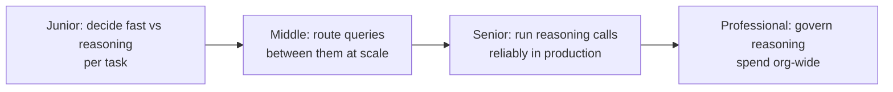
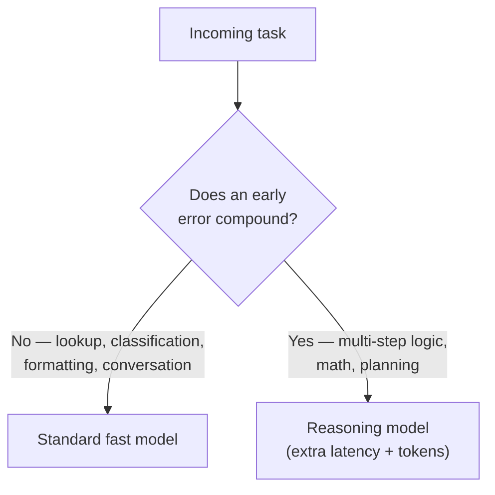

# Reasoning Models

> A reasoning model spends extra inference-time compute thinking before it answers — the skill is knowing when that trade is worth its latency and cost, and when it isn't.

Every reasoning model — OpenAI's o1 and o3, Claude's extended thinking mode, DeepSeek-R1 — makes the same trade: generate an internal chain of intermediate reasoning steps before the final answer, in exchange for materially better results on tasks where an early mistake invalidates everything after it. The skill this topic builds is not "how do I turn reasoning mode on" — it's "how do I decide when that trade is worth it, and how do I run it safely once I've decided yes."

## Levels

| Level | Guide | You are done when... |
|---|---|---|
| Junior | [junior.md](junior.md) | You can look at a task description and decide standard-model vs reasoning-model using the compounding-error rule, and explain what a reasoning model is actually doing differently. |
| Middle | [middle.md](middle.md) | You can design a routing layer that classifies incoming queries as easy or hard and sends each to the right model, and you can name what happens when the router is wrong in either direction. |
| Senior | [senior.md](senior.md) | You can run reasoning calls in production without freezing the UI, hanging a request past a budget, or letting a malformed input trigger runaway reasoning-token spend. |
| Professional | [professional.md](professional.md) | You can set and enforce an org policy for which product surfaces may default to reasoning mode, backed by a quality-per-dollar measurement, and you review that policy on a cadence as models evolve. |

## Practice rule

Before you reach for reasoning mode, name the specific step in the task where a small mistake would invalidate everything downstream of it. If you can't name that step, you don't need a reasoning model — you need a standard model and, possibly, a better prompt.

## Related

- [Choosing the Right Model](../choosing-the-right-model/README.md) — reasoning-vs-standard is a special case of this general model-selection decision, applied specifically to test-time compute.
- [Fine-Tuning](../fine-tuning/README.md) — when a standard model's raw capability, not its reasoning depth, is the actual gap, fine-tuning is the lever to check before reaching for reasoning mode.
- [Pretrained Models](../pretrained-models/README.md) — reasoning models add a further training stage (e.g., DeepSeek-R1's documented reinforcement-learning stage) on top of the pretrain → SFT → RLHF pipeline this topic assumes you already know.
- [AI Agent](../../ai-agent/README.md) — reasoning models are commonly used as the planning component in agentic systems that decompose a goal into steps.

