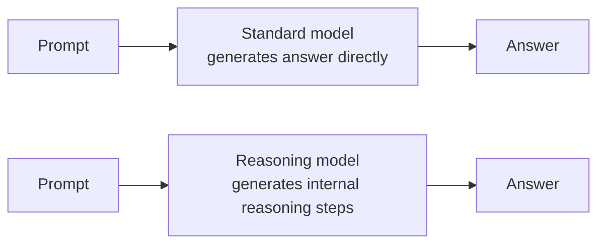

# Reasoning Models — Junior

<!-- level-focus -->
At junior level, focus on this question:

> Given a short task description, can you decide whether it needs a reasoning model or a standard fast model, using the compounding-error rule — and name what "reasoning mode" is actually doing differently?

Use the smallest realistic scenario that exposes the decision and its failure behavior.

---

## Core Concept 1 — What a Reasoning Model Actually Does Differently

A standard model generates its response token by token, straight from the prompt to the final answer. A **reasoning model** does something structurally different: before producing the final answer, it generates an internal sequence of intermediate reasoning steps — sometimes called a "chain of thought," "thinking," or a "reasoning trace" — and only then emits the answer the user sees. This extra generation is often called **test-time compute** or **inference-time compute**: instead of spending more compute once, at training time, the model spends more compute *per request*, at answer time.

Real, currently available examples of this pattern — know these names, they come up constantly in tooling and pricing docs:

- **OpenAI's o1 and o3 models** — reasoning models that generate an internal chain of reasoning before answering.
- **Claude's extended thinking mode** — a mode available on Claude models that allocates a "thinking token" budget the model spends working through the problem before writing its final response.
- **DeepSeek-R1** — a publicly released, open-weight reasoning model whose release also documented using reinforcement learning to train the model to reason, rather than relying only on supervised fine-tuning.

The trade you're making by turning this on: **better performance on tasks with multiple dependent steps, at the cost of materially higher latency and materially higher token usage.** Reasoning calls typically take several seconds to minutes and consume substantially more tokens than a standard response, because the internal reasoning steps are themselves tokens — generated, and usually billed, even though the user never reads most of them directly.

## Core Concept 2 — The Compounding-Error Decision Rule

You don't need a benchmark to decide whether a task needs a reasoning model. You need one question:

> **If the model makes a small error in an intermediate step, does that error invalidate the final answer?**

- **Yes → the task's steps compound.** A wrong number three steps into a scheduling calculation makes the final schedule wrong, not just "slightly off." A reasoning model's advantage is spending extra effort specifically on getting each intermediate step right before committing to the next one.
- **No → the task has no compounding steps.** Summarizing an email, classifying a support ticket into one of five categories, or reformatting a JSON blob doesn't chain dependent logical steps where an early mistake propagates. A standard fast model is already reliable at this, and the extra latency and cost of reasoning mode buys nothing — there's no compounding error for it to prevent.

This is the whole rule. Apply it before looking at anything else. Task difficulty in the abstract ("this seems hard") is not the same test as "does an early mistake here invalidate everything after it."

## Core Concept 3 — Working Through Examples

| Task | Does an early error compound? | Decision |
|---|---|---|
| "Summarize this 3-paragraph email in two sentences." | No — summarizing doesn't chain dependent logical steps | Standard model |
| "Classify this support ticket as billing, technical, or account." | No — a single classification judgment, not a step chain | Standard model |
| "Given these 6 employees' availability and 4 scheduling constraints, build a work schedule that satisfies all constraints." | Yes — assigning employee 3 wrong changes whether employees 4–6 can still satisfy the remaining constraints | Reasoning model |
| "Rewrite this paragraph in a more formal tone." | No — a style transform, not a dependent step chain | Standard model |
| "Trace this function's logic and determine what it returns when called with `n = -3`, given three nested conditional branches." | Yes — misreading one branch invalidates the whole trace | Reasoning model |
| "What's the capital of Australia?" | No — direct lookup, no steps at all | Standard model |
| "Given this proof sketch, verify each step is logically valid and identify the first invalid step, if any." | Yes — the entire task is checking a dependent chain of steps | Reasoning model |

The pattern: reasoning mode wins on multi-step logic, math, and planning tasks — anything where step N's correctness depends on step N-1 being correct. It doesn't win on lookups, straightforward classification, formatting, tone changes, or ordinary conversation, because there's no chain for the extra effort to protect.

## Core Concept 4 — Prompting a Reasoning Model Is Different

A common junior habit carried over from standard models is writing an elaborate "think step by step — first do X, then consider Y, then check Z" prompt to coax out careful reasoning. For a reasoning model, this is usually unnecessary and can be counterproductive: the model already performs internal step-by-step reasoning by design, before you ask it to. Layering your own explicit chain-of-thought scaffolding on top can be redundant at best, and at worst can box the model into following your possibly-incomplete decomposition instead of finding its own path through the problem.

The practical shift: for a reasoning model, spend your prompt-writing effort on stating the problem, the constraints, and the desired output format clearly — not on instructing it how to think through the problem step by step.

## Core Concept 5 — A Visible Trace Is a Diagnostic, Not Proof

Some reasoning models and modes expose some form of the internal reasoning trace to you. Treat it as a useful debugging signal — it can help you see roughly where a wrong answer went off track — but not as a guaranteed, complete, or fully faithful account of the actual computation that produced the answer. A model can display a reasoning path that looks sound while the final answer was shaped by something the displayed trace doesn't fully capture. Read a trace to build a hypothesis about what went wrong, not as a certified explanation you can cite as ground truth. This limit matters more at senior level, where a trace gets used operationally, but the habit of not over-trusting it starts here.

## Common Mistakes

1. **Reaching for a reasoning model "to be safe" on every non-trivial task.** If a task has no compounding-error chain, reasoning mode adds latency and cost for no quality gain — apply the rule from Core Concept 2 before defaulting to it.
2. **Writing "think step by step" prompts for a reasoning model.** The model already does this internally; an elaborate manual chain-of-thought prompt is often redundant and can even narrow the model's own reasoning path.
3. **Judging task difficulty by how hard it *sounds* rather than whether errors compound.** "Summarize this 40-page document" sounds hard but is not a compounding-step task; "convert these three numbers with this formula, then feed the result into this next formula" sounds simple but is.
4. **Treating a visible reasoning trace as proof the answer is correct.** A plausible-looking trace does not guarantee the final answer is right — verify the answer itself, don't just eyeball the trace and move on.
5. **Ignoring the latency cost in a conversational UI.** A reasoning call that takes tens of seconds inside a chat interface designed for near-instant replies produces a broken-feeling experience even when the answer is correct.

## Apply it

Classify each task below as "standard model" or "reasoning model," writing one sentence citing the compounding-error rule for each:

1. "Translate this product description into Spanish."
2. "Given these 5 delivery addresses and 2 trucks with different capacities, find a route assignment that minimizes total distance while respecting each truck's capacity."
3. "Is this customer review positive, negative, or neutral?"
4. "Walk through this Python function and determine what it returns when called with `n = -3`, given it has three nested conditional branches."
5. "Write a one-paragraph apology email for a shipping delay."
6. "Given this list of 8 tasks with dependencies (task B can't start until task A finishes), compute the minimum total completion time and which task should start first."

## Verify your work

- You can state the compounding-error rule from memory, in one sentence.
- For each task in "Apply it," you can name the specific step-dependency (or lack of one) that drove your decision — not just "this seems hard."
- You can name at least two real reasoning models or modes (from Core Concept 1) and one real task where invoking one would be wasteful.
- You can explain, without looking back at Core Concept 4, why an elaborate "think step by step" prompt is often redundant on a reasoning model.
- You can explain why a visible reasoning trace should change how much you trust an answer, but should never be the only thing you check.

## Review questions

- What does a reasoning model spend extra inference-time compute on, concretely, before producing its final answer?
- What is the compounding-error rule, and how do you apply it to a task you've never seen before?
- Why can an elaborate "think step by step" prompt be redundant or counterproductive on a reasoning model, when it's often helpful on a standard model?
- Why is a visible reasoning trace not sufficient evidence, by itself, that an answer is correct?
- Name two tasks from your own work where reasoning mode would be wasted effort, and explain why using the rule.
