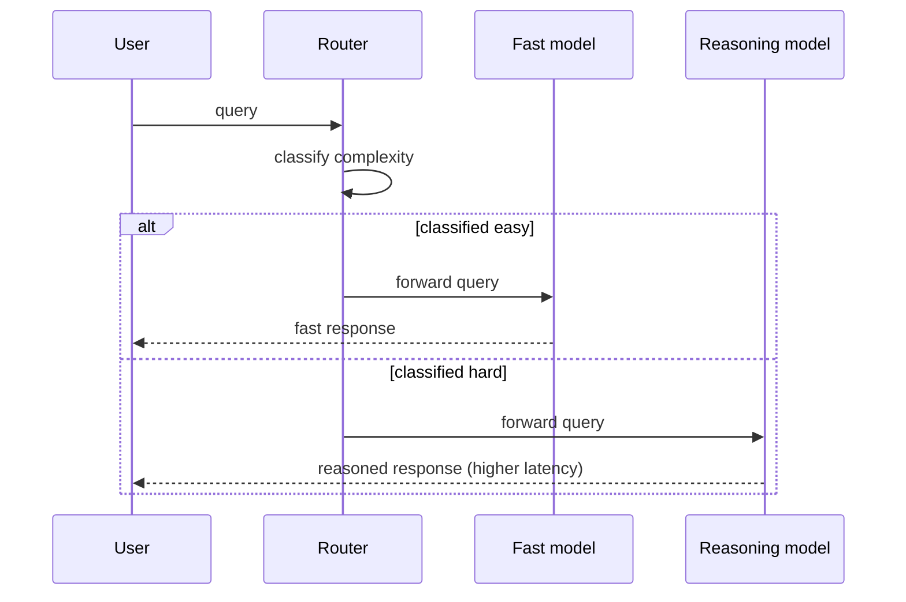

# Reasoning Models — Middle

<!-- level-focus -->
At middle level, focus on this question:

> Given a system that receives a mix of easy and hard queries at volume, how do you design a router that sends each query to a standard model or a reasoning model, and how do you handle it when the router gets a query wrong in either direction?

Use the smallest realistic scenario that exposes the decision and its failure behavior.

---

## Core Concept 1 — Why Routing Exists

At junior level, the decision is manual: you, a human, read one task and decide. At middle level, the same decision has to happen automatically, per request, at whatever volume the system receives — and getting it wrong in either direction has a cost. Send every query to a reasoning model and latency and token spend balloon on requests that never needed it. Send every query to a standard model and the subset of requests with real multi-step logic silently gets worse answers, often without the failure being obvious to anyone monitoring average latency or average cost. A **router** is the component that applies the compounding-error rule automatically, per request, instead of relying on a human to apply it once per task type.

## Core Concept 2 — Routing Signals

Three approaches, usable alone or combined, roughly in order of how much they cost to build:

| Signal | How it works | Where it's strong | Where it's weak |
|---|---|---|---|
| **Rule-based heuristics** | Pattern-match on the query: presence of multiple numeric constraints, words like "step by step," "prove," "schedule," "optimize," multi-clause requests with dependencies between clauses | Cheap, fast, fully explainable, easy to audit | Brittle — misses hard queries phrased in plain language, and can false-positive on casual use of trigger words |
| **Lightweight classifier** | A small, cheap model (or a fine-tuned classifier) trained on labeled examples of "easy" vs "hard" queries, run before the real model call | Learns patterns heuristics miss; improves with labeled data | Needs a labeled dataset and ongoing maintenance as query patterns drift |
| **Complexity signals** | Structural features of the query itself — length, number of distinct sub-asks identified by parsing, whether the request references external state that must be reasoned about jointly (e.g., "given constraints A, B, and C, find X") | Works without any labeled training data; composable with the other two | Correlates with difficulty, doesn't guarantee it — a long query can still be simple, a short one can still compound |

None of these is a complete solution alone. A practical router usually starts with rule-based heuristics (cheap to ship, easy to reason about), and layers a lightweight classifier on top once enough real traffic exists to label.

## Core Concept 3 — A Worked Router Architecture

A minimal routing layer sits between the client and the model calls, decides once per incoming query, and forwards:



The router is a single decision point, which matters for two reasons: it's the one place you instrument to measure routing accuracy (Core Concept 5), and it's the one place you change when the decision policy needs to evolve — you are not hunting through call sites scattered across the codebase for places that decided fast-vs-reasoning independently.

## Core Concept 4 — Handling Routing Mistakes

A router will get some requests wrong. The two failure directions have different symptoms and different fixes:

- **False negative — a hard query routed to the fast model.** The fast model returns a confident, fluent, wrong answer, with no compounding-step protection applied. This failure is dangerous specifically because it doesn't look like a failure — there's no error, no timeout, just a wrong answer delivered as if it were right. Mitigation: give the fast model a way to signal low confidence (e.g., a self-consistency check — ask it the same question twice with different phrasing or sampling and compare, or have it output a confidence estimate), and escalate low-confidence responses to the reasoning model automatically rather than trusting the router's classification alone.
- **False positive — an easy query routed to the reasoning model.** The cost here is purely wasted latency and tokens — the answer is still correct, just slower and more expensive than necessary. Mitigation: keep the complexity threshold conservative rather than paranoid, and monitor the fraction of reasoning-model responses that a fast model would have answered identically (sampled, checked after the fact) as a signal the threshold is too aggressive.

The two mistakes are not symmetric. A false negative silently damages answer quality; a false positive silently wastes money. Treat them as two separate metrics to track, not one blended "routing accuracy" number — a router can have high blended accuracy while still routing all its hard-query traffic incorrectly if hard queries are rare.

## Core Concept 5 — Verification at Two Levels

**Unit level — the router's classification function, in isolation:**

Build a labeled set of example queries (easy/hard, hand-labeled using the compounding-error rule) and run it through the router's classification logic directly, without calling any model:

```python
labeled_examples = [
    ("Summarize this email in two sentences.", "easy"),
    ("Given 6 employees and 4 constraints, build a schedule.", "hard"),
    ("What's the capital of Australia?", "easy"),
    ("Trace this function's logic for n = -3.", "hard"),
    # ...
]

correct = sum(
    1 for query, expected in labeled_examples
    if router.classify(query) == expected
)
accuracy = correct / len(labeled_examples)
```

Set a concrete bar before shipping — for example, the router must correctly classify every "hard" example in the labeled set (false negatives are the costlier mistake, so weight the bar toward catching them) while keeping false positives on "easy" examples below some tolerance you've decided is affordable.

**Integrated-flow level — the full pipeline, with real model calls:**

Send actual queries through the whole router → model → response path and confirm two distributions look as expected: latency (easy-routed requests should cluster near the fast model's typical latency, hard-routed requests near the reasoning model's) and, on a sampled basis, answer quality (spot-check a sample of hard-routed answers against a known-correct result, and a sample of easy-routed answers for anything that looks like it needed reasoning and didn't get it).

## Core Concept 6 — Under- and Over-Application Signals

- **Under-routing to reasoning** (threshold too conservative): watch for a pattern of user complaints, regenerate-clicks, or downstream error reports clustering on a specific query category — if that category correlates with multi-step tasks the router is classifying as easy, the threshold is missing real hard queries.
- **Over-routing to reasoning** (threshold too aggressive): watch reasoning-model traffic share and cost trend upward without a matching trend in the kind of queries coming in — if a growing fraction of reasoning-routed responses would have been identical from the fast model (per the sampled check in Core Concept 4), the threshold is catching queries it doesn't need to.

Neither signal shows up by staring at a single dashboard number; both require sampling actual routed traffic and checking it against the compounding-error rule, on a schedule, not just once at launch.

## Core Concept 7 — Incremental Adoption

Building a trained classifier from a cold start, with no labeled data and no production traffic pattern yet, is backwards. A workable order:

1. Ship a rule-based heuristic router first — cheap, explainable, and it gives you something to compare against later.
2. Run a lightweight classifier in *shadow mode*: it makes a classification decision for every query, but the rule-based router's decision is what actually routes traffic. Log where the two disagree.
3. Review the disagreements against the compounding-error rule by hand — this is where you build the labeled dataset the classifier actually needs, instead of guessing at labels upfront.
4. Once the classifier's shadow-mode decisions are trustworthy on the disagreement set, cut a small percentage of real traffic over to it and compare the two failure-direction metrics from Core Concept 4 before expanding further.

## Real-World Examples

- **A keyword heuristic misses a hard query phrased casually.** A router flags "hard" only on the presence of words like "calculate" or "optimize"; a user asks "can you help me figure out which of these three vendors is cheapest once you include the volume discounts and the shipping tiers" — a genuinely compounding multi-step calculation — and the heuristic routes it to the fast model because none of its trigger words appear. Adding a complexity signal (multiple numeric conditions referenced jointly) catches what the keyword list missed.
- **A conservative threshold quietly overspends.** A team sets the reasoning-mode threshold low "to be safe," and six months later notices reasoning-model cost is a large fraction of total inference spend; sampling routed traffic shows a majority of reasoning-routed queries are simple classification tasks that happened to contain the word "determine." Tightening the threshold and re-running the sampled check restores most of the fast-model traffic without any drop in answer quality.
- **A self-consistency check catches a false negative before the user does.** A fast model is asked a query the router misclassified as easy; asking it twice with slightly different phrasing produces two different final numbers. The disagreement itself is the signal — the request is automatically escalated to the reasoning model rather than returning either fast answer as-is.

## Common Mistakes

- **Treating routing accuracy as one blended number.** False negatives (quality risk) and false positives (cost risk) are different failures with different consequences — track them separately.
- **Building a trained classifier before any real traffic or labeled data exists.** Guessed labels produce a classifier that's confidently wrong in ways nobody can predict until it's already routing production traffic.
- **Never sampling routed traffic after launch.** A router that was well-calibrated at launch drifts as the mix of incoming queries changes; without periodic sampling, drift is invisible until cost or quality complaints surface it.
- **Routing purely on keyword presence.** Keyword heuristics miss hard queries phrased in plain language and false-positive on casual mentions of trigger words — treat them as one signal among several, not the whole router.
- **Cutting over to a new classifier at 100% traffic immediately.** Skips the shadow-mode comparison that would have caught systematic disagreements before they affected real users.

---

## Apply it

1. Write 10 example queries spanning your own domain, hand-labeled "easy" or "hard" using the compounding-error rule from the junior level.
2. Write a simple rule-based classification function (keyword or structural signal based) and run it against your 10 labeled examples; compute its accuracy.
3. For every example it got wrong, write one sentence explaining what signal it missed.
4. Design one mitigation for a false negative (a hard query classified easy) and one for a false positive (an easy query classified hard), specific to your router.
5. Sketch what you'd log at the router to support the two verification levels from Core Concept 5 — what would you need in your logs to compute a labeled-set accuracy score and to compare latency distributions per route?

## Verify your work

- Your rule-based classifier's accuracy against your labeled set is a real, computed number, not an estimate.
- You can name, separately, your false-negative rate and your false-positive rate on the labeled set — not one blended accuracy figure.
- You can describe a concrete mitigation for each failure direction that doesn't just mean "make the classifier better" — an escalation mechanism, a confidence check, a sampling process.
- You can explain the difference between the unit-level check (labeled set, no model calls) and the integrated-flow check (real queries, real model calls, real latency) and what each one catches that the other doesn't.
- You can state, in one sentence, why shadow mode is safer than an immediate full cutover when introducing a new routing signal.

## Review questions

- Why is treating routing accuracy as one blended number a worse design than tracking false negatives and false positives separately?
- What does a self-consistency check give you that a keyword-based router alone cannot?
- Why does building a trained classifier before any labeled data exists tend to produce a router that's confidently wrong?
- What specifically does the integrated-flow verification catch that the unit-level labeled-set check cannot?
- Why does routing threshold drift stay invisible without periodic sampling of live traffic?
