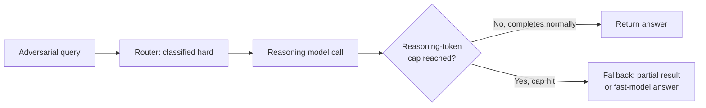

# Reasoning Models — Senior

<!-- level-focus -->
At senior level, focus on this question:

> What must a production system guarantee when a single reasoning call might take three seconds or three minutes — and what stops a malformed or adversarial input from turning that variance into an unbounded cost or an unbounded hang?

Use the smallest realistic scenario that exposes the decision and its failure behavior.

---

## Core Concept 1 — Reasoning Latency Is a Distribution, Not a Number

A middle-level router decides *whether* a query goes to a reasoning model. At senior level, the organizing question changes: once that call is made, what does the system guarantee about how it behaves? Reasoning calls typically take several seconds to minutes, and the same query type can land anywhere in that range depending on how much internal reasoning the model decides the problem needs. Designing as if reasoning latency were a fixed number — "the reasoning model takes about 8 seconds" — produces a system that behaves fine in testing and then hangs, times out, or bills for far more than expected the first time a request needs more internal reasoning than the typical case.

Three invariants a production system needs around this, each covered below:

| Invariant | What it rules out |
|---|---|
| The user is never left staring at a frozen interface during a multi-second-to-minutes call | A UI that shows nothing between "submit" and "response" reads as broken well before the actual answer would have arrived |
| No request holds system resources or a user's attention past a defined budget | An unbounded wait means one slow reasoning call can degrade the experience of everyone waiting behind it, or leave a request open indefinitely |
| No single request can consume unbounded reasoning-token cost | A malformed or adversarial input that pushes the model into excessive internal reasoning becomes an availability and cost incident, not just a slow response |

## Core Concept 2 — Streaming Partial Reasoning

The fix for "frozen interface" is to give the user something to look at while the model is still working, rather than a blank wait. Two variants, depending on what the model/API actually exposes:

- **Streaming the real reasoning trace.** Some reasoning modes (for example, Claude's extended thinking) can stream thinking-token content as it's generated, before the final answer. Surfacing a summarized or raw version of this gives the user genuine, real-time evidence that the system is working through the problem, not just a spinner.
- **Synthesized progress, when the trace isn't exposed or isn't appropriate to show.** Not every reasoning API exposes its internal trace, and even when it does, showing raw reasoning tokens to an end user is not always the right call (see Core Concept 4). A synthesized progress indicator — "analyzing constraints," "checking for conflicts," staged status text tied to what you know the task involves — gives the same anti-frozen benefit without depending on the model exposing anything or without exposing internal content you haven't decided is safe to show.

Either way, the design requirement is the same: the interface must communicate "still working, this is expected to take a while" within the first second or two, not leave the user to guess whether the request even went through.

## Core Concept 3 — Timeout Handling

A reasoning call needs an explicit, bounded budget — in time, in reasoning tokens, or both — and an explicit, decided answer to "what happens when that budget is hit," rather than an unbounded wait or a silent failure. The realistic options:

| Fallback on budget exceeded | When it fits |
|---|---|
| **Return the best partial result available** (if the API/architecture supports extracting a partial answer from an incomplete reasoning process) | The task can produce a usable-if-imperfect answer even from incomplete reasoning, and a partial answer beats no answer |
| **Fall back to a standard fast model's answer** | A slower, more-correct answer isn't reachable in time, but *a* reasonable answer from the fast model is better than a timeout error, and the task tolerates that quality trade in the rare case the budget is hit |
| **Switch to an async pattern** — accept the request, return immediately with a job reference, deliver the result via polling or a webhook when reasoning completes | The task's correct answer genuinely needs more time than any interactive budget can allow, and the product surface can tolerate a non-instant response (background job, notification, batch pipeline) |

Whichever fallback you choose, it must be a decision made in advance and tested, not the default behavior of whatever HTTP client or SDK you happen to be using timing out with a generic error. A request that just hangs until some infrastructure-layer timeout fires, with no product-level handling, is not a timeout policy — it's the absence of one.

## Core Concept 4 — Cost Caps Against Runaway Reasoning

A per-request reasoning-token budget is not optional at senior level — it is the mechanism that turns "the model decided this needed a lot of internal reasoning" from an open-ended cost into a bounded one. Two distinct risks this protects against:

- **Legitimately hard inputs that need more reasoning than typical.** Expected variance — bound it so the cost is predictable even in the tail, not so it never happens.
- **Malformed or adversarial inputs engineered to trigger excessive internal reasoning.** A prompt deliberately constructed to be ambiguous, self-referential, or to describe an unsatisfiable constraint set can push a reasoning model into unusually long internal reasoning with no proportionally useful output — this is functionally a cost-based denial-of-service vector if there's no ceiling.

Enforce the cap server-side, independent of the model's own tendency to stop reasoning on its own — a per-request maximum reasoning-token or time budget, and, for systems serving many users, a per-user or per-account rolling budget that catches a pattern of many individually-under-budget requests adding up to abnormal total spend. Treat a request that hits the cap as a defined failure mode with the fallback behavior from Core Concept 3, not as an exception to handle later.

## Core Concept 5 — The Reasoning Trace as Diagnostic, Not Proof, Applied Operationally

The junior-level caution — a visible trace isn't guaranteed to faithfully or completely describe the actual computation behind an answer — has direct operational consequences at this level:

- **Log traces for internal debugging and audit.** A trace is genuinely useful for an engineer investigating a wrong answer after the fact — it narrows down where to look.
- **Don't expose a raw, unreviewed trace to end users as an authoritative explanation**, particularly on a trust-sensitive or regulated product surface. A trace that reads as confident and coherent can still fail to fully explain the actual answer, and presenting it to a user as "here's why the system decided this" implies a guarantee the trace doesn't actually provide.
- **Don't build automated systems that trust the trace's stated reasoning as ground truth**, for example an automated approval pipeline that reads the trace to decide the answer is safe to act on. The trace is evidence to inform a human or a separate verification step, not a substitute for verifying the actual answer.

## Core Concept 6 — Cross-Component Scenario: An Adversarial Input Hits the Cap

A production system has the router from the middle level, streaming (Core Concept 2), a timeout fallback (Core Concept 3), and a per-request reasoning-token cap (Core Concept 4). A user submits a deliberately convoluted, self-contradictory scheduling request — every clause seems to reference every other clause, and several constraints are mutually unsatisfiable, whether by mistake or intentionally.

Without the cap, the reasoning model spends far more time and tokens than a normal hard query, still fails to produce a coherent answer to an unsatisfiable request, and the user is left staring at a stalled interface. With the cap, the request hits its budget, the system returns the defined fallback (for example, a fast-model-generated response noting the constraints appear contradictory), and the incident shows up as one capped request in monitoring rather than a stuck request an on-call engineer has to notice and kill manually.

## Core Concept 7 — Trade-offs Among Delivery Patterns

| Pattern | Fits when | Doesn't fit when |
|---|---|---|
| **Synchronous with timeout + fallback** | The budget is short enough (roughly single-digit seconds to low tens of seconds) that a user can stay engaged, and a fallback answer is acceptable on the rare miss | The correct answer genuinely needs a budget too long for a user to wait on, or a fallback isn't acceptable for this task |
| **Streaming with early exit** | The API exposes incremental output and the product surface benefits from showing progress; a user can choose to stop waiting once they see enough | The task's answer is only meaningful once fully complete — partial output would mislead rather than reassure |
| **Async job + polling/webhook** | The budget realistically needs minutes, and the product surface (background processing, batch, notification-driven UX) tolerates a non-instant response | The product surface is a live, synchronous conversation where a delayed, disconnected response breaks the interaction model |

Choosing among these is a property of the specific product surface's tolerance for delay and partial answers — not a single "best" pattern to apply everywhere reasoning mode is used.

## Core Concept 8 — Questions That Expose Weak Assumptions

- "What actually happens right now if a reasoning call exceeds our assumed typical latency by 5x? Have we tested it, or are we assuming the infrastructure's default timeout handles it gracefully?"
- "Is there a hard, server-enforced ceiling on reasoning-token spend per request, or does the system rely on the model choosing to stop on its own?"
- "If ten users simultaneously submit inputs each individually under budget but collectively adversarial, does anything catch that pattern, or only per-request limits?"
- "Do we show raw reasoning-trace content to end users anywhere, and if so, has anyone reviewed what happens when that trace looks confident but is wrong?"
- "What's our actual p95 and p99 reasoning-call latency, measured from production traffic — not the number we assumed when we designed the timeout?"

## Real-World Examples

- **A missing timeout turns one slow request into a stuck queue.** A system without an explicit reasoning-call budget relies on the HTTP client's default timeout; a legitimately complex query takes long enough to trip that default, the client-side error handling wasn't designed for this failure mode, and the request retries automatically, doubling the load on the reasoning model for the same user session. Adding an explicit, product-defined budget and fallback (Core Concept 3) replaces the accidental retry storm with one clean fallback response.
- **A streaming indicator turns a "broken-feeling" feature into a trusted one.** A reasoning-backed feature launches with no progress indicator; user feedback describes it as "hangs" and "feels broken" even though it eventually returns a correct answer. Adding a synthesized progress indicator (Core Concept 2) doesn't change the latency at all, and complaints about the feature "not working" drop sharply — the UX problem was frozen feedback, not actual speed.
- **A per-user rolling budget catches what a per-request cap misses.** A per-request reasoning-token cap is in place, but a pattern of many individually-under-cap requests from the same account still produces an unusual cost spike; a per-user rolling budget added on top catches the aggregate pattern the per-request cap was never designed to see.

## Common Mistakes

- **Treating reasoning latency as a fixed number when designing the UX or the timeout.** It's a distribution with real tail risk — design for the tail, not the median.
- **Relying on an infrastructure-layer default timeout instead of a product-level decision.** A generic timeout produces a generic error; a product-level fallback (Core Concept 3) produces a usable result.
- **Enforcing a reasoning-token cap only per-request, never per-user.** Misses the aggregate pattern of many individually-acceptable requests adding up to abnormal spend.
- **Exposing a raw reasoning trace to end users without deciding, deliberately, that it's safe to show.** A confident-looking trace can imply a guarantee about correctness that it doesn't provide.
- **Choosing one delivery pattern (sync, streaming, or async) and applying it to every reasoning-backed feature regardless of the product surface's actual tolerance for delay.**

---

## Apply it

1. Take a reasoning-backed call in a system you have access to (or design one for a hypothetical multi-step task) and determine: is there currently an explicit, product-level timeout and fallback, or does it rely on an infrastructure default?
2. Design the fallback behavior for when the timeout is hit — pick one of the three patterns from Core Concept 3 and justify the choice against this specific task's tolerance for a partial or lower-quality answer.
3. Design a per-request reasoning-token cap and a per-user rolling budget, and write down one adversarial input pattern each is meant to catch.
4. Decide, explicitly, whether this feature should show a real streamed reasoning trace, a synthesized progress indicator, or neither — and write one sentence justifying the choice against the trust-sensitivity of the product surface.
5. Run the five weak-assumption questions from Core Concept 8 against this feature and write down which one exposed the shakiest assumption.

## Verify your work

- You can state, from actual measurement (not assumption), your system's p95 and p99 reasoning-call latency.
- The timeout fallback is a defined, tested behavior — you can demonstrate what a request that hits the budget actually returns to the user.
- The reasoning-token cap is enforced server-side and does not depend on the model choosing to stop reasoning on its own.
- You can name a specific adversarial or malformed input that would test the cap, and what the system does when that input is submitted.
- If a reasoning trace is shown to end users anywhere, you can state the specific decision that made it safe to show, not just that it happens to be available from the API.

## Review questions

- Why is treating reasoning latency as a single expected number, rather than a distribution with a tail, a design mistake?
- What is the difference between an infrastructure-layer default timeout and a product-level timeout policy, and why does the difference matter to the user?
- Why does a per-request reasoning-token cap alone fail to catch every runaway-cost pattern, and what closes that gap?
- What risk does showing a raw, unreviewed reasoning trace to an end user introduce, even when the trace looks coherent?
- Given a task's tolerance for delay and partial answers, how do you choose among synchronous-with-fallback, streaming, and async delivery patterns?
