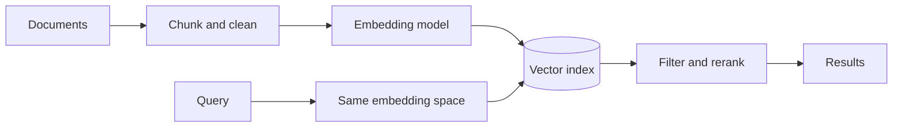

# Embeddings and Vector Databases

> Embeddings make similarity searchable; a reliable vector system also needs identity, metadata, filtering, evaluation, and lifecycle control.

## Levels

| Level | Guide | You are done when... |
|---|---|---|
| Junior | [junior.md](junior.md) | You can explain embeddings, similarity, and why vectors need metadata |
| Middle | [middle.md](middle.md) | You can build a small indexed semantic search flow and evaluate retrieval |
| Senior | [senior.md](senior.md) | You can choose hybrid search, ANN parameters, filters, and migration strategies |
| Professional | [professional.md](professional.md) | You can design and operate billion-scale vector retrieval with explicit recall and consistency trade-offs |

## Practice rule

Keep canonical source data outside the vector index. Embeddings are derived artifacts that must be reproducible and replaceable.

## Related

- [RAG](../rag/)
- [Feature Store](../feature-store/)
- [Agent Memory](../../ai-agents/07-agent-memory/)
