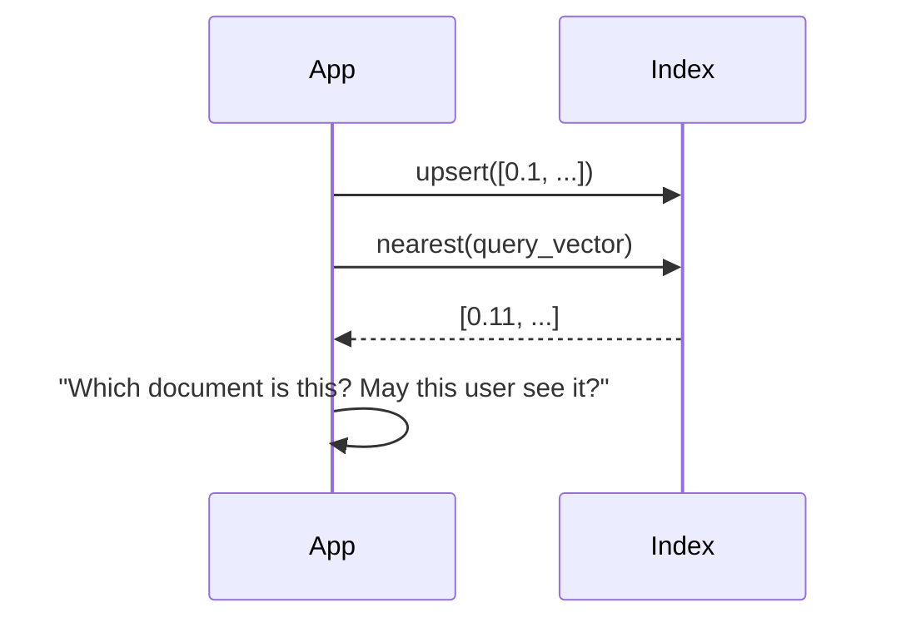

# Embeddings and Vector Databases - Junior

## What is an embedding?

An embedding model maps an input into a fixed-length numeric vector. Inputs
with related meaning often lie near one another in that model's vector space.
The coordinates are learned features, not human-readable labels.

Common uses include semantic search, recommendation candidate generation,
clustering, classification features, deduplication, and anomaly detection.
An embedding does not prove truth, quality, causation, or user intent.

## Similarity

Cosine similarity compares vector direction. Dot product also reflects
magnitude unless vectors are normalized. Euclidean distance measures geometric
distance. Use the metric expected by the embedding model and index.

```python
import numpy as np

def cosine(a: list[float], b: list[float]) -> float:
    av, bv = np.array(a), np.array(b)
    return float(av @ bv / (np.linalg.norm(av) * np.linalg.norm(bv)))
```

## The naive approach: store only vectors



Each vector needs a stable record ID, source/version, text or source reference,
tenant and access metadata, timestamps, embedding model/version, and content
hash. Metadata filters enforce scope; similarity alone must never cross an
authorization boundary.

## Vector database responsibilities

A vector database stores vectors and identifiers, builds exact or approximate
nearest-neighbor indexes, applies metadata filters, and returns ranked
candidates. Some general databases add vector indexes; specialized systems
offer vector-first scaling. Choose from measured requirements, not category.

## Test yourself

1. What does an embedding represent, and what does it not guarantee?
2. Why must the similarity metric match the model/index assumptions?
3. Which metadata must accompany a vector?
4. Why cannot similarity enforce authorization?

Continue to [`middle.md`](middle.md).
