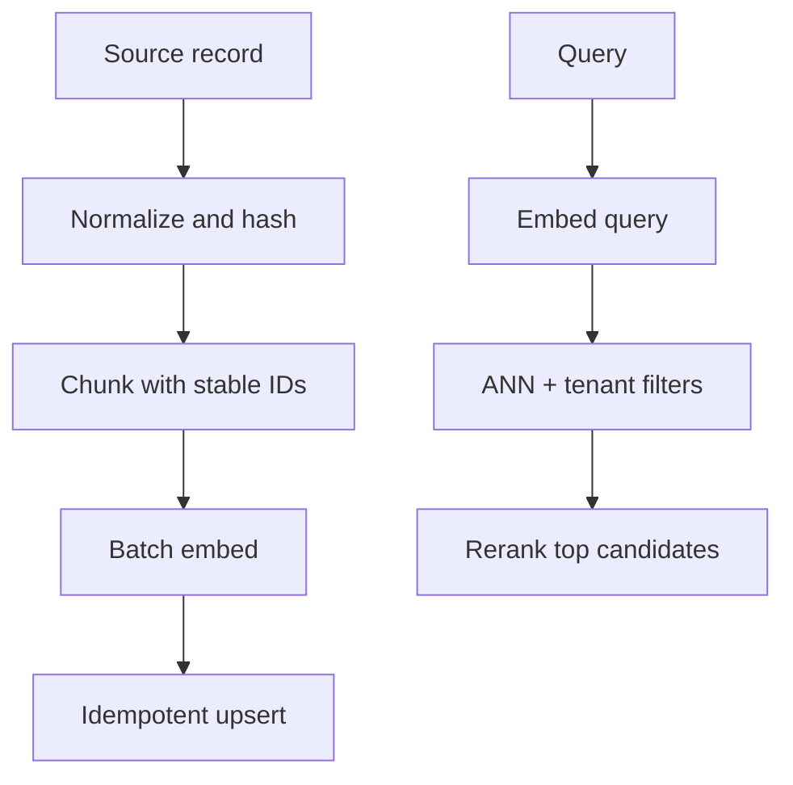

# Embeddings and Vector Databases - Middle

## Build separate ingestion and query paths

Ingestion validates and chunks canonical content, embeds deterministic inputs,
and idempotently upserts records. Querying embeds the request with a compatible
model, applies mandatory filters, retrieves candidates, and optionally reranks.



```python
def index_document(doc: Document) -> None:
    for chunk in chunker.split(doc.text):
        chunk_id = f"{doc.id}:{doc.version}:{chunk.position}"
        vector = embedder.embed(chunk.text)
        store.upsert(
            id=chunk_id,
            vector=vector,
            metadata={"tenant": doc.tenant, "source_id": doc.id,
                      "version": doc.version, "text": chunk.text},
        )

def search(tenant: str, query: str, k: int = 10):
    vector = embedder.embed_query(query)
    return store.search(vector, k=k, filter={"tenant": tenant})
```

## Retrieval decisions

| Decision | Trade-off |
|---|---|
| Chunk size | Context completeness versus precise matching |
| Top-k | Recall versus noise and downstream cost |
| Exact search | Perfect nearest neighbors but linear work |
| ANN search | Lower latency/scale at possible recall loss |
| Vector-only | Semantic matching but weak exact-name handling |
| Hybrid search | Better semantic + lexical coverage, more tuning |
| Reranking | Better ordering, added latency and cost |

Evaluate with queries and relevance judgments. Measure recall@k, precision@k,
MRR or nDCG as appropriate, plus latency and filter correctness. Inspect misses;
generation quality cannot repair evidence that retrieval never returned.

## Test yourself

1. Why use stable chunk IDs and idempotent upserts?
2. What failure does hybrid search address?
3. Which metric asks whether a relevant item appeared in the top k?
4. Why should tenant filtering be mandatory in the search function?

Continue to [`senior.md`](senior.md).
