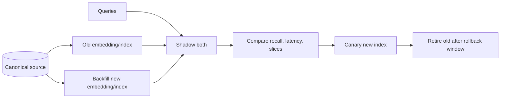

# Embeddings and Vector Databases - Senior

## Make retrieval quality an engineered contract

An ANN index exposes tuning knobs that exchange latency, memory, build cost,
and recall. Benchmark on your vector count, dimensions, filter distribution,
updates, hardware, and query workload rather than vendor defaults.

## Failure modes

| Failure | Symptom | Control |
|---|---|---|
| Embedding drift | New queries poorly match old vectors | Version spaces; never mix incompatible vectors |
| Filter after ANN | Sparse tenant gets few/no results | Filter-aware indexing or oversampling with measured recall |
| Hot tenant | One partition dominates CPU/memory | Partitioning and tenant-aware admission |
| Stale vector | Deleted/updated source still retrieved | Version checks, tombstones, reconciliation |
| Duplicate chunks | Results lack diversity | Content hashes, grouping, MMR/reranking |
| Long-tail names | Semantic search misses exact tokens | Hybrid lexical/vector retrieval |

## Safe embedding migration

Use separate versioned collections or columns, not in-place mixed vectors.
Dual-read a sample, backfill idempotently, verify counts and deletion state,
then canary. Keep canonical text and transformation versions so the index can
be rebuilt without recovering from another vector store.

## Security and privacy

Embeddings can leak membership or sensitive relationships and should be
classified like derived personal data. Enforce authorization before result
delivery, encrypt transport/storage, minimize payloads, and include indexes,
caches, replicas, and backups in deletion policy. Never rely on "vectors are
not readable" as a privacy control.

## Test yourself

1. Why can metadata filtering reduce ANN recall?
2. How do you prevent incompatible embeddings from mixing?
3. Design a rollback-safe migration to a new embedding model.
4. Why are embeddings still sensitive derived data?

Continue to [`professional.md`](professional.md).
