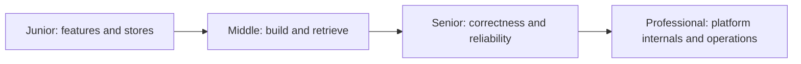
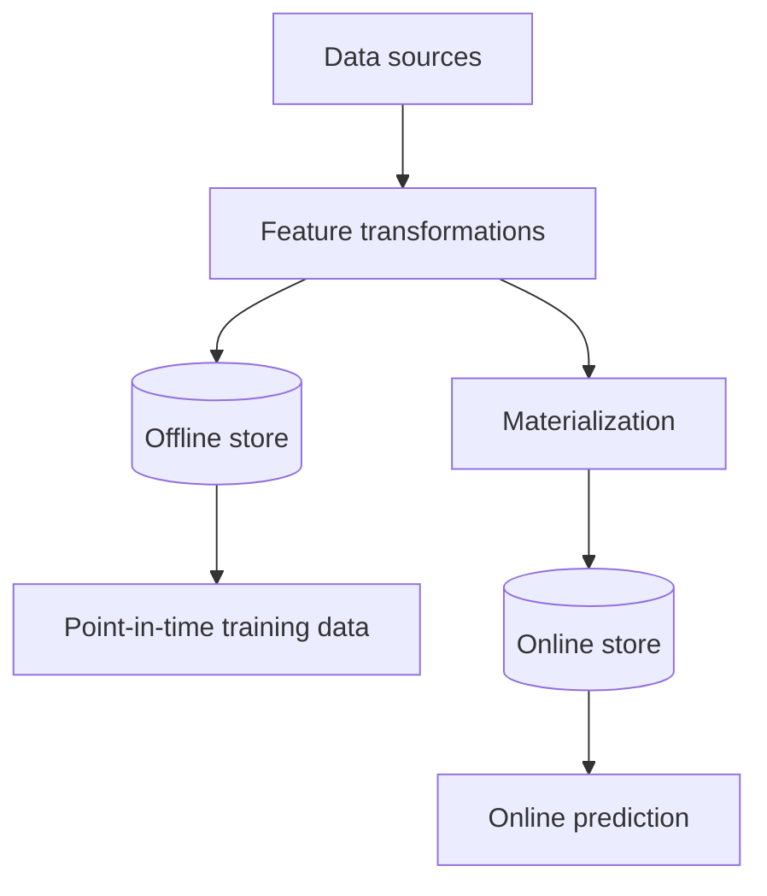

# Feature Store

> A feature store makes model inputs reproducible across training and serving while preserving event-time correctness, freshness, and ownership.

## Levels

| Level | Guide | You are done when... |
|---|---|---|
| Junior | [junior.md](junior.md) | You can explain features, offline/online stores, and training-serving skew |
| Middle | [middle.md](middle.md) | You can define entities/features and retrieve correct historical and online values |
| Senior | [senior.md](senior.md) | You can design point-in-time joins, materialization, freshness, backfills, and fallbacks |
| Professional | [professional.md](professional.md) | You can operate a multi-tenant feature platform with strong correctness and lifecycle controls |

## Practice rule

Define feature semantics and event-time behavior before choosing storage. A fast lookup of the wrong historical value is still incorrect.

## Related

- [Embeddings and Vector Databases](../embeddings-vector-db/)
- [RAG](../rag/)
- [Evaluation and Testing](../../ai-agents/10-evaluation-and-testing/)
