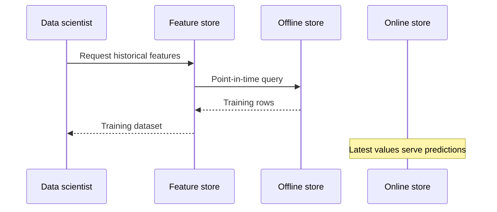

# Feature Store - Junior

## What is a feature?

A **feature** is a model input derived from data, such as `orders_last_30d`,
`account_age_days`, or `merchant_risk_score`. A feature definition includes
more than a column name: entity key, data type, transformation, event-time
meaning, valid range, owner, and version.

A **feature store** coordinates how those definitions are computed, stored,
discovered, and retrieved for model training and online predictions. It is not
just a database and it does not automatically improve model quality.

## Offline and online stores

- **Offline store**: keeps large historical feature data for training,
  backfills, and batch inference. Warehouses and lakehouses commonly fill this
  role.
- **Online store**: serves the latest feature values by entity key at low
  latency. Key-value databases are common.
- **Registry/catalog**: records feature schemas, entities, ownership, and
  transformation metadata.
- **Materialization**: moves computed values from source/offline pipelines into
  the online store.

## Why teams need one

Without shared definitions, training code may calculate a feature one way
while the production service calculates it another way. This is
**training-serving skew**. A model can test well offline and fail in production
because it receives different values.

The second major danger is **data leakage**: a training row accidentally uses
information that became available after the prediction time. Historical
retrieval must reproduce what the system could have known at that moment.

## When not to add a feature store

A small batch-only model with a few features in one warehouse may need only
versioned SQL, tests, and a clear dataset contract. Add a feature store when
reuse, online serving, point-in-time correctness, or governance justifies its
operational cost.

## Test yourself

1. What metadata belongs to a feature definition besides its name?
2. How do offline and online stores differ?
3. Explain training-serving skew with an example.
4. Why can a future value make an offline model score unrealistically well?

Continue to [`middle.md`](middle.md).
