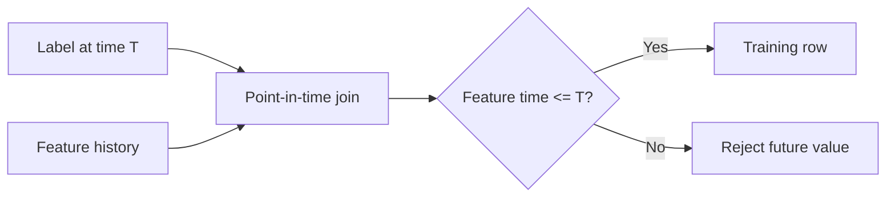

# Feature Store - Middle

## Define entities and features explicitly

An **entity** is the lookup key and semantic subject of a feature, such as
customer, product, or merchant. Keep feature definitions declarative and
versioned so training and serving can use the same contract.

```python
from datetime import timedelta
from feast import Entity, FeatureView, Field
from feast.types import Float32, Int64

customer = Entity(name="customer", join_keys=["customer_id"])

customer_activity = FeatureView(
    name="customer_activity_v1",
    entities=[customer],
    ttl=timedelta(days=2),
    schema=[
        Field(name="orders_30d", dtype=Int64),
        Field(name="refund_rate_30d", dtype=Float32),
    ],
    source=customer_activity_source,
)
```

The example is Feast-shaped, but the design principles transfer: stable entity
keys, explicit schemas, bounded staleness, source metadata, and immutable
versions for breaking semantic changes.

## Point-in-time historical retrieval

For each training observation `(entity_id, prediction_time)`, select the newest
feature event whose `event_time <= prediction_time`. Also account for when data
became available if ingestion delay matters.



## Online retrieval

Materialize the same feature definitions to an online store keyed by entity.
At prediction time, fetch a group of compatible features in one request,
validate freshness, and record feature/service versions with the prediction.

| Concern | Offline retrieval | Online retrieval |
|---|---|---|
| Primary goal | Historical correctness and throughput | Low tail latency and freshness |
| Typical access | Time-range scan and point-in-time join | Key lookup |
| Missing value | Imputation or row policy | Default, fallback, or reject |
| Main risk | Leakage | Stale or partially updated values |

## Test yourself

1. Why is an entity more than a database primary key?
2. State the point-in-time join condition.
3. When should ingestion time affect historical retrieval?
4. Which metadata makes an online prediction reproducible?

Continue to [`senior.md`](senior.md).
