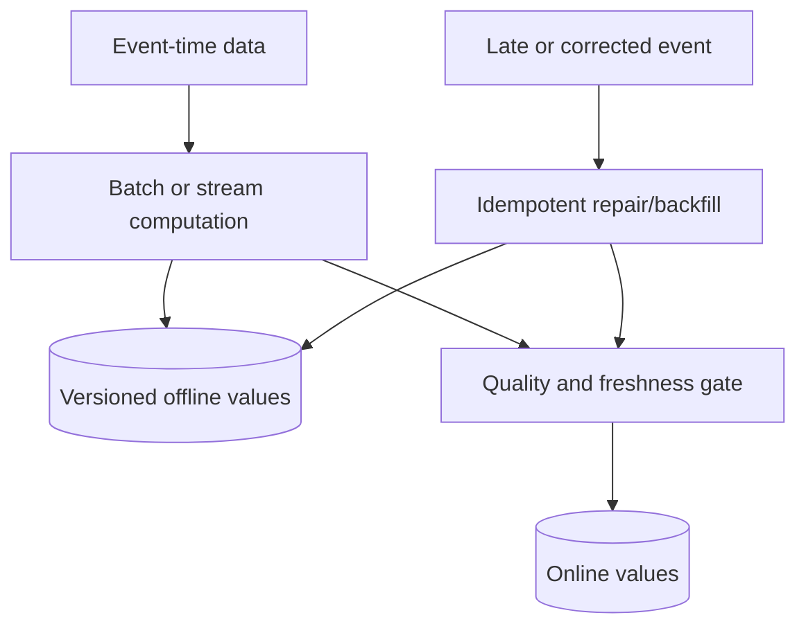

# Feature Store - Senior

## Design for temporal correctness

Track at least event time, processing/ingestion time, feature-definition
version, and source version. Late events may correct history after an initial
training dataset was built. Decide whether datasets are immutable snapshots or
reproducibly rebuildable from versioned sources.

## Failure modes and controls

| Failure | Consequence | Control |
|---|---|---|
| Future leakage | Inflated offline quality | Point-in-time tests and temporal fixtures |
| Partial materialization | Mixed feature versions | Atomic groups/version marker or fail closed |
| Late events | Offline/online disagreement | Watermarks, correction policy, reconciliation |
| Hot entity | Online partition overload | Key salting only when read semantics remain valid |
| Stale feature | Bad prediction with HTTP success | Per-feature freshness and prediction-time gate |
| Unsafe default | Silent systematic bias | Typed missingness policy evaluated with the model |

## Backfills and migrations

Use idempotent writes keyed by entity, event time, and feature version. Run
backfills in isolated capacity, checkpoint progress, and reconcile counts and
sample values. For a breaking definition change, write `v2` beside `v1`, build
training data, shadow online retrieval, compare model outcomes, canary, then
retire `v1` after the rollback window.

## Reliability boundaries

Set freshness and availability SLOs by feature group rather than applying one
number globally. A fraud model may reject a request when a critical feature is
stale; a recommendation model may tolerate an older value. The prediction
service, not the feature store alone, owns the final fallback decision.

Separate feature computation errors, materialization lag, online-store errors,
and client timeouts in telemetry. A single `feature_fetch_failed` metric hides
the recovery path.

## Test yourself

1. Which timestamps and versions are required for temporal debugging?
2. How can partial materialization mix incompatible values?
3. Design a rollback-safe feature-definition migration.
4. Why should freshness policy vary by feature group and model use case?

Continue to [`professional.md`](professional.md).
