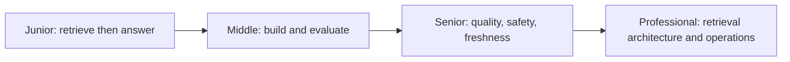
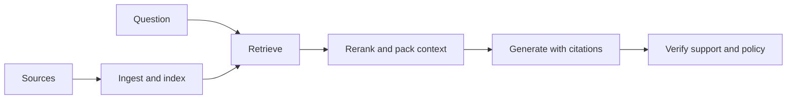

# Retrieval-Augmented Generation (RAG)

> RAG retrieves evidence at request time so generation can be current, private, attributable, and easier to update.

## Levels

| Level | Guide | You are done when... |
|---|---|---|
| Junior | [junior.md](junior.md) | You can explain when RAG helps and trace a basic grounded answer |
| Middle | [middle.md](middle.md) | You can implement ingestion, retrieval, context assembly, citations, and evaluation |
| Senior | [senior.md](senior.md) | You can diagnose retrieval/generation failures and design secure, fresh, hybrid RAG |
| Professional | [professional.md](professional.md) | You can operate multi-stage retrieval with measurable recall, consistency, and cost |

## Practice rule

Evaluate retrieval before generation. A fluent model cannot cite evidence that never entered the candidate set.

## Related

- [Embeddings and Vector Databases](../embeddings-vector-db/)
- [Feature Store](../feature-store/)
- [Evaluation and Testing](../../ai-agents/evaluation-and-testing/)
- [Security and Ethics](../../ai-agents/security-ethics/)
