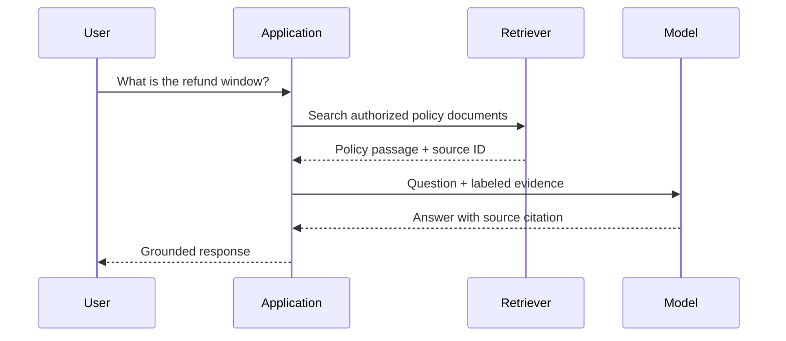

# Retrieval-Augmented Generation - Junior

## Why retrieve before generating?

A pre-trained model may lack private documents, recent updates, or exact
product policy. RAG searches an external knowledge source at request time and
places relevant passages in the model context.

RAG is useful when knowledge changes, citations matter, access differs by
user, or the corpus is too large for every prompt. It does not automatically
make answers correct: retrieval can miss evidence, return stale text, or
include hostile instructions, and the model can ignore or distort it.

## Basic flow

## Ingestion and query stages

1. Load and normalize source documents.
2. Split them into retrievable chunks with source metadata.
3. Build lexical and/or vector indexes.
4. Search with mandatory access filters.
5. Pack the strongest evidence within a token budget.
6. Ask the model to answer from evidence and cite sources.
7. Validate citations and handle insufficient evidence truthfully.

## RAG versus fine-tuning

RAG supplies knowledge at inference time and can reflect a source update after
reindexing. Fine-tuning changes model behavior or style through parameter
updates. Fine-tuning is not a dependable database for frequently changing
facts; RAG does not teach a model a fundamentally new output behavior. Systems
may use both for different reasons.

## Test yourself

1. Which problems does RAG address better than a model-only prompt?
2. Why can RAG still produce an unsupported answer?
3. What metadata must a chunk preserve for citation and authorization?
4. When is fine-tuning more appropriate than RAG?

Continue to [`middle.md`](middle.md).
