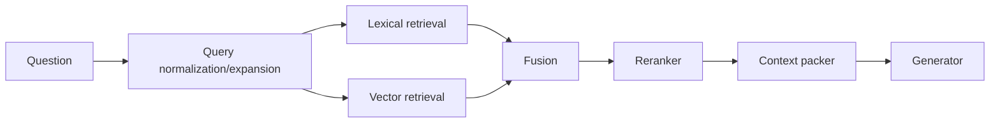

# Retrieval-Augmented Generation - Middle

## Implement a transparent pipeline

Start with direct SDK/library components whose inputs and outputs you can
inspect. Frameworks such as LlamaIndex, LangChain, or Haystack can compose the
same stages, but do not replace retrieval evaluation or access control.

```python
def answer(user: User, question: str) -> Answer:
    lexical = bm25.search(question, filter={"groups": user.groups}, k=30)
    semantic = vectors.search(embed_query(question),
                              filter={"groups": user.groups}, k=30)
    candidates = reciprocal_rank_fusion(lexical, semantic)
    passages = reranker.rank(question, candidates)[:8]
    context = pack_with_citations(passages, token_budget=4000)
    output = model.generate(question=question, evidence=context)
    return validate_citations(output, passages)
```

## Retrieval layers



| Stage | Useful measure |
|---|---|
| Ingestion | Parse failures, freshness lag, chunk coverage |
| Candidate retrieval | Recall@k by query slice |
| Ranking | MRR/nDCG, relevant rank, latency |
| Context packing | Evidence coverage, duplication, token use |
| Generation | Citation correctness, faithfulness, answer usefulness |
| End to end | Task success, safety, latency, successful-task cost |

Use lexical search for exact names, codes, and rare terms; vector search for
semantic paraphrases. Fusion often outperforms either alone. Rerank a modest
candidate set with a stronger model rather than generating from raw top-k.

Citation validation should confirm that cited IDs were supplied and that the
claim is supported, not merely that brackets exist. Return "insufficient
evidence" when authorized sources do not answer the question.

## Test yourself

1. What does candidate recall@k isolate from generation quality?
2. Why combine lexical and semantic retrieval?
3. Which two properties must citation validation check?
4. What should happen when no authorized evidence answers the question?

Continue to [`senior.md`](senior.md).
