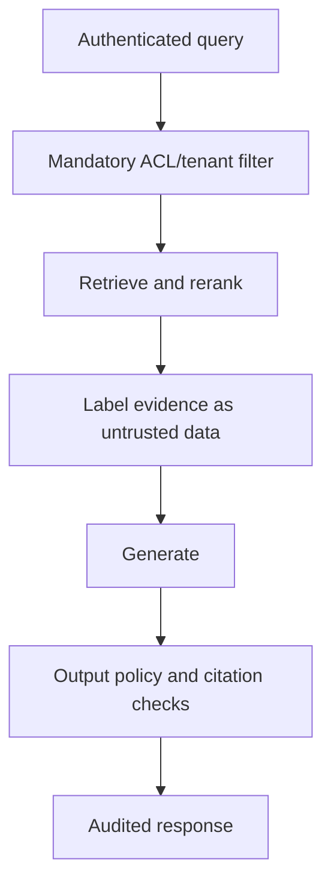

# Retrieval-Augmented Generation - Senior

## Diagnose the first failing stage

Do not tune prompts when the correct document was never parsed or retrieved.
Record source/version, query transformations, candidates and scores, filters,
reranking, packed context, output claims, and citations for sampled traces.

## Failure map

| Failure | Evidence | Control |
|---|---|---|
| Missing source | Ingestion inventory gap | Connectors, parse checks, reconciliation |
| Poor chunks | Relevant facts split or buried | Structure-aware chunking and overlap tests |
| Retrieval miss | Relevant chunk absent from candidates | Hybrid search, expansion, model/index tuning |
| Ranking miss | Relevant candidate ranked too low | Reranker and hard-negative evaluation |
| Context loss | Relevant chunk retrieved but not packed | Diversity and token-aware packing |
| Generation drift | Evidence present but claim unsupported | Strong grounding contract and claim checks |

## Secure and fresh retrieval

Apply authorization during retrieval, not after generation. Indirect prompt
injection can live inside indexed documents; separate evidence from
instructions and ensure retrieved text cannot grant tools or alter policy.
Treat source authority as a ranking feature: an official current policy should
beat a similar obsolete comment.

Use versioned change events and tombstones to keep indexes synchronized. Show
source dates where freshness matters. During index lag, readers should reject
known stale/tombstoned versions. Verify deletions across lexical/vector indexes,
caches, replicas, and generated artifacts.

Evaluate adversarial queries, access boundaries, conflicting sources,
unanswerable questions, multilingual content, and long-tail entities. Report
retrieval and generation slices separately so improvements are attributable.

## Test yourself

1. How do you identify whether chunking or ranking caused a miss?
2. Why must authorization happen before generation?
3. How should two conflicting sources be prioritized?
4. Design a test for indirect injection in retrieved documents.

Continue to [`professional.md`](professional.md).
