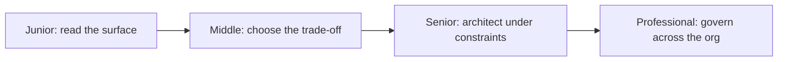

# LLM Fundamentals

> Understand what actually happens between a prompt and a response — architecture, tokens, context, sampling, and the engineering discipline of controlling what a model sees — well enough to make cost, latency, and quality trade-offs instead of guessing at them.

Every topic in this section climbs the same four levels. Junior means you can read a model card, a token count, or a sampling parameter and explain what it does. Middle means you can pick between competing options for a concrete product constraint. Senior means you can diagnose and design around failure in a system already in production. Professional means you can set standards that keep multiple teams and multiple model vendors from drifting into incompatible assumptions.

## Topics

| # | Topic | What you'll learn |
|---|-------|-------------------|
| 01 | [Transformer Architecture](transformer-architecture/junior.md) | What self-attention, KV cache, and decoder-only design mean for latency, cost, and context length. |
| 02 | [Tokenization](tokenization/junior.md) | Why token count isn't word count, how it differs by vendor, and how it drives cost and truncation bugs. |
| 03 | [Context Window](context-window/junior.md) | What actually fills the window, why effective context is smaller than advertised, and how to manage it. |
| 04 | [Decoding and Sampling](decoding-and-sampling/junior.md) | Temperature, top-p, top-k, and constrained decoding — and when determinism matters more than creativity. |
| 05 | [Prompt Engineering](prompt-engineering/junior.md) | Structuring, testing, and versioning prompts as the code they functionally are. |
| 06 | [Context Engineering](context-engineering/junior.md) | Deciding what information enters the context window, from where, in what order, under what budget. |
| 07 | [AI Model](ai-model/README.md) | Pretrained models, choosing the right model, fine-tuning, and reasoning models — applying fundamentals to real model selection and adaptation decisions. |

## How to use this section

Each topic has four depth levels — **junior → middle → senior → professional**. Start at your level and climb; each level assumes the one before it. Topics 1–6 are the mechanical and applied foundations: Transformer Architecture and Tokenization explain why the model behaves the way it does at the level of tokens and attention. Context Window and Decoding and Sampling build directly on that foundation: the context window is measured in the tokens Tokenization defines, and decoding operates on the logits Transformer Architecture produces. Prompt Engineering and Context Engineering are the applied discipline built on top of all four — prompt engineering shapes what you ask the model, context engineering shapes what the model can see when you ask it. Topic 7, AI Model, takes all of those fundamentals and applies them to the practical question of which model to use and how to adapt it to your constraints. Treat prompt, context, model choice, and fine-tuning decisions with the same rigor as code changes: they are versioned, tested, and reviewed the same way.

## Practice rule

Before changing a prompt, a sampling parameter, or what goes into the context window, name the specific failure you're trying to fix and the metric that would tell you if it worked. A change you can't measure is a guess wearing an engineering costume.

---

*Part of [Engineer Knowledge](../../README.md) → [AI Engineering](../README.md).*
