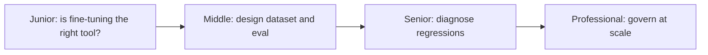
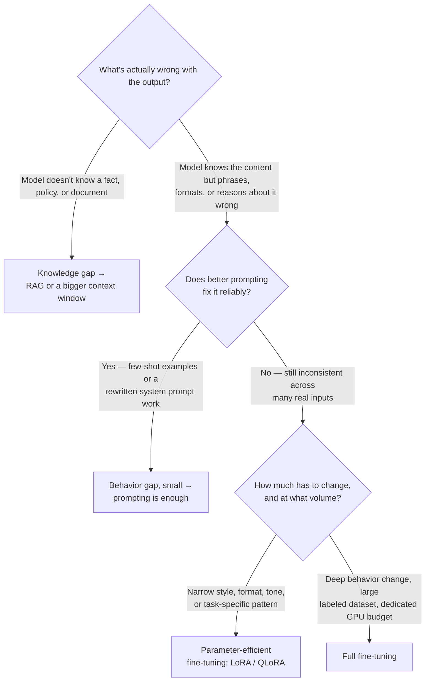

# Fine-Tuning

> Fine-tuning changes how a model behaves, not what it knows — reach for it only after prompting and retrieval have failed to fix a behavior problem.

## The core decision: knowledge gap or behavior gap?

Before touching a training script, classify the problem. This single question eliminates most fine-tuning projects before they start:

Fine-tuning cannot teach a model facts it was never shown any better than cramming a textbook teaches a fact you skim once — a few gradient updates on a handful of examples nudge phrasing and formatting, not the model's underlying knowledge. If the complaint is "it doesn't know about our product catalog," the fix is retrieval, not training. If the complaint is "it knows the answer but won't format it as our support macros require, no matter how the prompt is worded," fine-tuning is a legitimate candidate.

## Levels

| Level | Guide | You are done when... |
|---|---|---|
| Junior | [junior.md](junior.md) | You can run a specific feature request through the knowledge-vs-behavior checklist and justify a fine-tune / prompt / RAG decision |
| Middle | [middle.md](middle.md) | You can design a labeled dataset schema, split, and evaluation plan for a narrow fine-tuning task |
| Senior | [senior.md](senior.md) | You can distinguish overfitting, catastrophic forgetting, and distribution shift in a production regression using evidence, and design the matching fix |
| Professional | [professional.md](professional.md) | You can operate an org-wide fine-tuning pipeline with data provenance controls, a drift-driven retraining cadence, and a rollback strategy |

## Practice rule

Never start a fine-tuning project by writing a training script. Start by writing down, in one sentence, what the base model gets wrong today and why prompting and retrieval cannot fix it. If you cannot write that sentence, you are not ready to fine-tune — you are guessing.

## Related

- [Choosing the Right Model](../choosing-the-right-model/README.md) — the model bake-off that precedes fine-tuning; fine-tuning is what you reach for when no off-the-shelf model clears the bar
- [Pretrained Models](../pretrained-models/README.md) — fine-tuning starts from a pretrained, often already instruct-tuned, base model
- [AI Evaluation](../../../ai-evaluation/README.md) — the evaluation methodology needed to detect a fine-tuned model's regressions before and after deployment
