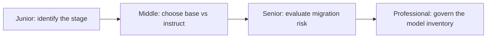
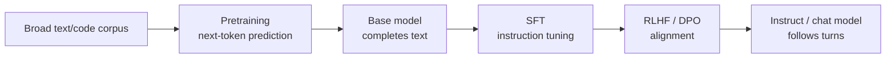

# Pretrained Models

> A model card tells you what a model *is* — base or instruct, RLHF'd or not, open-weight or API-only — and that answer determines how you must prompt it, deploy it, and plan for its retirement.

Every model you call went through some prefix of the same pipeline. Knowing where a specific model sits in it — and why — is the foundation everything else in AI Model building blocks on top of.

Pretraining alone produces a **base model**: a very capable but undirected next-token predictor. Everything after it — SFT, then RLHF or DPO — is what turns that raw capability into a model that reliably answers a question instead of just continuing the text that contains it.

## Levels

| Level | Guide | You are done when... |
|---|---|---|
| Junior | [junior.md](junior.md) | You can read a model card or API doc and state whether a model is base or instruct/chat, whether it went through RLHF/DPO, and what that implies for how you prompt it. |
| Middle | [middle.md](middle.md) | You can choose between a base and an instruct/chat model for a specific feature, using a decision method, and predict the concrete failure mode of the wrong choice. |
| Senior | [senior.md](senior.md) | You can design an evaluation and staged-rollout process for migrating a production system to a new model version before you flip the switch. |
| Professional | [professional.md](professional.md) | You can run an org-wide model inventory and lifecycle policy that survives a vendor's deprecation notice without an emergency migration. |

## Practice rule

Before you trust a model's output shape, confirm which pipeline stage produced it. A base model completes; an instruct model answers; a model that went through RLHF or DPO has opinions about what it will and won't say. Treating any of these as interchangeable is how a prompt that worked yesterday silently breaks today.

## Related

- [Choosing the Right Model](../choosing-the-right-model/README.md) — once you know what a model *is*, this is how you pick one for a specific job.
- [Fine-Tuning](../fine-tuning/README.md) — adapting a pretrained model further, beyond what its provider's SFT/RLHF pass already did.
- [Reasoning Models](../reasoning-models/README.md) — models with an additional RL stage optimized specifically for multi-step reasoning, not just preference alignment.
- [LLM Fundamentals](../../README.md) — the mechanical layer underneath all of this: tokens, context windows, and decoding.
