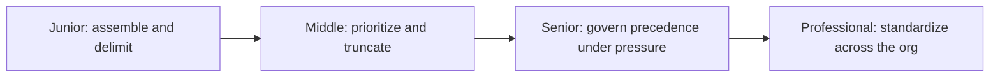
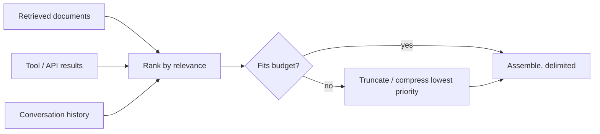

# Context Engineering

> Context engineering decides what information — retrieved documents, tool outputs, memory, examples — enters the context window, from where, in what order, and under what budget; prompt engineering decides how the instructions asking about that information are phrased.

The second diagram is the whole discipline in miniature: several structurally different sources compete for one fixed budget, something has to rank them, and something has to decide what gets cut when they don't all fit. Every level below is a deeper answer to that same problem.

## Levels

| Level | Guide | You are done when... |
|---|---|---|
| Junior | [junior.md](junior.md) | You can assemble a context window from a system prompt, one retrieved document, and a user query — correctly ordered and clearly delimited. |
| Middle | [middle.md](middle.md) | You can build a context assembly pipeline that ranks sources by relevance and truncates to a token budget, verifying the highest-relevance content survives. |
| Senior | [senior.md](senior.md) | You can design an explicit precedence policy for an agent pulling from RAG, tools, and history at once, and trace exactly what a production call saw. |
| Professional | [professional.md](professional.md) | You can run a shared context-assembly library and standardized observability across teams, with governance and measured outcomes. |

## Practice rule

Before adding a source to a context window, name its priority relative to every other source already competing for the budget, and how it's delimited from them. A context that fits the token limit but blurs "instruction" into "document" into "question" produces a confidently wrong answer, not an error you can catch in CI.

## Related

- [Context Window](../context-window/README.md) — context engineering decides what fills the window; context window covers the window's mechanics, size, and limits.
- [Prompt Engineering](../prompt-engineering/README.md) — the two disciplines are usually practiced together: prompt engineering shapes what you ask, context engineering shapes what the model can see when you ask it.
- [Tokenization](../tokenization/README.md) — every source you assemble is measured and budgeted in tokens, not words.

A dedicated RAG domain will cover retrieval and chunking strategy in depth — context engineering assumes chunks already exist and decides which of them earn a place in the window. A dedicated AI Agent domain will cover multi-step agent memory and planning, which is where context assembly under live tool calls matters most. A dedicated AI Evaluation domain will cover how to measure whether a given context shape actually produces better answers, rather than just fitting the budget.
