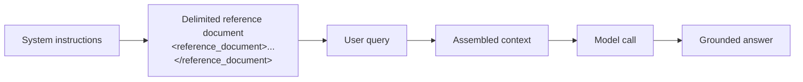

# Context Engineering — Junior

<!-- level-focus -->
At junior level, focus on this question:

> Given a system prompt, one retrieved reference document, and a user's question, can you assemble a single context window that keeps the three clearly separated, in an order the model can rely on — and explain why concatenating them into one blob is a real risk, not a style preference?

Use the smallest realistic scenario that exposes the decision and its failure behavior.

---

## Core Concept 1 — Context Engineering vs. Prompt Engineering, in One Sentence

The two terms get used interchangeably, and that habit hides a real distinction:

- **Prompt engineering** is about *how you phrase the instructions* — word choice, examples, output format requests, the text you'd write if there were nothing else in the call.
- **Context engineering** is about *what information you assemble around those instructions* — which documents, which prior turns, which tool results, from where, in what order, under what token budget.

A well-phrased prompt pointed at the wrong or badly-organized context still produces a wrong answer. A perfectly relevant set of retrieved documents, dumped into the window with no structure, can produce a wrong answer too — not because the instructions were unclear, but because the model couldn't tell which part of the input was the instruction, which part was reference material, and which part was the actual question. Context engineering is the discipline of getting that second failure mode under control.

## Core Concept 2 — Why Ordering and Delimiting Matter

A large language model receives one continuous sequence of tokens per call. It has no built-in notion of "this part is a system instruction" and "this part is a document" unless something in the text itself marks that boundary — either explicit formatting, or the conventions the model was trained to expect (most providers train and document their models to recognize a system role and structural markers like headers or tags as separating distinct kinds of content).

Concatenate three things with no separation:

```
Answer questions only using the provided information. Be concise.
Refund window is 30 days from purchase, no exceptions for sale items.
What's your refund policy on a discounted item?
```

A model reading this has to guess where the instruction ends, where the reference text ends, and where the question begins. Two concrete failure modes follow from that ambiguity:

1. **The model treats part of the document as an instruction.** If a retrieved document happens to contain a sentence like "always recommend the premium plan," an undelimited concatenation gives the model no signal that this is *content to reference*, not *a rule to follow*.
2. **The model answers a different question than the one asked**, because without a clear boundary it can lose track of which trailing sentence is the actual user query versus more reference text — especially once the reference document is long.

Neither failure shows up as an error. The call succeeds, tokens are within budget, and the answer is simply wrong or subtly off — which makes ordering and delimiting a correctness problem, not a formatting nicety.

## Core Concept 3 — A Delimiting Convention That Works

The fix is to wrap each distinct source in an explicit, structural marker so the boundary is unambiguous in the raw text itself, not implied. Two conventions cover almost every case:

**XML-style tags**, one pair per source:

```xml
<system_instructions>
Answer questions only using the information inside <reference_document>.
If the document doesn't contain the answer, say so — do not guess.
</system_instructions>

<reference_document>
Refund window is 30 days from purchase, no exceptions for sale items.
</reference_document>

<user_question>
What's your refund policy on a discounted item?
</user_question>
```

**Markdown headers**, one heading per source:

```markdown
## Instructions
Answer questions only using the information under Reference Document.
If the document doesn't contain the answer, say so — do not guess.

## Reference Document
Refund window is 30 days from purchase, no exceptions for sale items.

## User Question
What's your refund policy on a discounted item?
```

Both work because they give every source a distinct, named boundary — the model can attend to "everything inside `<reference_document>`" as a unit, separate from "everything inside `<system_instructions>`." XML tags tend to be the more robust choice when a source's own content might itself contain Markdown headers (a retrieved document that's already formatted with `##` sections can be confused with your delimiter if you also use `##` to mark it off). Pick one convention and use it consistently across a project — mixing both in the same context window reintroduces the ambiguity you're trying to remove.

## Core Concept 4 — Ordering Logic: Instructions First, Reference Material Next, Question Last

Delimiting tells the model *where* one source ends and another begins. Ordering tells it *what matters when*. The default that works for the large majority of single-document Q&A cases:

1. **System instructions first** — the model needs to know the rules of the interaction (what it's allowed to do, what format to answer in) before it reads anything it's going to apply those rules to.
2. **Reference material next** — the document(s) the answer should be grounded in, delimited as its own block.
3. **User's question last** — placed immediately before generation begins, so it's the most recent thing the model has read when it starts producing tokens.

Putting the question last isn't arbitrary: it's the last input token sequence the model attends to before generating the first output token, which keeps the actual task freshest and most salient at the exact moment it matters most. A context that buries the question above a long reference document risks the question getting "diluted" by everything read after it before generation starts.

## Core Concept 5 — Worked Example: Assembling a Single-Document Q&A Context

Scenario: a small internal support tool answers employee questions using one HR policy document. The retrieved document (via a simple keyword or vector search — a dedicated RAG domain will cover retrieval strategy) is about 500 words. Here is the actual assembled context sent to the model:

```xml
<system_instructions>
You are an internal HR assistant. Answer the user's question using only the
information inside <reference_document>. If the document does not contain
the answer, respond exactly with: "I don't have that information in the
policy document." Do not speculate or use outside knowledge.
</system_instructions>

<reference_document>
Paid Time Off Policy (effective 2026)

Full-time employees accrue 1.5 days of paid time off (PTO) per month worked,
up to a maximum of 18 days per calendar year. PTO accrual begins on the
employee's start date; there is no waiting period.

Unused PTO carries over into the next calendar year up to a cap of 5 days.
Any balance above 5 days on December 31 is forfeited unless local law
requires otherwise.

Employees must request PTO through the HR portal at least 3 business days
in advance for absences of 1-2 days, and at least 10 business days in
advance for absences of 3 or more consecutive days. Manager approval is
required before the absence is confirmed.

Sick leave is tracked separately from PTO and is not subject to the same
advance-notice requirement.

Part-time employees accrue PTO on a pro-rated basis according to their
contracted hours, calculated by HR at the start of each calendar year.

[... remainder of the ~500-word document ...]
</reference_document>

<user_question>
How far in advance do I need to request a 4-day vacation?
</user_question>
```

The model reads this as three unambiguous blocks and can correctly locate the answer ("at least 10 business days in advance, since 4 days is 3 or more consecutive days") without confusing the document's content for an instruction, and without losing track of which sentence was the actual question.



## Common Mistakes

| Mistake | Why it hurts | Fix |
|---|---|---|
| Concatenating instructions, document, and question with no markers | The model has to guess boundaries; content can be mistaken for instructions | Wrap each source in an explicit tag or header, per Core Concept 3 |
| Putting the user's question before the reference document | The question is no longer the freshest thing the model reads before generating | Order instructions → reference material → question, per Core Concept 4 |
| Mixing delimiting styles (some sources in XML tags, others in Markdown headers, others in nothing) | Reintroduces ambiguity about which convention marks a real boundary | Pick one convention per project and apply it to every source, every call |
| Using a delimiter style that collides with the source's own content (Markdown headers around a document that already contains `##` headings) | The model can't tell your delimiter from the document's own formatting | Use XML-style tags for documents that may contain their own Markdown structure |
| Treating "it fits under the token limit" as "it's assembled correctly" | A context can be well within budget and still be an undifferentiated, ambiguous blob | Verify structure and boundaries, not just token count |

## Apply it

1. Pick a real document you have access to (a policy, a README, a short spec) of 300-700 words, and a system prompt of 2-4 sentences instructing an assistant to answer questions using only that document.
2. Write out the full assembled context exactly as you would send it to a model: system instructions first, the document wrapped in a clear delimiter second, a user question last.
3. Use XML-style tags for one version and Markdown headers for a second version of the same context, and compare which one handles your specific document more cleanly (check whether the document's own content contains `#`/`##` characters that would collide with header-style delimiting).
4. Write one question your document *cannot* answer, and confirm your system instructions explicitly tell the model what to do in that case (say it doesn't know, rather than guessing).
5. Read your assembled context back as if you were the model with no other context: can you point to exactly where the instructions end, where the document ends, and where the question is, using only the text's own structure?

## Verify your work

- Every distinct source (instructions, document, question) is wrapped in its own named delimiter — no two sources share a boundary marker, and no source is left undelimited.
- The order is instructions, then reference material, then the user's question, with the question last.
- Your system instructions explicitly state what the model should do if the document doesn't contain the answer.
- You can point to the exact character span of each source in your assembled text without needing to remember which part was which.
- You tested at least one question the document cannot answer, and the assembled context's instructions give the model an explicit path for that case rather than leaving it to guess.

## Review questions

- In one sentence, what's the difference between prompt engineering and context engineering?
- Why can a context window that is well within the token limit still produce a wrong answer?
- What specifically goes wrong when a system prompt, a retrieved document, and a user question are concatenated with no delimiters?
- Why does placing the user's question last, immediately before the model generates, matter more than placing it first?
- Why can mixing two different delimiting conventions in the same context window be worse than using no delimiters consistently?
