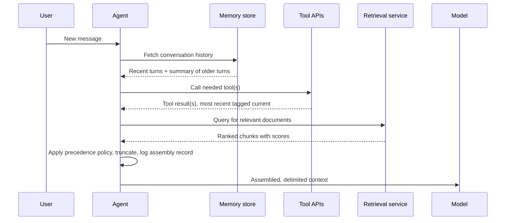

# Context Engineering — Senior

<!-- level-focus -->
At senior level, focus on this question:

> For an agent that pulls from RAG, live tool results, and multi-turn conversation history at the same time, what explicit precedence policy decides what survives when the combined sources exceed budget — and what observability into a specific production call would let you prove, after the fact, exactly what the model saw at the turn where it went wrong?

Use the smallest realistic scenario that exposes the decision and its failure behavior.

---

## Core Concept 1 — Ad Hoc Assembly Is a Reliability Risk, Not Just an Inefficiency

A middle-level pipeline has one source competing against a budget cap (retrieved chunks) alongside a small, predictable set of fixed overhead (instructions, reserved output, recent history). An agentic system multiplies the number of structurally different sources competing for the same budget, live, on every step: retrieved knowledge, one or more tool/API results from the current turn, multi-turn memory that may itself include earlier tool results, system instructions, and sometimes few-shot exemplars. Each source has a different owner in the codebase — the retrieval module, the tool-calling layer, the memory store — and each was very likely built by someone reasoning about their own source in isolation.

The default failure mode is **ad hoc assembly**: whichever module happens to run first appends its content to a growing context, with no single place in the code that decides overall precedence. This isn't merely wasteful of tokens — it's a reliability risk, because the ordering and inclusion decisions that end up governing a production answer are an emergent property of code call order, not a deliberate policy anyone reviewed. Two systems built this way, both individually well-tested, can produce different answers to the same question depending on which module happened to append last — a class of bug that unit tests on a single module cannot catch, because the bug lives in the interaction, not in any one piece.

## Core Concept 2 — Precedence Policy as an Architectural Artifact

The fix is to make precedence an explicit, documented, testable artifact — not a description of best practice scattered across each module's code, but a single ordering rule the assembly step enforces mechanically, the same way a database schema enforces a constraint rather than trusting every caller to remember it. A workable precedence policy for an agentic system, in order:

1. **System instructions and the current turn's user input — immutable.** Never truncated, never dropped, always present in full.
2. **The most recent tool result outranks older tool results.** If a tool was called twice in the same session (a search re-run with refined terms, a database query re-issued after a correction), the newer result reflects the current state of the world; the older one is now stale by construction and is the first tool-related content to be dropped.
3. **Retrieved documents are ranked; the tail is dropped first**, exactly as at middle level, but now competing against tool results and history rather than only against a fixed budget.
4. **Conversation history beyond N turns is summarized, not silently dropped.** This is the middle-level compression policy carried forward, but at senior scope it needs an explicit N and an explicit summarization trigger written down, not left to whichever engineer touches the memory module next.

Writing this down as an ordered list is necessary but not sufficient — it only becomes an architectural artifact once the assembly code enforces it mechanically and a test suite exercises it under the specific condition where sources compete (Core Concept 3 in [middle.md](middle.md) already covers testing this for a single ranked source; the senior-level version tests it across sources with different priority tiers, not just within one).

## Core Concept 3 — Observability Into Context Assembly

Even a correct precedence policy is invisible after the fact unless something records what it actually did on a specific call. "What did the model actually see" is otherwise unanswerable once the call has completed — the same reason a team logs the exact SQL query an ORM generated rather than trusting the ORM call site alone: the abstraction that assembles the final artifact (a query, a context window) can behave differently than its call site suggests, and the only way to know for certain is to capture what it actually produced.

A minimal observability record per call:

```json
{
  "call_id": "a1b2c3",
  "timestamp": "2026-09-02T14:03:11Z",
  "sources": [
    {"type": "system_instructions", "tokens": 480, "status": "included"},
    {"type": "tool_result", "tool": "order_lookup", "tokens": 620, "status": "included", "age_seconds": 2},
    {"type": "tool_result", "tool": "order_lookup", "tokens": 610, "status": "excluded_stale", "age_seconds": 340},
    {"type": "retrieved_chunk", "doc_id": "policy-42", "score": 0.89, "tokens": 780, "status": "included"},
    {"type": "retrieved_chunk", "doc_id": "policy-17", "score": 0.31, "tokens": 795, "status": "excluded_low_rank"},
    {"type": "conversation_history", "turns_included": 4, "turns_summarized": 11, "tokens": 1500, "status": "included"}
  ],
  "total_tokens": 5990,
  "budget_tokens": 8000
}
```

This is not a debug log left in by accident — it's a first-class record, kept for every production call (or a representative sample, when full logging is too costly), specifically so a later question like "was the tool result stale when it answered?" has a factual answer instead of a guess. Without it, the only way to investigate a wrong answer is to re-run the pipeline against current state and hope the conditions that caused the original failure — a stale tool result, a low-ranked document that shouldn't have won, history that should have been summarized but wasn't — still reproduce, which they frequently don't.

## Core Concept 4 — Sequence: An Agent Assembling Context Before a Model Call

The precedence policy and the observability record both describe a decision that happens in a specific order, across several components, before generation even starts:



The takeaway is in the second-to-last step: precedence and truncation happen once, in one place, *after* every source has reported in and *before* the model is called — not incrementally as each source happens to arrive. An assembly step that instead appends each source to the context as soon as it's available, in whatever order the calls happen to resolve, is the ad hoc pattern from Core Concept 1 with extra steps.

## Core Concept 5 — Cross-Component Scenario: An Agent That Gets Worse Over a Long Session

A support agent handles a multi-step task: it retrieves policy documents, calls an order-lookup tool, calls a refund-eligibility tool, and references earlier turns of a long conversation. Twenty minutes and many turns into the session, its answers start contradicting facts it stated correctly ten minutes earlier. Three hypotheses, and what would distinguish them:

| Hypothesis | What it would look like in the assembly record | How to confirm or rule out |
|---|---|---|
| **A tool result went stale and wasn't re-fetched or de-prioritized.** The order-lookup result from early in the session (before a status change) is still in context, and a newer lookup was never triggered or was ranked no higher than the old one. | An `excluded_stale` or missing entry for a tool result that should have been superseded; the included tool result's `age_seconds` is large relative to how fast the underlying data changes. | Compare the tool result's timestamp in the assembly record against when the underlying order status actually changed. |
| **The wrong document was ranked highest.** A retrieved policy chunk that's superficially similar in wording but describes a different, outdated policy outranks the correct one. | The `included` chunk's `doc_id` and `score` in the record don't match the document a human reviewer would pick as correct for this question. | Re-run retrieval for the same query in isolation and check whether the correct document scores lower than the one that was actually included. |
| **Old conversation history was never summarized or dropped, and stale context leaked into the answer.** A fact stated early in the session (before it changed) is still present verbatim, uncompressed, deep in history, and the model weighs it alongside the current, contradicting fact. | `turns_included` is unexpectedly high, or `turns_summarized` is 0 well past the policy's configured threshold — the compression trigger from Core Concept 2, point 4, didn't fire. | Check whether the session's turn count exceeded the configured summarization threshold and whether a summarization call actually ran. |

Without the assembly record, diagnosing this requires re-running the entire session and guessing which of the three hypotheses to chase first — and because tool results and retrieval scores can change between the original call and a retry, a fresh re-run may not even reproduce the original failure. With the record, the diagnosis is a direct read: pull the assembly log for the specific failing call, and the `status` field on each source answers which hypothesis holds, in minutes rather than through speculative re-runs. This is the same shift in kind as debugging with an assembled SQL query log versus debugging by re-running an application and hoping to reproduce a race condition — evidence replaces guessing.

## Core Concept 6 — Questions That Expose Weak Assumptions

- "If two tool calls for the same underlying data happen in one session, does our precedence policy actually favor the newer one — or does whichever call's result happens to append to context last win by accident?" Surfaces whether recency precedence is enforced or coincidental.
- "Can I pull the exact assembled context — sources, scores, included/excluded status — for a specific production call from an hour ago, right now, without re-running anything?" An honest "no" means there is no observability, only the ability to guess and retry.
- "What's the configured threshold for summarizing old conversation history, and do we have evidence it actually fires in production, not just in a unit test?" Surfaces whether the compression trigger from Core Concept 2 is real or aspirational.
- "If a retrieved document and a tool result disagree, which one does our precedence policy say wins, and is that the answer a domain expert would actually want?" Surfaces whether precedence was designed deliberately or defaulted to whatever order the code happens to call things in.
- "When was the last time someone actually read an assembly record for a call that produced a wrong answer, versus just re-running the pipeline and hoping for a different result?" Surfaces whether the observability that exists is actually used.

## Real-World Examples

- **A precedence bug only showed up under a specific interleaving.** An agent that called the same lookup tool twice in one session — once early, once after the user corrected a detail — had no explicit recency rule; whichever result happened to be appended last by an unrelated code path won, which was usually but not always the newer one. The failure was intermittent and passed most tests because most sessions only called the tool once. Making recency an explicit, tested precedence rule (Core Concept 2) turned an intermittent bug into a nonissue.
- **An assembly record cut a debugging session from hours to minutes.** A wrong answer reported by a user could not be reproduced by re-running the same question, because the retrieval scores had shifted slightly by the time anyone investigated. The team had started logging assembly records the previous quarter; pulling the record for the original call showed the actual document ranked highest that day, immediately confirming a retrieval-ranking issue rather than a prompt issue — no re-run needed.
- **A missing summarization trigger let stale history win a tiebreak.** A long support session never crossed the summarization threshold because the threshold was measured in turn count but the session had unusually short turns, so far more raw history tokens were present than the threshold's designer had assumed. The uncompressed early turns, still verbatim in context, described a since-resolved issue that the model then referenced as if still current.

## Common Mistakes

- **Treating precedence as an informal convention instead of enforced, testable code.** Different modules appending in whatever order they happen to run in is the default outcome unless assembly is a single, deliberate step.
- **Building observability only for errors, not for successful-but-wrong calls.** A call that returns 200 with a wrong answer produces no exception and no alert; without a standing assembly record, it leaves no trace to investigate later.
- **Assuming a "most recent wins" rule is enforced just because it seems obvious.** Recency precedence has to be implemented and tested against a scenario where the same source type appears twice in one session — it's exactly the case ad hoc assembly gets wrong.
- **Sizing a summarization trigger by turn count without checking it against real token-per-turn variance.** A threshold that works for typical turns can leave far more raw history in context than intended for atypically short or long ones.
- **Re-running a failed session to diagnose it, when retrieval scores or tool results may have changed since the original call.** The original assembled context is evidence; a fresh re-run is a different, possibly non-reproducing, experiment.

---

## Apply it

1. For an agent or RAG-backed system you have (or design one on paper), write out its precedence policy as an explicit, ordered list — which source is immutable, which is next, which is truncated first — using Core Concept 2 as the template.
2. Design the assembly record schema (per Core Concept 3) your system would emit for one real call, including every source, its token count, and its included/excluded/truncated status.
3. Construct a test scenario where the same source type (a tool result, most concretely) appears twice in one session with different values, and verify your precedence policy's code — not just its documentation — actually favors the more recent one.
4. Using the cross-component scenario in Core Concept 5 as a model, write the three hypotheses you'd check first if your system's answers degraded over a long session, and what specific field in your assembly record would confirm or rule out each one.
5. Run at least two of the five weak-assumption questions from Core Concept 6 against your system and write down what each one actually surfaced.

## Verify your work

- Your precedence policy is written down as an explicit ordered list, not implied by code call order, and a test exercises the case where two sources of the same type compete (most recent should win).
- You can produce an assembly record for a specific call showing every source's status (included, excluded, truncated, stale) without re-running the pipeline.
- At least one of your weak-assumption questions surfaced a real gap — a precedence rule that wasn't actually enforced, or an observability record that doesn't yet exist — not a hypothetical one.
- You can explain, using the sequence diagram in Core Concept 4 as a reference, why precedence and truncation happening once, after all sources report in, prevents the append-order bug described in Core Concept 1.
- For the cross-component scenario, you can state which of the three hypotheses your assembly record would confirm fastest, and why the other two would take longer to rule out without it.

## Review questions

- Why is ad hoc context assembly — each module appending its content as it becomes available — a reliability risk rather than only an efficiency problem?
- What makes a precedence policy an "architectural artifact" rather than just a description of intended behavior?
- Why is an assembly record that only captures errors insufficient for diagnosing a call that returned a confidently wrong answer?
- In the cross-component scenario, why can re-running the failing session fail to reproduce the original problem, and what does the assembly record give you that a re-run doesn't?
- Why does "most recent tool result wins" need to be an explicit, tested rule rather than something you can assume the code already does?
