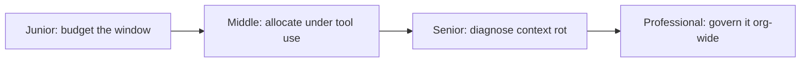
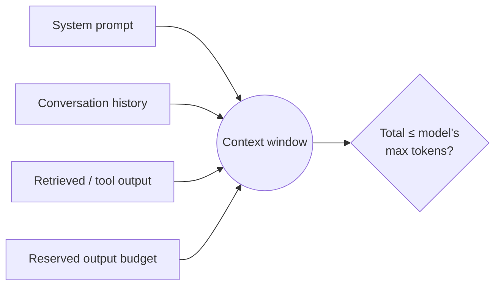

# Context Window

> The context window is the fixed token budget a model call draws from — every input and every generated token competes for the same finite space.

## Levels

| Level | Guide | You are done when... |
|---|---|---|
| Junior | [junior.md](junior.md) | You can compute a context budget for a simple chat app and explain what happens when it's exceeded. |
| Middle | [middle.md](middle.md) | You can design a context allocation strategy for a multi-turn agent that calls tools, and verify placement, not just token count. |
| Senior | [senior.md](senior.md) | You can diagnose context rot as distinct from a hard limit error, and fix a dilution problem with evidence. |
| Professional | [professional.md](professional.md) | You can set org-wide context budget contracts and regression-test them in CI across products and models. |

## Practice rule

Fitting under the token limit is necessary, not sufficient. A context that fits can still produce a worse answer than a smaller one — always verify with a placement or fill-level test, not just a token count.

## Related

- [Tokenization](../tokenization/README.md) — the window's size is measured in tokens, and how text is tokenized determines how much of it fits.
- [Context Engineering](../context-engineering/README.md) — the applied discipline of deciding what fills this window and in what order.
- [Prompt Engineering](../prompt-engineering/README.md) — how the system prompt, one of the window's fixed occupants, is authored.
- [Transformer Architecture](../transformer-architecture/README.md) — why attention cost and quality change with sequence length in the first place.
