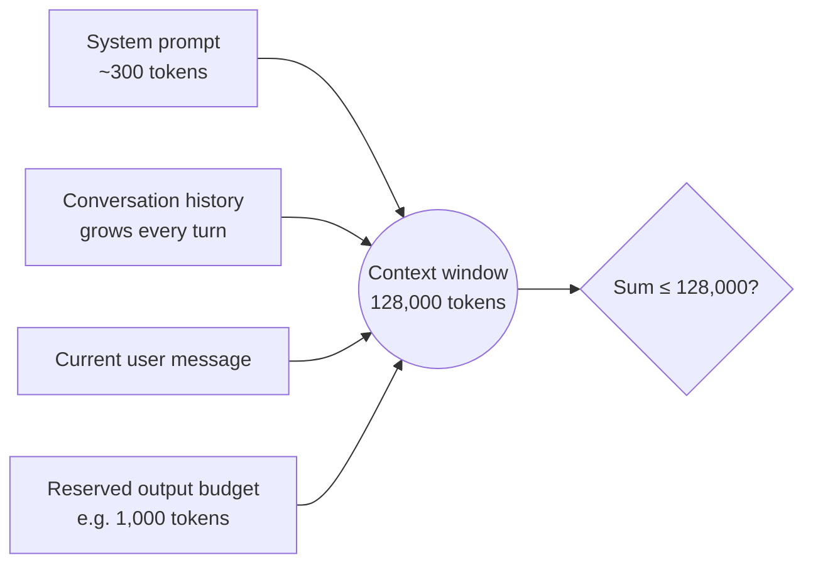

# Context Window — Junior

<!-- level-focus -->
At junior level, focus on this question:

> Given a chat app's system prompt, a growing conversation history, and a model's advertised context length, can you compute how many turns fit before you must do something about history growth — and explain exactly what happens if you don't?

Use the smallest realistic scenario that exposes the decision and its failure behavior.

---

## Core Concept 1 — What the Context Window Actually Is

The **context window** is the total number of tokens a model can process in a single call — every token you send in, plus every token it generates back, drawn from one fixed budget. It is not "how much the model remembers" in some vague, human-memory sense. It is a hard, numeric ceiling set by how the model was trained and served.

Common advertised windows, as of models available in 2025–2026:

| Model family | Advertised context window |
|---|---|
| GPT-4o (OpenAI) | 128,000 tokens |
| Claude (Anthropic, most current models) | 200,000 tokens |
| Gemini 1.5 / 2.5 (Google, largest variants) | 1,000,000–2,000,000 tokens |

Two things about that number trip people up immediately:

1. **It's combined, not per-message.** A 128k window means input tokens plus output tokens together must stay under 128,000 for that call — not 128k of input and then a separate allowance for output.
2. **A token is not a word.** For English text, a rough rule of thumb is about 4 characters or ¾ of a word per token — "The context window is shared" tokenizes to roughly 7–8 tokens, not 6 words. Exact counts depend on the tokenizer (see [Tokenization](../tokenization/README.md)); use a tokenizer library or the provider's token-counting endpoint when you need an exact number, not the word count.

## Core Concept 2 — Everything Shares One Budget

A single API call's token budget is consumed by several things at once, and they all come out of the same pool:



- **System prompt** — instructions sent on every call, defining the assistant's role, tone, and rules. Fixed size, paid on every single request.
- **Conversation history** — every prior user and assistant message in the thread, resent in full on each new call (chat APIs are stateless; the client resends the transcript every time).
- **Current user message** — whatever the user just typed.
- **Reserved output budget** — space you must leave for the model to actually generate a response. If you don't reserve it, you don't get a shorter answer — you get a request that's rejected outright before generation starts, or a response truncated mid-sentence.

There is no separate "memory" pool. If the conversation history grows, it eats into the same budget that the system prompt and the output need.

## Core Concept 3 — Worked Example: Budgeting a Simple Chat App

Take a chat app built on a 128,000-token model (GPT-4o-class), with:

- A system prompt of **300 tokens** (product instructions, tone, a few rules).
- A **max_tokens** output reservation of **1,000 tokens** (enough for a few paragraphs of reply).
- A conversation made of turns, where each turn (one user message + one assistant reply) averages **150 tokens** combined.

The fixed overhead per call is:

```
300 (system prompt) + 1,000 (reserved output) = 1,300 tokens
```

That leaves:

```
128,000 - 1,300 = 126,700 tokens available for conversation history
```

At 150 tokens per turn:

```
126,700 / 150 ≈ 844 turns
```

So, in principle, this app could run roughly 844 back-and-forth turns before the raw history alone would exceed the window — assuming turns stay at that average size and nothing else grows. Two things about that number matter more than the number itself:

1. **It's a ceiling, not a target.** Long before turn 844, resending the full history on every call means the app is paying for (and the model is processing) tens of thousands of tokens of old conversation on every single request — costly and, as covered in [middle.md](middle.md), not free of quality cost either.
2. **The arithmetic is what you compute before shipping, not after a user hits an error.** If your product lets a session run indefinitely (a support chatbot open all day, an assistant left running), you need a plan for history growth well before turn 844 — see Core Concept 4.

## Core Concept 4 — What Happens When You Exceed the Window

Exceeding the context window is not silent and not graceful by default. The typical behavior:

- The API call **fails outright** with an explicit error — commonly something like a 400-status "context length exceeded" or "maximum context length is 128000 tokens, however you requested 129452 tokens" — before any generation happens. No partial answer, no automatic truncation on the provider's side.
- If you reserved an output budget that leaves too little room once history grows, generation can also be **cut off mid-response** when the model hits `max_tokens`, producing a reply that stops mid-sentence — a different failure from the hard error, but also caused by the same shared-budget arithmetic.

Nothing about the API "figures it out for you." If your app doesn't proactively manage history size, the user experience is an error message or a truncated answer, not quiet, automatic summarization. Managing that growth is your app's job, not the model's.

## Common Mistakes

| Mistake | Why it hurts | Fix |
|---|---|---|
| Counting words instead of tokens when estimating budget | Token counts run ~30% higher than word counts for English text, so a "safe" estimate silently isn't | Use an actual tokenizer or the provider's token-counting endpoint, not a word count |
| Not reserving output budget at all | The full window fills with input, leaving no room to generate a reply, or the max_tokens value silently truncates a longer answer | Always subtract a reserved output allowance from the window before computing how much input budget remains |
| Assuming the API will "handle it" when history gets long | There is no silent truncation; a request over the limit fails with an explicit error | Track cumulative token count client-side and act before the limit, not after the error |
| Treating the advertised context window as the amount available for conversation history | System prompt and output reservation are fixed overhead that must be subtracted first | Compute `available_for_history = window - system_prompt - reserved_output`, as in Core Concept 3 |
| Resending the entire history forever without a plan | Cost and latency grow every turn, and the app eventually hits the hard limit with no graceful path | Decide on a history-management strategy (covered in [middle.md](middle.md)) before the app ships, not after a user's long session breaks it |

## Apply it

1. Pick a real model you use (state its advertised context window — for example, 128,000 for GPT-4o or 200,000 for Claude).
2. Write down a realistic system prompt for a small chat app (2–4 sentences of instructions) and count its tokens using a tokenizer library or the provider's token-counting endpoint.
3. Decide a reserved output budget (a reasonable value for a chat reply — 500 to 1,500 tokens) and subtract both the system prompt and the reserved output from the total window to get the tokens available for history.
4. Estimate an average per-turn size for your app's conversation (a customer-support chat might average 100–200 tokens per turn; a coding assistant with pasted code might average 1,000+). Divide the available history budget by that per-turn size to get an approximate number of turns before the raw history alone exceeds the window.
5. State, in one sentence, what your app should do when a session approaches that turn count — even if the full strategy is covered later, name the trigger point.

## Verify your work

- You can state the exact token count of your system prompt, not an estimate rounded to a guess.
- Your arithmetic for `available_for_history` explicitly subtracts both the system prompt and the reserved output budget, not just one of them.
- You can name the specific error behavior (an explicit API error, not silent truncation) your app should expect if history grows past the limit.
- You can distinguish, in your own words, what "128,000 tokens" means as a combined input+output budget versus a common misreading as "128,000 tokens of conversation, plus however much output I want."
- You have a concrete turn-count number for your scenario, derived from real numbers (system prompt tokens, reserved output tokens, average turn size), not a round guess.

## Review questions

- What three things typically share a single model call's context window budget, at minimum?
- Why is counting words instead of tokens a risky way to estimate whether a prompt fits in the context window?
- What actually happens when an API call's total tokens exceed the model's context window — does the API silently truncate the input, or does something else happen?
- In the worked example, why does the number of turns before running out of context depend on the reserved output budget, not just the window size and history size?
- Why is "the raw history alone exceeds the window at turn 844" not the number your app should actually wait for before doing something about history growth?
