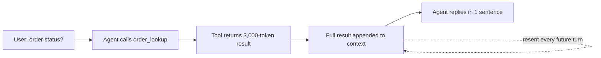

# Context Window — Middle

<!-- level-focus -->
At middle level, focus on this question:

> When a multi-turn agent calls tools and accumulates results across a session, how do you design a context allocation strategy that keeps the window under budget while still placing the facts the model needs where it can actually use them?

Use the smallest realistic scenario that exposes the decision and its failure behavior.

---

## Core Concept 1 — Tool Output Is Invisible Budget

The junior-level budget (system prompt + history + reserved output) is the whole picture only for a plain chat app. The moment an agent calls tools, a new, easy-to-underestimate consumer joins the budget: **tool outputs**.

A user asks a support agent "what's the status of order 48213?" The agent calls an `order_lookup` tool, which returns a 3,000-token JSON blob (full order history, shipping events, customer notes, related tickets). That entire blob typically gets appended to the conversation as a tool-result message and resent on every subsequent call in the session — even though the user only sees the agent's one-sentence summary of it. The user-facing conversation looks short. The actual context being sent to the model is not.



This is the core middle-level shift: **the token cost of an agent turn is not what the user typed or read — it's everything the agent called and received, silently compounding turn over turn.**

## Core Concept 2 — Lost in the Middle: Placement Matters, Not Just Size

Published research on long-context LLMs has documented a consistent effect: **models are measurably less reliable at using information placed in the middle of a long context than information placed near the start or the end.** This is often called "lost in the middle." It is a real, measurable degradation in retrieval and reasoning accuracy as a function of *where* a fact sits in the context — not just whether the context fits under the token limit.

The practical implication is concrete: if you dump a 50,000-token document into context and the one fact the user actually needs is buried at token 25,000, the model is meaningfully less likely to surface or correctly use that fact than if it were positioned near the start or the end of the context, or pulled out and summarized up front. This matters independently of whether the request is anywhere close to the model's hard token limit — a request at 40% of the context window can still under-perform on a mid-buried fact.

Two design consequences that follow directly:

1. **Don't just ask "does it fit?"** Ask "where does the critical information sit relative to the start and end of the context?"
2. **When you control assembly order, put the highest-value content first or last**, not wherever it happened to land chronologically. An agent that appends tool results in call order, with the single most relevant result buried in the middle of five, is making exactly this mistake.

## Core Concept 3 — Truncation Strategies and Their Trade-offs

When history and tool outputs threaten to exceed budget, three strategies are in common use, each with a real cost:

| Strategy | How it works | Strength | Trade-off |
|---|---|---|---|
| **Sliding window (drop oldest first)** | Keep only the most recent N turns or tokens; discard everything older | Cheap — no extra LLM call, trivial to implement | Old facts are lost entirely and permanently; a detail from turn 3 is unrecoverable at turn 40 |
| **Summarize-and-replace** | Periodically replace older turns with an LLM-generated summary of their content | Preserves the gist of old context at a fraction of its token cost | Costs an extra LLM call each time it runs; summarization can lose or subtly distort specific detail (an exact number, a precise quote) |
| **Retrieval-based selection** | Store full history externally (e.g., a vector store), retrieve only turns relevant to the current query into context | Keeps full detail available, and only pulls in what's actually relevant to right now | Adds latency (a retrieval call) and system complexity (an index to build and keep in sync); retrieval can miss a relevant turn if the query phrasing doesn't match well |

None of these is universally correct. A sliding window is defensible for a short-lived session where old turns genuinely stop mattering (a single customer-support conversation that resolves in 10 turns). Summarization suits a long-running assistant where the gist of earlier conversation still matters but exact wording doesn't. Retrieval-based selection earns its added complexity when a session is long-running *and* specific old details need to be recoverable on demand — the same trade-off that governs when retrieval-augmented generation is worth the added infrastructure over just stuffing everything into context.

## Core Concept 4 — Scenario: An Agent's Context Balloons Across 20 Turns

A tool-using support agent starts a session with a 300-token system prompt. Across a 20-turn session, it calls tools roughly every other turn, and every tool result — averaging 2,000 tokens — gets appended to context in full and resent on every subsequent call. By turn 20:

```
Before redesign:
  system prompt:        300 tokens (fixed)
  20 turns of dialogue:  20 × 150  =  3,000 tokens
  10 tool calls:         10 × 2,000 = 20,000 tokens
  ------------------------------------------------
  total context by turn 20:        ≈ 23,300 tokens
```

23,300 tokens is nowhere near a 128k or 200k window — this session would not fail with a hard error. But two problems are already present: cost (every one of those 20 calls resends the accumulating tool-result history, so the *cumulative* tokens billed across the session are far higher than 23,300), and — per Core Concept 2 — a critical detail from tool call #2 is now buried deep in the middle of the context by turn 20, exactly where retrieval reliability is weakest.

A redesign applying the strategies from Core Concept 3:

1. **Cap full tool-result retention to the most recent 2 calls** (sliding window, scoped to tool outputs specifically, not the whole conversation).
2. **Summarize older tool results into one or two sentences each** the moment they age out of the "recent" window, replacing the 2,000-token blob with a ~50-token summary that preserves the outcome ("order 48213: confirmed shipped 3/14, tracking ABC123") without the full raw payload.
3. **Cap total history tokens at a fixed ceiling** (say, 8,000 tokens) as a hard budget the agent's context-assembly step enforces before every call, not an afterthought.

```
After redesign, by turn 20:
  system prompt:                     300 tokens (fixed)
  20 turns of dialogue:               3,000 tokens
  2 most-recent full tool results:    2 × 2,000 = 4,000 tokens
  8 summarized older tool results:    8 × 50    =   400 tokens
  ------------------------------------------------------------
  total context by turn 20:          ≈ 7,700 tokens
```

Same session, same 20 turns, roughly a third of the context size — and the critical facts from early tool calls are now in a short summary near a predictable position rather than buried whole in the middle of a growing transcript.

## Core Concept 5 — Verification Beyond "Does It Fit"

Checking that a context assembly strategy stays under the token limit is necessary but not sufficient — it tells you nothing about whether the model can actually use what's in the window. The verification that actually matters at this level:

1. **Run a long session deliberately** (15–20+ turns, with tool calls interleaved) and plant one specific, checkable fact early in the session — an order number, a specific date, a stated constraint.
2. **At the end of the session, ask a question that requires recalling that fact.**
3. **Check whether the answer is correct**, not just whether the request succeeded. A request that returns 200 OK with a confidently wrong or vague answer is a silent failure that "does it fit" verification will never catch.
4. **Compare placement**, not just presence: if the fact survives summarization but the agent still gets it wrong, check where in the assembled context it landed — near the start, near the end, or buried in the middle of a large tool-result block.

This is the token-budget equivalent of an integration test versus a unit test: fitting under the limit is the unit-level check; getting the right answer from a real session is the integrated-flow check, and only the second one tells you whether the allocation strategy is actually working.

## Common Mistakes

- **Treating tool outputs as free because the user doesn't see them.** A 3,000-token tool result costs exactly as much context budget as 3,000 tokens the user typed, whether or not it's shown in the UI.
- **Optimizing only for "stays under the token limit" and never testing recall.** A session can be well under budget and still lose a mid-context fact to the lost-in-the-middle effect.
- **Reaching for retrieval-based selection by default.** Its added latency and infrastructure cost isn't justified for a short-lived session where a sliding window would have worked fine.
- **Summarizing so aggressively that exact values are lost.** A summary that drops a specific order number or dollar amount trades away exactly the detail the next turn needed.
- **Appending tool results in call order without considering placement.** The most relevant result of several ends up wherever it happened to be returned, not where the model is most likely to attend to it.

## Apply it

1. Take (or design) a tool-using agent scenario with at least 15 turns and 5+ tool calls, and compute its context size at the final turn the way Core Concept 4 does — fixed overhead, dialogue tokens, and full tool-result tokens, itemized.
2. Identify which of the three truncation strategies (sliding window, summarize-and-replace, retrieval-based) best fits this scenario's actual needs, and justify the choice against the trade-offs in Core Concept 3 — not just "summarization sounds good."
3. Redesign the context assembly with a cap on full tool-result retention plus summarization of older results, and recompute the context size at the same final turn.
4. Plant a specific fact early in a real or simulated session, run it to 15+ turns, and ask a final question that requires recalling that fact. Record whether the answer is correct.
5. If the answer is wrong, check where the fact landed in the assembled context (start, middle, end) before assuming the redesign itself is broken — the placement, not just the token cap, may be the cause.

## Verify your work

- You have an itemized before/after token count for your scenario (fixed overhead, dialogue, tool results), not a single combined estimate.
- You can justify your chosen truncation strategy against a competing option's trade-off, not just describe how your choice works.
- You ran an actual recall test (a planted fact, a session of 15+ turns, a final question) rather than only checking the token count against the limit.
- If the recall test failed, you checked the fact's position in the assembled context before concluding the fix was insufficient.
- Your redesigned context assembly enforces a hard total-token ceiling as an explicit step, not an implicit result of "we summarize sometimes."

## Review questions

- Why can a tool-using agent's session consume far more tokens than what appears in the user-visible conversation?
- What does the "lost in the middle" effect describe, and why is it a distinct problem from simply exceeding the context window?
- What does a sliding-window truncation strategy give up that a summarize-and-replace strategy tries to preserve, and what does summarization give up in exchange?
- In the 20-turn scenario, why did the redesign reduce token count and also change where the earliest tool-call facts sit in context — why do both matter?
- Why is "the request stayed under the token limit" insufficient evidence that a context allocation strategy is working correctly?
