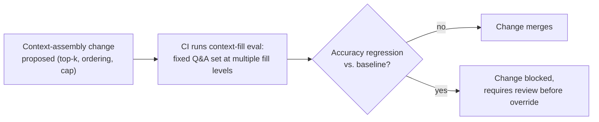

# Context Window — Professional

<!-- level-focus -->
At professional level, focus on this question:

> How do you run context-window management as a durable, org-wide operating model — a shared assembly library, a per-product token budget contract, and CI-gated quality regression tests — so every team stops independently reinventing truncation logic and rediscovering context rot after a user complaint?

Use the smallest realistic scenario that exposes the decision and its failure behavior.

---

## Core Concept 1 — The Failure Mode Without an Operating Model

Left to their own devices, product teams building on LLMs each write their own history-truncation logic, their own summarization triggers, their own tool-output caps — independently, inconsistently, and usually only after their own version of the context-rot incident described in [senior.md](senior.md) happens in production. The result is an organization where:

- The same bug (a critical fact lost to lost-in-the-middle dilution, a tool-output blowup, an unhandled context-limit error) gets discovered and fixed separately by every team that hits it, at the cost of every team's own incident.
- No two products manage context the same way, so there is no shared body of tuning knowledge, and no way to know whether a fix that worked for one team's model and traffic pattern would help another's.
- Nobody can answer "what's our org-wide rate of context-related incidents" because there's no consistent definition of one, let alone consistent instrumentation.

The fix is the same shape as any other cross-cutting infrastructure concern: shared library, documented contract, and governance — not a mandate that every team individually gets context management right through better individual judgment.

## Core Concept 2 — A Shared Context-Assembly Library

A **context-assembly library**, owned centrally and consumed by every team building on an LLM, encodes the truncation, summarization, and placement logic from [middle.md](middle.md) and [senior.md](senior.md) once, instead of once per team:

```python
# Illustrative shape, not a specific product's real API.
budget = ContextBudget(
    model="claude-sonnet-4.5",       # governs the effective window and
                                       # known lost-in-the-middle behavior
    system_prompt_tokens=300,
    reserved_output_tokens=1000,
    history_strategy="summarize_after_n_turns",
    history_token_cap=8000,
    relevance_ordering=True,          # place highest-relevance content
                                       # first/last, not append order
)
assembled = budget.assemble(system_prompt, history, tool_results, retrieved_docs)
```

The library's value is the same as any shared internal library: a bug fix or an improved summarization strategy discovered by one team benefits every team on the next version bump, instead of living only in that one team's codebase. It also means the org has exactly one place to instrument for the metrics in Core Concept 4, instead of instrumentation scattered (or missing) across every product.

A library only gets adopted if it's actually easier than writing bespoke logic — that means covering the common cases (chat history, tool-result accumulation, retrieved-document assembly) out of the box, being usable without deep familiarity with its internals, and not forcing a team into an assembly pattern that doesn't fit their product's actual shape (Core Concept 6 covers what happens when it doesn't fit).

## Core Concept 3 — The Context-Budget Contract Per Product Surface

Every product surface that calls an LLM should document its token allocation the way an API's request/response shape is documented — reviewed at design time, not discovered by reading the assembly code:

```yaml
# context-budget-contract.yaml — support-chat-agent
model: claude-sonnet-4.5
total_window: 200000
allocation:
  system_prompt:      300     # fixed, reviewed on any prompt change
  reserved_output:    1500    # fixed, sized to the longest expected reply
  tool_results:        cap 6000, summarized after 2 most-recent calls
  retrieved_documents:  cap 8000, top-k 5, relevance-ordered
  conversation_history: cap 8000, sliding window after 20 turns
review_trigger: "any change to allocation values, or a change to the underlying model"
```

Treating this like an API contract means: it's reviewed when a team proposes changing it (raising a top-k, a history cap), it's versioned alongside the product, and a downstream consumer (an evaluation suite, an on-call runbook) can reference a specific version of it rather than "however context assembly currently happens to work." The contract review is exactly the point at which a change like "let's raise retrieval top-k for more thoroughness" — the change that caused the RAG dilution scenario in [senior.md](senior.md) — gets caught before it ships, because the contract review asks "what does this do to the context-fill eval," not just "does this seem like a reasonable product improvement."

## Core Concept 4 — Governance: CI-Gated Context-Quality Regression Testing

The senior-level controlled context-fill test (2k/20k/80k accuracy comparison) and the reorder test (placement vs. relevance) are one-off diagnostic tools when run manually after an incident. At professional level, they become a **standing eval suite**, run automatically:



The eval set is a fixed collection of question/correct-answer pairs specifically constructed to be sensitive to context-fill and placement effects (planted facts at varying positions and varying surrounding volume, per the senior-level test design), run against every proposed change to context-assembly logic — a new summarization threshold, a top-k change, a reordering change — *before* it ships, not discovered after a user complaint reaches support. This is the same principle as any other regression suite: catch the regression in CI, where it costs a blocked merge, not in production, where it costs a quietly degraded product and an after-the-fact investigation.

## Core Concept 5 — Migration Guidance: Swapping the Underlying Model

The senior-level invariant — a context strategy tuned for one model doesn't automatically transfer to another — becomes an organizational migration checklist at this level. A team proposing to swap a product's underlying model (a version upgrade, or a switch to a different provider) should not treat "the new model has a bigger advertised context window" as license to relax discipline. The migration path:

1. **Run the existing context-fill eval suite (Core Concept 4) against the new model before switching traffic**, using the same fixed Q&A set, to get a baseline for the new model's own lost-in-the-middle curve.
2. **Compare directly against the old model's results at the same fill levels.** A bigger window on the new model says nothing about whether its degradation curve is better, worse, or merely shifted to a higher token count — that's an empirical question the eval answers, not an assumption the marketing spec sheet settles.
3. **Re-tune the context-budget contract (Core Concept 3) based on the new model's actual measured behavior**, not by proportionally scaling the old caps to the new window size. A cap that was 8,000 tokens on a 128k-window model doesn't necessarily become 12,500 tokens (proportionally scaled) on a 200k-window model — it becomes whatever the new eval shows still holds quality.
4. **Roll the model swap out behind the same incremental process as any other infrastructure change** (a pilot product surface first, not every consumer of the shared library simultaneously) so a bad assumption about the new model's context behavior is caught on one product, not the whole portfolio.

## Core Concept 6 — Scenario: Consolidating Ad Hoc Truncation Into a Shared Library

Several product teams — a support-chat agent, a document-summarization tool, a coding assistant — each built their own context-truncation logic independently over the past year. Each has had at least one context-related production incident: the support-chat agent dropped a customer's stated order number to a mid-context tool result; the document tool hit a hard context-limit error on an unusually long input with no graceful fallback; the coding assistant's history-summarization silently lost a specific file path a user had mentioned six turns earlier.

The org decomposes consolidation into reversible increments, the same pattern as any cross-team infrastructure migration:

1. **Extract the shared library's initial shape from what these three teams' incidents actually needed** — sliding-window caps, summarization-with-detail-preservation, and a documented contract format — rather than designing it speculatively before seeing real failure modes.
2. **Pilot the library on one team (the one with the clearest, most recent incident) first**, migrate their context assembly to it, and validate with the CI eval suite that quality is at least as good as their bespoke logic was.
3. **Roll out to the remaining teams incrementally**, each validated against the eval suite before their bespoke logic is retired — not a simultaneous cutover.
4. **Track the measurable outcome**: a defined "context-related incident" rate (hard-limit errors reaching production, and context-rot regressions caught post-launch rather than in CI) trending down across the org, and per-request cost becoming more predictable now that every team's allocation is a reviewed contract rather than an ad hoc guess.
5. **Keep a rollback path per team.** If a team's product has a context shape the shared library doesn't yet handle well — say, a product whose tool results are structured tables rather than prose, and the library's summarization strategy was built and tuned against prose — that team reverts to their own logic for the unsupported case, and the gap becomes a scoped feature request against the library rather than a blocked migration for that team indefinitely.

## Core Concept 7 — Sustained Delivery, Not a One-Time Migration

New models ship, new product surfaces get built, and context-shape edge cases keep surfacing — this isn't a program with a finish line:

- **New product surfaces adopt the shared library and write a budget contract by default**, the same way a new service defaults onto a golden base image rather than choosing its own base from scratch.
- **A model swap anywhere in the org triggers the migration checklist in Core Concept 5** for every product surface using that model, tracked centrally so no team's swap happens without the eval baseline being re-established.
- **The eval suite itself gets extended** as new context-rot failure modes are discovered in production — an incident that CI didn't catch is a gap in the eval set, and closing that gap is part of the incident's remediation, not a separate backlog item that may never get prioritized.
- **A periodic review of the incident-rate and cost-predictability metrics from Core Concept 6** decides whether the operating model is actually working, the same way the outcome measures in a golden-base-image program decide whether that program is working — adoption alone is a leading indicator, not proof of outcome.

---

## Real-World Examples

- **A shared library retires three separate incident postmortems' worth of bespoke code.** After consolidation, the support-chat, document-summarization, and coding-assistant teams' individually-patched truncation logic is replaced by one reviewed implementation; the next context-rot-shaped bug found in any one product gets fixed once, centrally, instead of requiring three separate patches.
- **A CI-gated eval catches a top-k change before it ships.** A team proposes raising retrieval top-k for "more thorough" answers; the context-fill eval in CI shows a measurable accuracy drop at the higher top-k before the change merges, and the team ships a rerank step instead — the exact dilution problem from the senior-level RAG scenario, caught before a user ever saw it.
- **A model migration's eval baseline saves a team from a false assumption.** A team migrating to a model with a much larger advertised window assumes they can drop their existing context caps; running the eval suite against the new model first shows its lost-in-the-middle curve is still present at a similar relative fill percentage, and the team keeps equivalent discipline instead of regressing quality post-migration.
- **A rollback path prevents a stalled migration.** A team whose product returns large structured tables from tool calls finds the shared library's prose-tuned summarization drops table structure; rather than blocking their migration indefinitely, they revert to bespoke handling for that one case and file it as a scoped library gap, which the platform team later closes with a table-aware summarization mode.

## Common Mistakes

- **Mandating every team adopt the shared library on a fixed deadline, before piloting.** Produces the same rushed, unvalidated-migration theater any top-down infrastructure mandate produces, and the library's design reflects guesses rather than a real team's actual needs.
- **Treating "the library exists" as the outcome, with no CI-gated eval enforcing it stays correct.** Without the eval suite from Core Concept 4, a change to the shared library's default summarization strategy can silently regress every team that depends on it at once.
- **Assuming a bigger context window on a new model means the migration checklist can be skipped.** Exactly the assumption Core Concept 5 exists to prevent — advertised window size and effective, measured context behavior are different things.
- **Rolling a stricter context budget or a new library version out to every consumer simultaneously.** The same failure shape as turning a vulnerability-scanning gate blocking for an entire fleet at once — validate on one team first, expand incrementally.
- **Having no rollback path for a team whose context shape doesn't fit the shared library's assumptions.** Forces a team to either block their roadmap or quietly route around the library, which reintroduces the exact fragmentation the library was built to remove.
- **Measuring only library adoption, never the incident rate or cost-predictability outcome.** Adoption is a leading indicator; the operating model's actual value is in fewer context-related incidents and more predictable per-request cost, and only tracking adoption can look successful while delivering neither.

## Apply it

1. Inventory the context-assembly logic currently in use across a set of products or teams you have visibility into, and identify which ones have already had a context-related production incident (a hard-limit error, a lost mid-context fact, an unexplained quality complaint).
2. Design the initial shape of a shared context-assembly library based on what those real incidents actually needed — name the specific truncation, summarization, and ordering capabilities it must have.
3. Draft a context-budget-contract template (like Core Concept 3's YAML) that any product team would fill in, including a named review trigger for when it must be re-reviewed.
4. Define the context-fill CI eval suite's structure: what a fixed Q&A pair needs to look like to be sensitive to fill-level and placement effects, and what regression threshold would block a merge.
5. Write the rollback condition for a team whose product's context shape the shared library doesn't yet support — what specifically would justify that team using bespoke logic temporarily, and what turns that exception into a scoped library improvement rather than a permanent fork.

## Verify your work

- Your library-scope decision is derived from named, real incidents, not a speculative list of features that might be useful.
- The budget-contract template has a concrete review trigger (a specific event, like an allocation change or a model swap), not an open-ended "review periodically."
- The CI eval suite's blocking condition is specific and falsifiable (a defined accuracy threshold at defined fill levels), not "make sure it still seems fine."
- You can state the exact re-validation step a model swap requires before its context strategy is trusted, and why a larger advertised window doesn't substitute for that step.
- The rollback path names a concrete criterion for when a team may diverge from the shared library, and how that divergence gets tracked back toward a library fix rather than becoming permanent silently.

## Review questions

- Why does letting each product team independently build its own context-truncation logic fail to scale as the number of LLM-backed products grows?
- What does a context-budget contract make explicit that an undocumented, ad hoc context-assembly implementation does not?
- Why does a CI-gated context-fill eval catch a class of regression that a standard token-limit check cannot?
- Why is a larger advertised context window on a new model insufficient justification for skipping the context-fill re-validation step during a model migration?
- What is the risk of rolling out a stricter shared context-assembly library to every consuming team simultaneously, rather than incrementally?
- What should happen when a team's product has a context shape the shared library doesn't yet handle well, and why does a permanent, untracked fork defeat the purpose of having a shared library at all?
