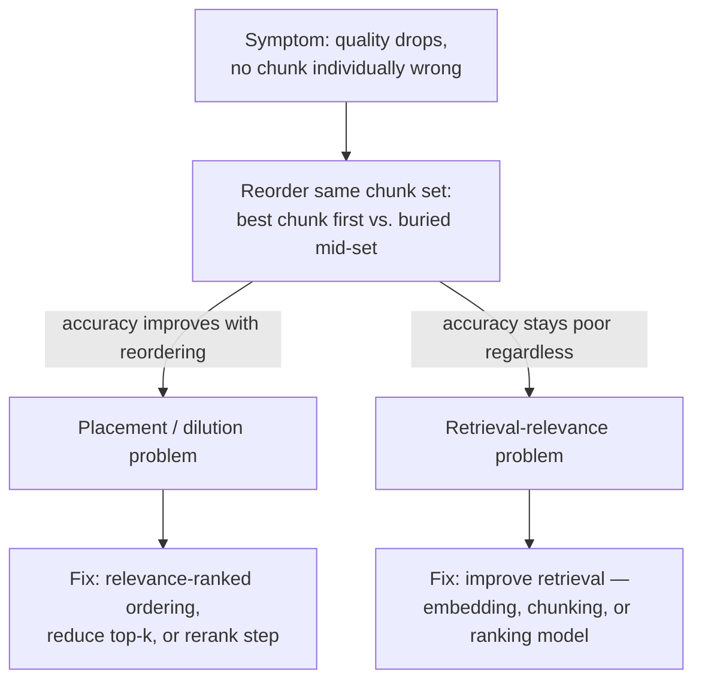

# Context Window — Senior

<!-- level-focus -->
At senior level, focus on this question:

> A RAG-backed agent's answer quality is quietly degrading, no single request is anywhere near the token limit, and no individual retrieved chunk looks wrong — what evidence isolates whether this is context rot, and what fix actually addresses the cause rather than the symptom?

Use the smallest realistic scenario that exposes the decision and its failure behavior.

---

## Core Concept 1 — Context Rot Is a Distinct Failure Mode From a Hard Limit Error

A middle-level engineer treats "exceeds the context window" as the failure to guard against. At senior level, a second, quieter failure mode has to be named and diagnosed separately: **context rot** — a request that is well under the token limit, produces no error, and still returns a measurably worse answer than the same question asked with less, more focused context. The window isn't full in the sense of hitting a hard ceiling; it's crowded with low-relevance content that dilutes the model's attention away from what actually answers the question.

This distinction matters because the two failure modes have different fixes. A hard-limit failure is fixed by reducing token count — truncate, summarize, drop something. Context rot is not reliably fixed by reducing token count alone; a context that's 30% smaller but still poorly ordered or still full of irrelevant-but-plausible-looking content can rot just as badly. The fix for context rot is about *relevance and placement*, not just *size*.

| | Hard context-limit failure | Context rot |
|---|---|---|
| Symptom | Explicit API error, request rejected | Request succeeds, answer is subtly worse |
| Trigger | Total tokens exceed the model's max | Context is crowded with low-relevance content, well under the max |
| Detectable by | Monitoring API error rates | Requires a quality/accuracy evaluation, not just a token count |
| Fixed by | Reduce total tokens | Improve relevance and placement of what's included |

## Core Concept 2 — Building Evidence for Context Rot

"The answers feel worse lately" is not evidence a senior engineer can act on or defend in a design review. The evidence that actually isolates context rot from other causes (a worse retrieval set, a model regression, a prompt change) is a **controlled context-fill test**: hold the question and the correct answer fixed, and vary only the amount of irrelevant-but-present content surrounding it.

```
Test design:
  Fixed:    one question, one ground-truth answer, one relevant fact
  Varied:   amount of irrelevant-but-plausible filler content padding the context
    - 2,000 tokens of context  (relevant fact + minimal filler)
    - 20,000 tokens of context (relevant fact + moderate filler)
    - 80,000 tokens of context (relevant fact + heavy filler)
  Measured: is the answer still correct at each fill level?
```

If accuracy holds steady at 2k and 20k but drops at 80k, that's evidence of fill-level-driven degradation, independent of whether 80k tokens is anywhere close to the model's advertised limit (which might be 128k or 200k — nowhere near being exceeded). This test isolates the *context-fill* effect from the *context-limit* effect precisely because the limit is never approached in any of the three runs — if quality still drops, the cause has to be something other than the hard ceiling.

Run this test with your own relevant fact and filler content pulled from your actual domain (real documents, real retrieved chunks) rather than synthetic filler — generic lorem-ipsum-style padding doesn't exercise the same attention dynamics as content that looks topically plausible but isn't the answer, which is the realistic failure case in a RAG system.

## Core Concept 3 — Cross-Component Scenario: A RAG Agent's Slow-Motion Degradation

A support agent answers questions by retrieving relevant chunks from a document store and generating an answer grounded in them. Over several months, the product adds more document sources — more manuals, more historical tickets, more FAQ pages. Nobody changed the retrieval logic or the generation prompt. But each retrieval call now returns more chunks (the index has more candidates to choose from, and the team raised top-k from 5 to 15 along the way to "be more thorough"), and answer quality has quietly dropped. No single retrieved chunk looks wrong in isolation — spot-checking any one chunk shows it's topically related to the query. The aggregate answer, though, is worse: relevant details get missed or contradicted by less relevant chunks that happened to also get pulled in.

This is exactly the shape of problem Core Concept 1 and 2 describe: no hard-limit error, no individually broken component, a quality regression that only shows up in aggregate.

## Core Concept 4 — Diagnosis Path: Retrieval-Relevance vs. Placement/Dilution

Two different root causes produce the same symptom, and a senior engineer's job is distinguishing them with a targeted test rather than guessing:

- **Retrieval-relevance problem** — the retrieval step itself is returning chunks that aren't actually relevant to the query (a ranking or embedding-quality issue upstream of context assembly).
- **Context-placement/dilution problem** — retrieval is returning the right chunks, but *ordering and volume* bury the most relevant one among several plausible-but-less-relevant ones, and the lost-in-the-middle effect (covered in [middle.md](middle.md)) makes the model less likely to use it correctly.

The test that separates them: **take the same retrieved chunk set and reorder it** — run it once with the most relevant chunk placed first, and again with the identical chunk placed in the middle of the same set. If accuracy improves substantially just from reordering, the chunks were relevant all along and the problem is placement/dilution, not retrieval. If accuracy stays poor regardless of order, the problem is upstream — the retrieval step isn't surfacing the right chunks in the first place, and reordering has nothing good to promote to the front.



## Core Concept 5 — The Fix: Ordering, Top-K, and Reranking

Once the diagnosis in Core Concept 4 confirms a placement/dilution problem, three fixes are available, and they compose rather than compete:

1. **Relevance-ranked ordering** — assemble retrieved chunks into context in order of relevance score, most relevant first (or first *and* last, exploiting both ends of the lost-in-the-middle curve), instead of whatever order the retrieval call happened to return them in.
2. **Reduce top-k** — if quality was fine at top-k=5 and degraded after raising it to top-k=15, the simplest fix is reverting or capping top-k, trading a small amount of recall (occasionally missing a relevant chunk ranked 6th–15th) for a real, measured gain in how reliably the model uses what it's given.
3. **Add a rerank step before context assembly** — a lightweight reranking model (distinct from and typically cheaper than the generation model) scores the initially retrieved candidate set and selects a smaller, higher-precision subset to actually place in context. This is the right fix when top-k can't simply be reduced because a broad initial retrieval genuinely is needed to find the relevant chunk among many marginal candidates — the rerank step narrows *after* broad retrieval, rather than narrowing retrieval itself.

None of these three is "more correct" in the abstract — reducing top-k is the cheapest fix and worth trying first if the controlled test from Core Concept 2 shows quality was fine before top-k was raised; a rerank step is worth its added latency and infrastructure specifically when broad initial recall is genuinely necessary and a simple top-k cut would start missing real answers.

## Core Concept 6 — Invariant: A Context Strategy Doesn't Transfer Across Models

A context-management strategy — a chosen top-k, a chunk ordering, a summarization threshold — is tuned against a *specific* model's effective-context behavior. That behavior is not a portable constant. A strategy validated against one model's lost-in-the-middle curve does not automatically hold for a different model, or even a new version of the same model family, because effective context behavior is a property of how that specific model was trained and evaluated — not a fixed law of context windows in general.

The practical consequence: **swapping the underlying model is a trigger for re-running the controlled context-fill test from Core Concept 2**, not an event you can reason through from the new model's advertised context length alone. A newer model with a larger advertised window is not evidence its lost-in-the-middle behavior is better, the same, or worse than the model it replaces — that has to be measured again, specifically, before trusting a context strategy tuned for the old model.

---

## Real-World Examples

- **A controlled fill-level test ends a "the model got worse" debate.** After a provider ships a model update, a team suspects the new model itself regressed. Running the same question at 2k/20k/80k context-fill levels against both the old and new model shows both degrade similarly as fill increases — the "regression" was context rot that existed all along and had simply become more visible as the product's average context size grew, not a change in the model.
- **Reordering alone recovers most of the lost accuracy.** In the RAG scenario from Core Concept 3, reordering the same 15 retrieved chunks — most relevant first — recovers most of the quality drop without changing retrieval at all, confirming the root cause was dilution, not relevance.
- **A larger context window ships and the dilution problem gets worse, not better.** A team migrates to a model with a much larger advertised context window and, assuming more room solves everything, stops capping top-k. Retrieval now returns even more chunks per query; the lost-in-the-middle effect on the new model turns out to be present too, and answer quality drops further until top-k discipline is reinstated.

## Common Mistakes

- **Treating "well under the token limit" as proof the context isn't the problem.** Context rot happens specifically in that "well under the limit" zone; ruling out the hard-limit error tells you nothing about dilution.
- **Debugging by staring at individual retrieved chunks.** Each chunk can look reasonable in isolation while the aggregate assembly dilutes the model's attention — the unit of analysis has to be the whole assembled context, not one chunk at a time.
- **Fixing a suspected retrieval problem before running the reorder test.** Without the targeted test from Core Concept 4, teams commonly spend weeks retraining or re-tuning a retrieval/embedding model to fix what was actually a placement problem solvable by reordering or capping top-k.
- **Assuming a bigger context window from a model upgrade removes the need for discipline.** A larger advertised window changes the hard ceiling; it does not change whether the model still degrades on diluted or poorly placed context, and that has to be re-tested, not assumed.
- **Raising top-k without a corresponding quality check.** "More retrieved context can only help" is the exact assumption the controlled fill-level test exists to falsify.

## Apply it

1. Design a controlled context-fill test for a system you work on: pick one question with a verifiable correct answer, and construct three context sizes (roughly 2k, 20k, and 80k tokens, or scaled proportionally to your model's window) that all include the relevant fact plus increasing amounts of realistic, topically-plausible filler.
2. Run the question at all three fill levels and record whether the answer is still correct at each. Note the fill level, if any, where accuracy starts dropping.
3. For a RAG or retrieval-based component, take an actual retrieved chunk set for one real query and run it twice: once with the most relevant chunk placed first, once with it placed in the middle of the same set. Compare answer accuracy between the two runs.
4. Based on the result of step 3, state which category the problem falls into — placement/dilution or retrieval-relevance — and name the specific fix (reorder, reduce top-k, add a rerank step, or improve retrieval quality) you'd apply.
5. If you have access to two versions of a model (or two different model families), repeat step 1 against both and compare where accuracy starts dropping for each — confirm or refute the invariant in Core Concept 6 for your own system.

## Verify your work

- You have fill-level-vs-accuracy data (a real table or chart) from your own controlled test, not an impression that "long context feels worse."
- Your reorder test used the identical chunk set in both runs — only the order changed — so any accuracy difference is attributable to placement, not content.
- You can state, with the reorder-test evidence in hand, whether your specific problem is retrieval-relevance or placement/dilution, and explain what evidence ruled out the other.
- You can name the specific fix you'd apply and what it costs (reduced recall from a lower top-k, added latency from a rerank step, or retrieval-model rework), not just "we'll improve context."
- If you tested across two model versions, you can state whether the same context strategy held or needed re-tuning — evidence, not assumption, either way.

## Review questions

- Why can a request be well under a model's advertised context limit and still suffer a real, measurable quality problem?
- What does the controlled context-fill test (2k/20k/80k) isolate that simply comparing "before" and "after" answers on a live product cannot?
- In the reorder test, what specific outcome would tell you the problem is retrieval-relevance rather than placement/dilution?
- Why doesn't raising top-k in a RAG pipeline straightforwardly improve answer quality, even though it increases the amount of potentially relevant material retrieved?
- Why does migrating to a model with a larger advertised context window not automatically justify relaxing an existing context-management strategy?
