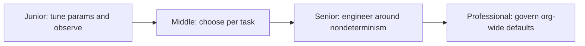
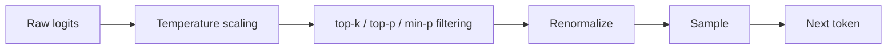

# Decoding and Sampling

> Turning a model's probability distribution over its vocabulary into an actual output token is a design decision, not a formality — the choice of decoding strategy determines determinism, quality, cost, and reproducibility.

## Levels

| Level | Guide | You are done when... |
|---|---|---|
| Junior | [junior.md](junior.md) | You can explain logits, softmax, greedy decoding, temperature, top-k, and top-p, and predict how changing each one changes output |
| Middle | [middle.md](middle.md) | You can choose and justify a decoding configuration per task (extraction, chat, creative) and fix a pipeline producing malformed structured output |
| Senior | [senior.md](senior.md) | You can diagnose why LLM output isn't fully deterministic even at temperature 0, and redesign tests and systems around that limit |
| Professional | [professional.md](professional.md) | You can set org-wide decoding-parameter defaults, governance, and cost trade-offs across a fleet of LLM-calling services |

## Practice rule

Match the decoding strategy to whether the task has one correct answer or benefits from variety — then verify the choice with a measured rate (schema-validity, flake rate, malformed-output rate) across many samples, never by eyeballing a few outputs.

## Related

- [Prompt Engineering](../prompt-engineering/README.md) — decoding parameters and prompt design are usually tuned together; a prompt that works at one temperature can fail at another.
- [Transformer Architecture](../transformer-architecture/README.md) — logits come from the model's final layer; understanding how they're produced clarifies what temperature and filtering actually operate on.
- [Context Engineering](../context-engineering/README.md) — what's in the context window shapes the logits decoding operates on, before any sampling parameter is applied.
