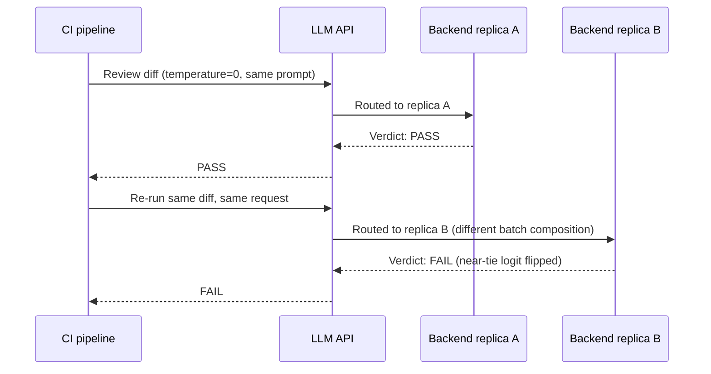

# Decoding and Sampling — Senior

<!-- level-focus -->
At senior level, focus on this question:

> A CI pipeline has flaky tests asserting exact output from an LLM-backed service, even with temperature pinned to 0. What's actually causing the variance, and how do you redesign the test suite and the system around it, rather than chasing a fix that can't fully exist?

Use the smallest realistic scenario that exposes the decision and its failure behavior.

---

## Core Concept 1 — Why Temperature 0 Is Not the Same as "Fully Deterministic"

At middle level, `temperature=0` (or greedy decoding) was treated as reliably deterministic — same input, same output, every time. That's true for a single, isolated, single-request run of a model's forward pass on fixed hardware. It stops being reliably true the moment that model is served in production, behind an API, at scale — for reasons that are structural to how large models are actually served, not implementation bugs a client can work around:

- **Floating-point non-associativity under batched inference.** `(a + b) + c` and `a + (b + c)` are not guaranteed to produce bit-identical results in floating-point arithmetic — the order operations happen in can change the last few bits of the result. GPU inference servers dynamically batch multiple concurrent requests together for throughput, and the composition of a batch (which other requests happen to be running alongside yours) can change the order matrix operations execute in. Your request's numeric result can shift by a tiny amount depending on what else was in the batch — and at a genuine tie or near-tie between two candidate tokens' logits, that tiny shift is enough to flip the argmax to a different token.
- **Provider-side load balancing across heterogeneous hardware or kernel versions.** A large provider serves a popular model from many replicas, potentially on slightly different hardware generations or with slightly different low-level kernel implementations rolled out gradually. Two calls to "the same model" can land on two different replicas with subtly different numerics.
- **Mixture-of-experts (MoE) routing.** Some modern architectures route each token through a subset of specialized "expert" subnetworks chosen dynamically, and the routing decision can depend on what else is in the current batch. This isn't just numeric drift — it can mean a genuinely different computation path runs for the same token depending on unrelated concurrent traffic.

This is a real, publicly documented limitation acknowledged across major LLM API providers, not a bug specific to any one client library — providers that expose a `seed` parameter typically describe it as *best-effort* reproducibility, not a guarantee, for exactly this reason. The practical takeaway: **you cannot fully engineer this away from the client side.** The correct response is not to keep chasing perfect determinism — it's to stop depending on it where it matters.

## Core Concept 2 — The Testing Implication: Exact-Match Assertions Are Structurally Flaky

If a CI test asserts `assert response == "expected exact string"` against a live LLM call, that test is flaky by construction — not because the test is badly written in the ordinary sense, but because it's asserting a property (bit-for-bit output stability) the underlying system doesn't actually guarantee, even at `temperature=0`.

The fix is to test the property you actually need, not the property that happens to be easiest to write an assertion for:

| Instead of asserting | Assert |
|---|---|
| Exact string equality | The output parses as valid JSON / matches the expected structure |
| The literal generated sentence | The required fields are present and of the correct type |
| An exact numeric value | The value falls within an expected range or passes a domain check |
| A specific phrasing | A rubric-based or model-graded check ("does this response address the user's question, on a 1-5 scale") clears a threshold |
| A single sample matching exactly | A sampled distribution property — e.g., 9 of 10 reruns produce a semantically equivalent answer |

This isn't lowering the bar — a structural or semantic assertion is often a *stronger* test of what actually matters (did the extraction get the right invoice total?) than an exact-match assertion was, which could pass on accidentally-correct phrasing and fail on a harmless rewording of the same correct answer.

## Core Concept 3 — Reproducibility Techniques That Help, But Don't Fully Solve It

None of these eliminate the sources of variance in Core Concept 1 — they reduce the *surface area* for variance and make the variance that remains easier to detect and reason about:

- **Seed parameters**, where the API exposes one — pins the sampling RNG, which controls *which* token gets picked among near-ties, but does not control the underlying floating-point computation that produces the logits in the first place. This is why providers document seed-based reproducibility as best-effort.
- **Pinning an exact model version**, not a floating alias — call `model-name-2024-08-06`, not `model-name-latest`. A `-latest` alias can be silently repointed to a newer model version at any time, which is a completely different (and much larger) source of output change than any of the numeric effects above, and one that's fully avoidable.
- **Logging the exact request (full prompt, all parameters, seed if used) and response for every call**, especially in a production or CI-adjacent path. When a flaky failure does occur, you cannot always reproduce it live — but a logged record lets you inspect exactly what was sent and received after the fact, which is often the only way to distinguish "this was provider-side numeric variance" from "this was a real regression in a prompt or parameter change."

## Core Concept 4 — Decision Framework: When Nondeterminism Is Acceptable

Not every use of an LLM needs to fight this. The question is what the output *feeds into*:

| Context | Nondeterminism acceptable? | Reasoning |
|---|---|---|
| Creative writing or brainstorming feature | Yes | Variety across runs is the point, not a defect |
| Open-ended chat replies | Yes | Users expect natural variation; identical replies would feel robotic |
| A/B testing a prompt or model change | No — must be controlled for | Nondeterminism is noise that can swamp the actual signal you're trying to measure |
| Anything gating a merge or deploy (CI checks, an automated code-review bot's block/approve decision) | No — must be engineered around | A flaky gate blocking unrelated, correct work destroys trust in CI and trains engineers to ignore or bypass it |
| Anything feeding a compliance or audit trail | No — must be engineered around | An audit record needs to be explainable and, ideally, reproducible from logged inputs; "the model just returned something different that day" is not an acceptable answer to an auditor |
| Data extraction feeding a downstream database or pipeline | No — must be engineered around | Downstream systems assume stable values; silent variance corrupts data quality in ways that are hard to trace back to the source |

The dividing line isn't "is this important" in some vague sense — it's whether something *downstream* assumes stability. A creative feature has no downstream consumer that breaks if two runs differ. A merge gate does.

## Core Concept 5 — Cross-Component Scenario: The Flaky Code-Review Bot

A CI pipeline runs an LLM-backed bot that reviews each pull request's diff and posts a pass/fail verdict as a required check. Over a few weeks, engineers notice the bot occasionally gives a different verdict on a re-run of the exact same, unchanged diff — sometimes blocking a merge that passed minutes earlier on an identical commit.

Diagnosis, in order:

1. **Confirm temperature is actually pinned to 0** in the request the CI job sends — not left at a service default, not overridden by a config file the bot's owner forgot about. If it isn't, that's the fix, full stop.
2. **If temperature is confirmed at 0 and the flake persists**, this is very likely the Core Concept 1 phenomenon — provider-side batching, hardware routing, or MoE effects — not a bug in the bot's prompt or code. At this point, chasing further client-side determinism fixes has a low ceiling; the redesign in step 3 is the actual fix.
3. **Redesign the test/gate around structural and semantic properties, not exact reproducibility.** Instead of "does the bot's verdict match exactly what it said last time," check: does the bot's output parse into the expected verdict schema, does it cite a real line number that exists in the diff, does its severity classification fall into one of the defined categories — and treat a genuine PASS/FAIL disagreement between two runs on an unchanged diff as a signal to *widen the review* (e.g., require two independent calls to agree, or route disagreements to a human) rather than trusting either single call blindly.
4. **Track a flake-rate baseline.** Rerun a fixed set of representative diffs against the bot repeatedly (e.g., 20 reruns each on 10 diffs) and record what fraction produce a different verdict than the majority. This gives you a number to compare against — if the flake rate is stable around, say, 2%, that's the system's baseline noise; if it jumps to 15% after a model version change, that's a real regression worth investigating, distinguishable from baseline noise specifically because you have the baseline logged.

## Real-World Examples

- **A seed parameter reduces but does not eliminate a flake.** A team adds a fixed `seed` to their extraction calls expecting fully reproducible output, and the flake rate drops noticeably but doesn't reach zero — because the seed controls sampling choice among near-ties, not the floating-point computation that produced the logits those ties are between. The remaining flakes are traced to provider-side batching, not a bug in the seed implementation.
- **An exact-match CI assertion masks a real prompt regression for weeks.** A test asserting exact string equality against an LLM call is already flaky enough that engineers have learned to just re-run CI on failure without investigating. A real regression — introduced by an unrelated prompt template change — gets lost in that noise, because the team had no way to distinguish "known baseline flakiness" from "new failure" without a tracked flake-rate baseline.
- **Pinning a model version prevents a much larger class of surprise than any seed setting.** A service calling a `-latest` model alias sees a sudden, large shift in output style after the provider silently updates which model version `-latest` points to — a much bigger and more disruptive change than the numeric variance discussed above, and one that pinning an exact dated version would have fully prevented.

## Common Mistakes

- **Assuming `temperature=0` fully solves determinism, and stopping the investigation there when a flake persists.** It reduces the *dominant* source of variance (sampling randomness); it does not address batching, hardware, or MoE-routing effects.
- **Writing CI assertions against exact LLM output strings.** Structurally flaky regardless of how careful the prompt is — assert structural and semantic properties instead.
- **Treating every flake as "the model is unreliable" without checking whether temperature is actually pinned in the request being sent.** Often the simpler, fully fixable cause (an unpinned or misconfigured temperature) is the real culprit and gets missed because the harder, unfixable cause is assumed first.
- **Having no flake-rate baseline**, so a real regression and ordinary background noise are indistinguishable when a failure shows up.
- **Relying on a `-latest` model alias in a path where reproducibility matters**, conflating an easily preventable source of change (a silent model swap) with the harder, provider-level nondeterminism this file describes.

---

## Apply it

1. Find (or write) an LLM-backed check in a CI pipeline, or a test asserting output from an LLM call.
2. Confirm what temperature and model-version reference it actually uses at request time — not what a config file claims, what's actually sent.
3. Rerun the exact same request 10–20 times and record whether the output is identical every time, even at `temperature=0`.
4. Rewrite at least one exact-match assertion into a structural or semantic assertion (schema validity, required fields, a rubric threshold) and explain in one paragraph what real defect the new assertion would catch that the old one wouldn't, and vice versa.
5. Using the decision framework in Core Concept 4, classify three LLM-backed features you know of (or can imagine) into "nondeterminism acceptable" and "must engineer around," and justify each in one sentence.

## Verify your work

- You have direct evidence (a rerun log, not an assumption) of whether your chosen LLM call produces identical output across repeated identical requests.
- You can state, without hedging, whether an observed flake is explained by an unpinned temperature or by provider-level variance, and what evidence supports that conclusion.
- Your rewritten assertion tests a property that actually matters to the system's correctness, not just a property that happens to be stable.
- You have a flake-rate number (a fraction from repeated reruns), not just an anecdote of "it flaked once."
- Your three classified features in the Apply It exercise each have a concrete downstream consumer named as the reason nondeterminism is or isn't acceptable.

## Review questions

- Why can `temperature=0` still produce different output across two calls to the same hosted API, on the same prompt?
- What specifically does a seed parameter control, and what does it not control, in a batched-inference production system?
- Why is an exact-string-match CI assertion against LLM output considered structurally flaky rather than just poorly written?
- What distinguishes a context where nondeterminism is acceptable from one where it must be engineered around?
- Why does a tracked flake-rate baseline matter for distinguishing a real regression from ordinary background variance?
