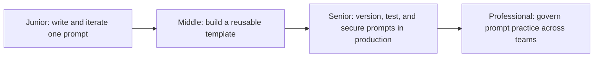
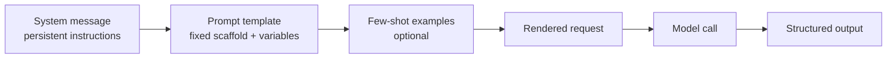

# Prompt Engineering

> Structuring, testing, and versioning prompts as the code they functionally are — because a prompt change can silently regress production behavior exactly like a code change can.

A prompt is not a string you get right once. It starts as a single hand-written instruction, becomes a parameterized template shared across a codebase, then becomes a versioned artifact with regression tests and a rollback path, and finally becomes a shared, reviewed asset multiple teams build on instead of each re-deriving the same lessons.

## Levels

| Level | Guide | You are done when... |
|---|---|---|
| Junior | [junior.md](junior.md) | You can turn a vague prompt into a specific one and explain why the rewrite produces more consistent output. |
| Middle | [middle.md](middle.md) | You can build a variable-driven prompt template, add few-shot examples only where they earn their token cost, and measure accuracy against a labeled set. |
| Senior | [senior.md](senior.md) | You can version a production prompt, run a golden-set regression test before shipping a change, and close off prompt-injection surface. |
| Professional | [professional.md](professional.md) | You can run a shared prompt library and review process across teams, with ownership, escalation, and measured outcomes. |

## Practice rule

Before changing a prompt that touches production, name the specific behavior you're trying to fix, the golden-set check that would catch a regression, and the version you'd roll back to if it doesn't work. A prompt edited in place with no test and no history is a deploy with no CI and no revert button.

## Related

- [Decoding and Sampling](../decoding-and-sampling/README.md) — sampling parameters and prompt design are tuned together: a prompt asking for a single deterministic label needs a different temperature than one asking for creative variation.
- [Context Engineering](../context-engineering/README.md) — prompt engineering shapes what you ask the model; context engineering shapes what the model can see when you ask it.

---

*Part of [Engineer Knowledge](../../../README.md) → [AI Engineering](../../README.md) → [LLM Fundamentals](../README.md).*
