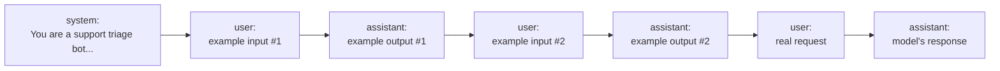

# Prompt Engineering — Junior

<!-- level-focus -->
At junior level, focus on this question:

> Given a concrete task, can you write a prompt that produces consistent, usable output on the first try — and when it doesn't, can you diagnose why and iterate it into one that does?

Use the smallest realistic scenario that exposes the decision and its failure behavior.

---

## Core Concept 1 — The Three Message Roles

Every major chat-based LLM API (OpenAI's Chat Completions, Anthropic's Messages API, Google's Gemini) structures a conversation as a list of messages, each tagged with a role:

| Role | Who writes it | What it's for |
|---|---|---|
| **system** | The application developer | Persistent instructions that apply to the whole conversation: the model's task, tone, constraints, and things it should never do. Sent once, stays in effect for every turn. |
| **user** | The human (or the calling application on the human's behalf) | One turn of input — a question, an instruction, a document to process. |
| **assistant** | The model | The model's own prior responses, included in the message list so a multi-turn conversation has memory. |



Two reasons this structure exists, not just convention:

1. **It separates trusted instructions from conversational content.** The system message is where the application developer's intent lives; user messages are where anything a human (or an upstream system relaying human input) typed lives. A model trained to weight these differently can, in principle, tell "the developer told me to only answer questions about billing" apart from "a user is now asking me to ignore that." (Senior level covers what happens when this separation breaks down — prompt injection.)
2. **It lets a client maintain multi-turn state without the model having any built-in memory.** The model itself is stateless between API calls — every request is independent. Sending the full message history, including prior `assistant` turns, on every call is how a chat application makes a conversation feel continuous. Drop a turn from the list and the model has no idea it happened.

A single API call typically looks like this in code (structure, not a specific SDK):

```json
{
  "messages": [
    {"role": "system", "content": "You are a helpful assistant that answers only questions about our product."},
    {"role": "user", "content": "How do I reset my password?"}
  ]
}
```

## Core Concept 2 — Zero-Shot vs Few-Shot

**Zero-shot prompting** gives the model instructions only — no examples of the desired input/output pairing:

```
Classify the sentiment of this review as positive, negative, or neutral.

Review: "The battery life is incredible but the case scratches easily."
```

**Few-shot prompting** adds 2–3 example input/output pairs before the real request, showing the model exactly the format and judgment call you want:

```
Classify the sentiment of each review as positive, negative, or neutral.

Review: "Fast shipping, exactly as described."
Sentiment: positive

Review: "Arrived broken, no response from support."
Sentiment: negative

Review: "It's fine. Does what it says."
Sentiment: neutral

Review: "The battery life is incredible but the case scratches easily."
Sentiment:
```

Zero-shot is enough when the task is simple and the desired output format is something the model would reasonably infer from a clear instruction alone (translate this sentence, summarize this paragraph in one sentence). Few-shot earns its cost when the task has a **specific desired format or judgment boundary the model wouldn't reliably infer from instructions alone** — for example, whether a mixed review like "incredible battery but scratches easily" counts as positive, negative, or neutral is a judgment call your examples pin down; an instruction alone leaves it to guess, and it will guess inconsistently across similar inputs.

## Core Concept 3 — Being Specific and Unambiguous

The single biggest quality lever at junior level is replacing a vague ask with an explicit one: exact output format, length, audience, and what to exclude.

**Vague prompt:**

```
Summarize this article.
```

What actually happens when you send this to a model, run after run, on the same article: the length varies from two sentences to a full paragraph depending on nothing you control; sometimes it opens with "This article discusses..." and sometimes it doesn't; sometimes it includes the author's tangential examples, sometimes it drops the actual conclusion. None of these outputs is *wrong* — the instruction never said what "summarize" should mean here — so the model is filling in every unstated dimension itself, differently each time.

**Specific prompt:**

```
Summarize the following article in exactly 3 bullet points, for a reader who has
not read the original. Each bullet must be one sentence, under 20 words. Do not
include the author's name, publication date, or any direct quotes. Focus only on
the article's main claim and its supporting evidence — omit background context.

Article:
<article text>
```

The qualitative difference: length is now fixed (3 bullets, not "a summary"), audience is named (someone who hasn't read the source, so it can't assume shared context), format is explicit (one sentence each, under 20 words), and exclusions are stated (no byline, no date, no quotes). Every dimension the vague version left the model to guess is now pinned down, so repeated runs converge on similar structure even though the exact wording still varies.

## Common Mistakes

| Mistake | Why it hurts | Fix |
|---|---|---|
| Asking for "a summary" / "a good response" with no length, format, or audience | The model fills in every unstated dimension itself, differently each run | Name the exact length, format, and audience |
| Putting task instructions in the `user` message and expecting them to "stick" across turns | Only the `system` message is treated as persistent; user-message instructions compete with whatever the user says next | Put persistent behavior in `system`; keep `user` messages to per-turn content |
| Reaching for few-shot examples on a task the model already does reliably zero-shot | Every example costs tokens on every request for no accuracy gain | Test zero-shot first; add examples only when output is inconsistent |
| Writing one giant paragraph of instructions with no structure | The model has to parse which sentence is a constraint, which is context, and which is the actual ask | Break instructions into short, separate statements — one constraint per line |
| Not specifying what to exclude | The model includes anything it judges relevant, which varies run to run | State exclusions explicitly ("do not include X") as often as inclusions |

## Apply it

1. Pick a real piece of text you have (an email, a support ticket, a paragraph from documentation) and write the vaguest possible one-line prompt asking a model to do something useful with it (summarize, classify, extract).
2. Run it 2–3 times (or reason through what would plausibly differ) and note every dimension of the output that varies run to run: length, format, what's included or excluded, tone.
3. Rewrite the prompt to pin down each of those dimensions explicitly: exact format, length constraint, audience, and at least one explicit exclusion.
4. If the task involves a judgment call the model could reasonably make two different ways (a borderline classification, an ambiguous edge case), add 2–3 few-shot examples that resolve that judgment call the way you want.
5. Compare the before/after output in writing: which specific vagueness in the original prompt caused which specific inconsistency in the output, and which line you added fixed it.

## Verify your work

- You can point to a specific line in your rewritten prompt that corresponds to each dimension (format, length, audience, exclusions) that varied in the vague version.
- Running the specific prompt multiple times produces outputs that agree on structure (same number of bullets, same format) even when the exact phrasing differs.
- If you added few-shot examples, you can name the specific ambiguity they resolve — not "it seemed like a good idea."
- You can explain, without looking it up, why a persistent instruction belongs in the `system` message rather than repeated in every `user` message.

## Review questions

- What is the difference between the `system`, `user`, and `assistant` roles, and why does an API call need all three instead of one block of text?
- Why does sending only the latest `user` message, without prior `assistant` turns, break a multi-turn conversation?
- When does few-shot prompting improve output over zero-shot, and when is it just extra tokens with no measurable benefit?
- Take the vague prompt "write something about our product" — name three dimensions of the output it leaves unspecified, and what you would add to pin down each one.
