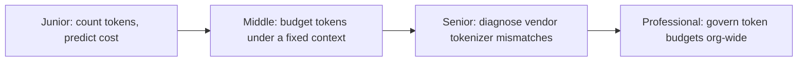
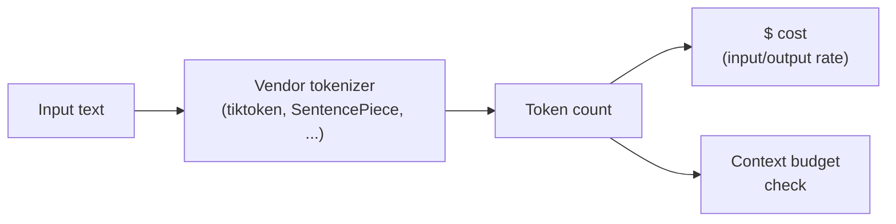

# Tokenization

> Every LLM reads, prices, and forgets in tokens, not words or characters — and the same string costs a different number of tokens depending on which vendor's tokenizer touches it.

The second diagram is the fact every level in this module keeps coming back to: a token count is not a side detail, it is the number both your bill and your context window are actually denominated in — and it only exists once a specific tokenizer has run.

## Levels

| Level | Guide | You are done when... |
|---|---|---|
| Junior | [junior.md](junior.md) | You can count the tokens in a real prompt with the actual tokenizer and compute its cost, instead of guessing from word count. |
| Middle | [middle.md](middle.md) | You can design a token budget — system prompt, history, input, output — that degrades predictably instead of silently truncating. |
| Senior | [senior.md](senior.md) | You can diagnose a production incident caused by a tokenizer difference between vendors and fix the root cause, not just the symptom. |
| Professional | [professional.md](professional.md) | You can design an org-wide token-counting and cost-governance operating model that survives a multilingual market launch or a vendor swap. |

## Practice rule

Measure token count with the actual tokenizer for the actual model before you budget, price, or truncate anything — `len(text) / 4` is a rule of thumb for English prose, not a substitute for running the tokenizer.

## Related

- [Context Window](../context-window/README.md) — the context window is a budget measured in tokens; tokenization is what fills it.
- [Transformer Architecture](../transformer-architecture/README.md) — tokens are the unit the model actually embeds and attends over.
- [Prompt Engineering](../prompt-engineering/README.md) — prompt structure decisions (few-shot examples, system prompt length) are also token-budget decisions.
