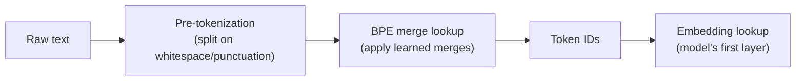

# Tokenization — Junior

<!-- level-focus -->
At junior level, focus on this question:

> Given a real prompt you're about to send to an LLM API, can you count its actual token count with the model's real tokenizer, explain why that number isn't the same as the word count, and compute what the request will cost?

Use the smallest realistic scenario that exposes the decision and its failure behavior.

---

## Core Concept 1 — What a Token Actually Is

A **token** is the unit an LLM reads, writes, and is priced in. It is not a word and it is not a character — it's a subword chunk produced by a specific **tokenizer**, and which chunks exist at all was decided once, offline, when that tokenizer's vocabulary was built.

Concretely, one English sentence splits like this under a BPE-style tokenizer (token boundaries marked with `|`):

```
"Tokenization|ization| is| the| first| step| in| every| LLM| request|."
```

Notice `Tokenization` alone splits into two pieces while short common words (`is`, `the`, `in`) each stay whole as a single token. That asymmetry is the entire point of Core Concept 2.

A widely used rule of thumb for English prose with BPE-style tokenizers (OpenAI's and similar): **roughly 4 characters per token, or roughly ¾ of a word per token.** Treat this as a planning estimate, not a law — it breaks down for code, numbers, and non-English text, which you'll meet in [middle.md](middle.md).

## Core Concept 2 — What BPE Does, in Plain Language

Most modern LLM tokenizers are built with **Byte-Pair Encoding (BPE)** or a close relative. The training process, in plain language:

1. Start with the smallest possible units — individual bytes or characters.
2. Scan a huge training corpus and count which *pairs* of adjacent units appear most often.
3. Merge the single most frequent pair into one new token.
4. Repeat steps 2–3, tens of thousands of times, each time merging the next-most-frequent pair — including pairs of tokens created by earlier merges.
5. Stop once the vocabulary reaches a target size (for example, cl100k_base — used by GPT-4/3.5-turbo — has just over 100,000 tokens; o200k_base — used by GPT-4o — has roughly 200,000, which is what the "200k" in its name refers to).

The result: words and word-fragments that appeared constantly in training (`the`, `tion`, `ing`, common punctuation) end up as single, cheap tokens early in the merge process. Rare words, made-up words, and text unlike the training corpus (a rare surname, a chemical formula, most non-English scripts) never got merged into a single token, so they fall back to being split into several smaller pieces — sometimes down to individual bytes.

This is why **token count is a function of how "typical" the text looks to that specific tokenizer's training data** — not a function of the text's actual length or meaning.



Every request to an LLM passes through this pipeline before the model does anything else. The token IDs, not the raw text, are what the model — and the billing meter — actually sees.

## Core Concept 3 — Counting Tokens for Real

Guessing is unnecessary — every major vendor exposes a way to count tokens exactly, and you should reach for it whenever the number actually matters (cost estimates, budget checks):

| Vendor / family | Tokenizer | How to count |
|---|---|---|
| OpenAI (GPT-4o, GPT-4o-mini, and newer) | `o200k_base` | `tiktoken` library, `encoding_for_model("gpt-4o")` |
| OpenAI (GPT-4, GPT-3.5-turbo, older) | `cl100k_base` | `tiktoken` library, `encoding_for_model("gpt-3.5-turbo")` |
| Anthropic (Claude models) | Claude's own tokenizer | The Anthropic API exposes a token-counting endpoint/SDK method — you send the request payload and get back the exact count without needing a local tokenizer implementation |
| Llama, Mistral, and most open-weight models | SentencePiece | Load the model's tokenizer via the `transformers` library (`AutoTokenizer.from_pretrained(...)`) or the `sentencepiece` package directly |

Minimal working example with `tiktoken`:

```python
import tiktoken

enc = tiktoken.encoding_for_model("gpt-4o")
prompt = "Summarize the attached support ticket in two sentences."
token_ids = enc.encode(prompt)

print(len(token_ids))   # -> exact token count for this exact string
print(token_ids[:5])    # -> [123, 4589, ...] the actual integer IDs the model sees
```

The core habit to build now: **when a number matters — a cost estimate, a budget check — run the real tokenizer for the real model, not a word count.** A word count is a fine sanity check; it is not a substitute.

## Core Concept 4 — How Pricing Is Actually Quoted

LLM API pricing is quoted **per token, and input and output tokens are priced separately** — typically as a rate per million tokens, with the output rate several times higher than the input rate (generating each output token costs more compute than reading an input token, since it requires a full forward pass per token generated).

A request's total cost is:

```
cost = (input_tokens / 1,000,000) × input_rate
     + (output_tokens / 1,000,000) × output_rate
```

Illustrative example rates for this module (not a specific vendor's current published price — always check the vendor's pricing page for the real number): **$3 per million input tokens, $15 per million output tokens.**

## Core Concept 5 — Worked Example: A ~200-Word Prompt

Take a realistic support-ticket-summarization prompt, roughly 200 words:

```
You are a support triage assistant. Read the customer message below and
produce a one-paragraph summary for the on-call engineer, followed by a
severity label of LOW, MEDIUM, or HIGH. Base the severity on whether the
customer's account is completely blocked from using the product, whether
data appears to have been lost, and how many times the customer has
already contacted support about this same issue this week. If the
message mentions a payment failure, always treat it as at least MEDIUM
severity even if the customer downplays it. If the customer explicitly
says they are considering canceling their subscription, always treat it
as HIGH severity regardless of the technical details. Do not invent
details that are not present in the message. If a detail needed to set
the severity is missing, state that explicitly in your summary rather
than guessing. Keep the summary itself under four sentences. Output the
summary and the severity label as two separate lines, with no additional
commentary before or after them.

Customer message: "I've tried resetting my password three times today
and I still can't log in. This is the second day in a row this has
happened and I have a client presentation in two hours that needs data
from my dashboard."
```

A naive assumption might treat this as roughly 200 tokens, one per word. Running it through the real tokenizer (`cl100k_base`/`o200k_base`) lands closer to **260–280 tokens** — an illustrative estimate, not a number to treat as exact for this specific text. The gap comes from several sources at once: punctuation marks are frequently their own tokens, capitalized mid-sentence words don't always merge the same way as their lowercase form, numbers like "three" and "two" tokenize independently of surrounding words, and quotation marks and line breaks each consume tokens too.

Cost for one request at the illustrative rates from Core Concept 4, assuming the model produces a short ~40-token summary and severity label as output:

```
input:  270 tokens  ->  270 / 1,000,000 × $3  = $0.00081
output:  40 tokens  ->   40 / 1,000,000 × $15 = $0.00060
                                        total  = $0.00141 per request
```

At 10,000 such requests a day, that's roughly **$14.10/day** — a number worth actually computing before assuming an LLM feature is "basically free," and worth recomputing whenever the prompt grows (a longer system prompt or a few added few-shot examples can double the input token count without anyone noticing until the bill does).

## Common Mistakes

| Mistake | Why it hurts | Fix |
|---|---|---|
| Assuming 1 word ≈ 1 token | Undercounts by roughly 25–40% for ordinary English prose, and far more for code or non-English text | Run the real tokenizer; treat "~4 chars/token" as a rough sanity check, not a source of truth |
| Forgetting output tokens are billed — and priced higher | Cost estimates that only count the input silently miss a large, often dominant, share of the real bill | Always budget and price input and output tokens separately, per Core Concept 4 |
| Using one vendor's tokenizer to estimate another vendor's cost | GPT, Claude, and Llama tokenizers do not agree on token counts for the same string (see [senior.md](senior.md) for why this matters more than it looks) | Use the target model's own tokenizer or counting endpoint |
| Treating `tiktoken`'s count as universal | `tiktoken` only reflects OpenAI's tokenizers (`cl100k_base`, `o200k_base`); it says nothing about Claude's or Llama's token count for the same text | Match the tool to the vendor you're actually calling |
| Skipping the tokenizer because "it's close enough" | Small prompts hide the error; the error compounds at scale (10,000+ requests/day) and disappears the moment someone actually checks | Count tokens whenever the number feeds a cost estimate or a budget decision |

## Apply it

1. Take a real prompt you use at work, or write one that's 150–250 words (a system prompt, a summarization instruction, anything realistic).
2. Install `tiktoken` (`pip install tiktoken`) and run it through `encoding_for_model("gpt-4o")` to get the exact token count.
3. Compute a naive word count for the same prompt (`len(text.split())`) and compare it to the tokenizer's count. Calculate the percentage difference.
4. Look up a real, current per-million-token input and output price for a model you actually use, and compute the cost of one request, assuming a 50-token output.
5. Multiply that per-request cost by a realistic daily request volume for your use case and write down the resulting daily and monthly cost.

## Verify your work

- You have an actual tokenizer-reported token count for a real prompt, not an estimate from `len(text)/4` or word count.
- You can state, from memory, that input and output tokens are priced separately and which one is more expensive per token.
- Your computed cost for one request matches a manual recalculation (within a fraction of a cent).
- You can explain, in one sentence, why your prompt's token count came out higher than its word count.

## Review questions

- What is a token, and why is it not the same thing as a word or a character?
- What does BPE do, in plain language, to decide what counts as a single token versus what gets split into pieces?
- Why are input and output tokens priced separately, and why is the output rate usually higher?
- Why might a 200-word English prompt tokenize to more than 200 tokens?
- Where would you look to get an authoritative token count for a specific model, instead of guessing from word count?
