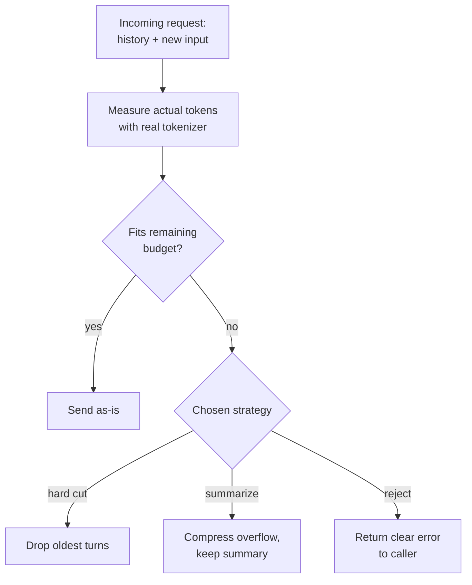

# Tokenization — Middle

<!-- level-focus -->
At middle level, focus on this question:

> Given an 8K-context chat product with variable-length, sometimes non-English, sometimes code-heavy user input, how do you allocate token budget across system prompt, conversation history, user input, and expected output so an unusually large or foreign-language message degrades predictably instead of silently truncating a real conversation?

Use the smallest realistic scenario that exposes the decision and its failure behavior.

---

## Core Concept 1 — Four Buckets Inside One Context Window

A model's context window is a single shared budget, and every request has to fit **system prompt + conversation history + new user input + reserved output** inside it, all at once. Junior level teaches counting tokens for one static prompt; middle level is about designing the allocation across all four buckets before a request is ever sent, because none of them is free to skip:

- **System prompt** — usually fixed size, but grows over time as instructions accumulate (few-shot examples, edge-case handling) — worth re-measuring periodically, not assumed constant forever.
- **Conversation history** — grows with every turn; the part most likely to be silently cut when budget runs short.
- **New user input** — the least predictable bucket in size, and the one attackers or edge cases stress hardest (a pasted log file, a copy-pasted email thread).
- **Reserved output** — set via the API's `max_tokens` / `max_output_tokens` parameter. This is not optional bookkeeping: **the output tokens the model is about to generate also have to fit inside the same context window**, and a request that doesn't reserve room for them can get its response cut off mid-sentence, mid-JSON-object, or mid-code-block — a truncation that looks like a model quality bug but is actually a budgeting bug.

A concrete allocation for an 8,000-token context model:

```
total context window:        8,000 tokens
system prompt (fixed):        -400 tokens
reserved output:              -800 tokens
--------------------------------------------
remaining for history + input: 6,800 tokens
```

That remaining 6,800 has to be further split between "how much prior conversation do we keep" and "how much new input do we accept" — which is where the truncation strategies in Core Concept 2 come in.

## Core Concept 2 — Truncation Strategies: Hard Cut, Summarize, or Reject

When incoming content (history + new input) would exceed its allotted budget, you have three real options, each with a different cost and a different failure mode:

| Strategy | What it does | Cost | When it's the right call |
|---|---|---|---|
| **Hard cut** | Drop the oldest history turns (or truncate the input string) until it fits | Cheapest, fastest; loses information silently unless the user is told | Low-stakes conversations where losing early context is tolerable and speed matters more than continuity |
| **Summarize overflow** | Before dropping old turns, compress them into a short summary and keep that instead of the raw text | Extra latency and an extra (usually small) API call; preserves the gist | Long-running conversations where continuity matters (support threads, multi-turn agents) and the summarization cost is worth paying |
| **Reject with a clear error** | Refuse the request outright — "Your message is too long by roughly N tokens; please shorten it" | No information loss, but interrupts the user; requires a UX for the error | User-facing inputs where silent data loss would be worse than asking the user to shorten their message (pasting a whole log file into a chat box) |

The strategy that should almost never be the default is **silent hard-cut with no signal to the user or the caller** — it's the cheapest to implement and the easiest to ship by accident, and it's exactly what produces the "the bot forgot what I told it" complaints that are hard to debug later (see [senior.md](senior.md) for a production incident built on exactly this).



## Core Concept 3 — Why Token-to-Character Ratio Varies by Content Type

The junior-level "~4 characters per token" rule of thumb is an English-prose number. It shifts substantially — and predictably in direction — for other content:

| Content type | Illustrative chars/token | Why |
|---|---|---|
| English prose | ~4 | BPE vocabularies are trained on English-majority corpora; common English words and fragments merged into single tokens early |
| Source code | Often ~2–3 | Indentation, punctuation-heavy syntax (`{`, `(`, `_`, camelCase), and identifiers that never appeared often enough in training to merge into single tokens |
| Numbers / IDs / hashes | Often close to 1 digit per token or worse | Digit sequences rarely repeat exactly, so they don't compress the way common words do |
| CJK languages (Chinese, Japanese, Korean) | Often ~1–2 | Each character or short cluster tends to map close to its own token; the same *amount of meaning* costs roughly 2–3x+ the tokens of an equivalent English sentence |
| Arabic, Hindi, and other non-Latin scripts | Often noticeably worse than English, similar order of magnitude to CJK | Same underlying cause: English-majority BPE training data means these scripts got far fewer dedicated merges |

Treat all of these as **illustrative ranges to verify empirically for your own content and tokenizer**, not fixed constants — the exact ratio depends on the specific tokenizer and the specific text. The direction, though, is consistent and worth internalizing: **the same number of characters, or the same amount of meaning, costs measurably more tokens in code and in non-English scripts than in English prose.** A budget sized by assuming English-prose ratios will under-budget both.

## Core Concept 4 — Scenario: An 8K Chat Product Meets a Log Paste and a Non-English Ticket

Take the allocation from Core Concept 1 — 6,800 tokens remaining for history + new input, of which the design reserves roughly 1,500 for a running conversation summary, leaving **~5,300 tokens for new user input.**

**Case A — a pasted log file.** A user pastes a 20 KB chunk of application logs into the chat box. Estimated with the English-prose rule of thumb (4 chars/token): `20,000 / 4 = 5,000 tokens` — looks like it just barely fits under 5,300. But log lines are timestamp- and symbol-heavy, closer to the "code" row in Core Concept 3's table (~2.5 chars/token): the *actual* token count is closer to `20,000 / 2.5 = 8,000 tokens` — nearly 2,700 tokens over budget. If the budget check used the char-count estimate instead of the real tokenizer, the request either errors unexpectedly deep in the API call (a `context_length_exceeded`-style failure) or, worse, a client library with a built-in silent-truncation default quietly drops the oldest turns of conversation history to make room — and the user never finds out their earlier messages are gone.

**Case B — a non-English support ticket.** A 500-character message in Vietnamese or Chinese arrives. The English-prose estimate predicts `500 / 4 = 125 tokens`. The real count, at something closer to 1.5–2 chars/token for CJK-dense text, lands closer to `500 / 1.75 ≈ 285 tokens` — more than double the estimate. A single message like this might still fit inside a generous budget, but a system sized around the English estimate for *every* market, scaled across thousands of non-English users, will systematically under-budget for that entire user base — not as an occasional edge case, but as the normal case for that segment.

The fix in both cases is the same: **measure the actual token count with the real tokenizer for the content that's actually arriving, not a character-count heuristic**, and only then decide whether it fits, needs the hard-cut/summarize/reject path, or is fine as-is.

## Core Concept 5 — Under- and Over-Reservation

Both directions of getting the output reservation wrong are real failure modes, not just one:

- **Over-reserving output budget** — setting `max_tokens` to, say, 4,000 for an endpoint that in practice never generates more than a couple hundred tokens wastes a large share of the context window that could have gone to conversation history or user input, causing history to be truncated *earlier* than necessary for no benefit.
- **Under-reserving output budget** — setting `max_tokens` too low, or reserving zero margin at all, risks the response being cut off mid-sentence, mid-JSON-object, or mid-code-block. This produces a response that looks like a model-quality bug (broken JSON, an unfinished code sample) when the actual cause is a budgeting decision made long before the model started generating.

The practical middle ground: measure the actual output length distribution for a given endpoint (most summaries are consistently short; most generated code samples are consistently longer), reserve close to the observed high-percentile length plus a small safety margin, and revisit that number when the prompt or use case changes.

## Core Concept 6 — Verification at Unit and Integrated-Flow Level

**Unit level — the budget-allocation function in isolation:**

```python
def fits_budget(history_tokens, input_text, reserved_output, context_window, tokenizer):
    input_tokens = len(tokenizer.encode(input_text))
    used = history_tokens + input_tokens + reserved_output
    return used <= context_window, used
```

Test this function with synthetic strings sized to land just under, exactly at, and just over the budget boundary, and confirm it uses the real tokenizer's `encode()` call — not `len(text) // 4` — so the unit test itself doesn't inherit the same estimation error it's supposed to catch.

**Integrated-flow level — against real, production-shaped input:**

Test the whole request path with actual non-English text and actual code-heavy text, not just English lorem-ipsum filler. English-only test fixtures are the single most common reason a token-budget bug ships unnoticed: every test passes because every test happens to be the content type the estimate was implicitly tuned for. Confirm that crossing the threshold triggers the chosen strategy (hard cut, summarize, or reject) correctly, and that the resulting behavior — a shortened history, a summary, or a clear error message — is what the design intended, not just "something happened and no exception was thrown."

## Common Mistakes

| Mistake | Fix |
|---|---|
| Sizing the input budget from a character-count heuristic instead of the real tokenizer | Measure with the actual tokenizer for the actual content before making the fits/doesn't-fit decision |
| Not reserving any output budget at all | Always subtract a `max_tokens` reservation from the context window before computing what's left for history + input |
| Reserving output budget from a guess instead of observed output length | Measure the endpoint's actual output-length distribution and reserve near its high end plus a margin |
| Testing the budget logic only with English prose | Include non-English and code-heavy fixtures in the same test suite that exercises the budget boundary |
| Defaulting to silent hard-cut with no signal to the caller | Choose the truncation strategy deliberately per use case, and make dropped content visible to the caller or user where continuity matters |

---

## Apply it

1. Take (or design) a chat product's context budget for a model with a known context window size. Write out the four-bucket allocation from Core Concept 1 with real numbers for your system prompt, reserved output, and remaining budget.
2. Pick one of the three truncation strategies for your scenario and justify the choice in one or two sentences, referencing the table in Core Concept 2.
3. Take a real log excerpt or code snippet and a real non-English paragraph, and run both through the actual tokenizer for your target model. Compare the resulting chars/token ratio against the English-prose rule of thumb.
4. Recompute Case A or Case B from Core Concept 4 using your own numbers: at what input size does your budget actually get exceeded, using the real ratio you just measured rather than the English estimate?
5. Write a unit test for your budget-allocation function that uses a non-English or code-heavy fixture, and confirm it fails if the function is (temporarily) swapped to use `len(text) // 4` instead of the real tokenizer.

## Verify your work

- Your budget allocation accounts for all four buckets — system prompt, history, input, and reserved output — not just input and output.
- You measured at least one non-English or code-heavy input with the real tokenizer and can state its chars/token ratio, not just assume it.
- You can name which truncation strategy your design uses and why, and what happens to the user or caller when the threshold is crossed.
- Your test suite includes at least one non-English or code-heavy fixture that exercises the budget boundary, not only English prose.
- You can point to the specific line in your budget-check code that would catch (or miss) a silent-truncation bug.

## Review questions

- Why does a request need to reserve token budget for output, not just for input and history?
- What is the practical difference between hard-cut, summarize-overflow, and reject-with-error truncation strategies, and what does each cost?
- Why does the same character count produce a different token count for English prose, source code, and CJK text?
- What goes wrong if a token budget is over-reserved for output? What goes wrong if it's under-reserved?
- Why can a budget-allocation test suite pass entirely while still shipping a truncation bug for non-English users?
