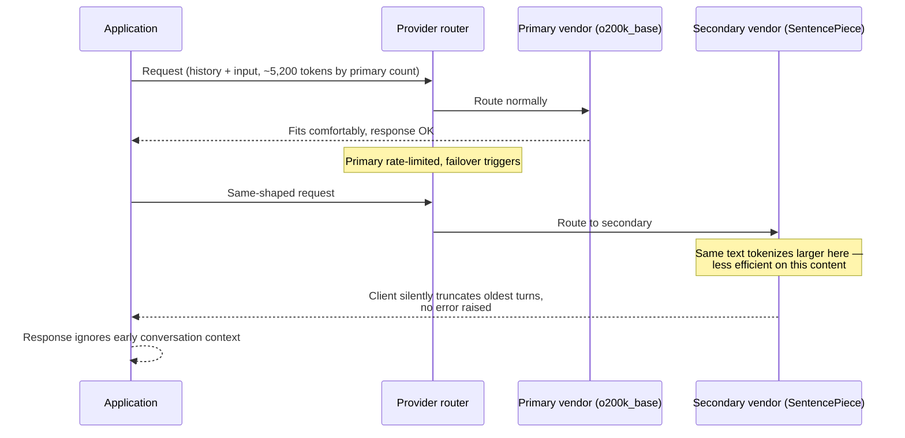

# Tokenization — Senior

<!-- level-focus -->
At senior level, focus on this question:

> A chat completion request comes back coherent but wrong — it seems to have forgotten something the user said a few turns ago — and no exception was thrown anywhere in the pipeline. What evidence separates "the tokenizer silently truncated context" from every other plausible root cause, and what fix keeps it from recurring the next time the backing model or vendor changes?

Use the smallest realistic scenario that exposes the decision and its failure behavior.

---

## Core Concept 1 — Tokenizer Differences Across Vendors Are a Real Invariant-Breaking Risk

A middle-level budget calculation picks a number of tokens to reserve and enforces it with one vendor's tokenizer in mind. At senior level, the assumption to interrogate is: **does that number still mean the same thing if the backing model changes?** It does not, in general, because different vendors' tokenizers are genuinely different pieces of software trained on different data with different vocabularies:

| Vendor / family | Tokenizer | Notes |
|---|---|---|
| OpenAI GPT-4o and newer | `o200k_base` | Roughly 200,000-entry vocabulary |
| OpenAI GPT-4 / GPT-3.5-turbo (older) | `cl100k_base` | Roughly 100,000-entry vocabulary; a different tokenizer from `o200k_base`, not just a smaller version of it |
| Anthropic Claude models | Claude's own tokenizer | Not `tiktoken`-compatible; counted via the API's own token-counting endpoint |
| Llama, Mistral, and most open-weight models | SentencePiece | Vocabulary and merge rules trained independently of any OpenAI or Anthropic tokenizer |

The same input string produces a **different token count** on each of these — sometimes by a wide margin, especially for non-English text, code, or unusual formatting. A token-budget calculation tuned and tested against one vendor's tokenizer is an assumption, not a guaranteed fact, about what happens against a different vendor. That assumption silently breaks in exactly the situations a mature system is likely to hit on purpose:

- **A/B testing** two models from different vendors behind the same feature.
- **Failover to a secondary provider** when the primary is rate-limited or down.
- **A model upgrade** that quietly changes tokenizer alongside model version (as happened, publicly, when OpenAI moved from `cl100k_base` to `o200k_base` for GPT-4o).

If the budget constant was never re-validated against the new tokenizer, none of these events raise an alarm on their own — the system keeps running, and the failure shows up later, downstream, as symptom rather than cause.

## Core Concept 2 — Special Tokens and Injection Risk

A tokenizer's vocabulary includes **special or reserved tokens** used for structural purposes — marking the end of a sequence, separating chat turns, denoting system versus user versus assistant content. These typically appear as distinctive strings, for example something resembling `<|endoftext|>` or a chat-template delimiter like `<|im_start|>` or `[INST]`, depending on the vendor and model family.

The risk shows up specifically in a **naive prompt-templating layer that builds the model input by raw string concatenation** instead of using the API's structured message format:

```python
# Risky: string concatenation. If user_message happens to contain text
# resembling a special token or delimiter, it becomes ambiguous whether
# that text is "user content" or "a structural marker" once everything
# is flattened into one string before tokenization.
prompt = f"System: {system_prompt}\nUser: {user_message}\nAssistant:"

# Safer: structured message roles. The API — not string concatenation —
# is responsible for keeping user content unambiguously scoped to its
# role, regardless of what text the user typed.
messages = [
    {"role": "system", "content": system_prompt},
    {"role": "user", "content": user_message},
]
```

With raw concatenation, a user message that happens to contain a sequence resembling a control token or a role delimiter can be mis-parsed by whatever downstream code (or, in some configurations, the tokenizer's own special-token handling) is looking for that literal string — a real category of prompt-injection risk, not a hypothetical one. Using the API's structured message-role fields keeps user-supplied text scoped to its role at the API level, rather than trusting that no user will ever type a string that looks like your prompt template's internal plumbing.

## Core Concept 3 — Silent Truncation as a Root-Cause Category

A request that exceeds a model's context window doesn't always fail loudly. Depending on the client library, SDK version, or gateway/proxy in front of the model, an oversized request can be **silently truncated** rather than rejected with an error — the oldest turns of history dropped, or the input string cut off, with the request still going through and a response still coming back.

This produces a specific, hard-to-triage symptom: **the answer is subtly wrong, not obviously broken.** It doesn't throw an exception. It doesn't show up as an elevated error rate on a dashboard built to watch for 4xx/5xx responses. What it produces is qualitative — a user complaint that the assistant "forgot" something said earlier, or gave an answer that ignored context that was, from the user's point of view, clearly part of the conversation.

Treat silent truncation as its own category of root cause to check for explicitly during incident response, distinct from a model-quality regression, a prompt-template bug, or a retrieval failure — because none of the usual signals (error rate, latency, exception logs) will point to it on their own.

## Core Concept 4 — Cross-Component Scenario: Failover Exposes a Shared Budget Constant

A production system routes chat requests between two model providers for cost and availability reasons: a primary vendor under normal conditions, and a secondary vendor as automatic failover when the primary is rate-limited or unavailable. The token-budget logic was written once, with a single constant — say, "reserve 5,300 tokens for history + input" — derived from testing against the **primary** vendor's tokenizer.

The failure sequence:



The secondary vendor's SentencePiece tokenizer is less efficient on this particular payload — the exact ratio varies by content, but the shared budget constant, tuned only against the primary, no longer reflects reality. The secondary vendor's client library truncates the oversized request rather than raising an error. Nothing in the error-rate dashboard moves. The only signal is a cluster of "the bot forgot what I told it" reports that started right around the same time as a failover event.

**Diagnosis — evidence, not assumption:**

1. **Reproduce with the exact payload from a complaint.** Pull the actual conversation history and user input involved, and run it through both vendors' *actual* tokenizers — not the shared estimate — to get two real numbers.
2. **Compare the two real counts against the budget constant.** If the primary's count fits comfortably under budget and the secondary's count exceeds it, that's direct evidence of a tokenizer-mismatch, not a guess.
3. **Check the secondary vendor's client/gateway configuration for its truncation behavior.** Confirm, from its documentation or source, whether it truncates silently by default or raises a context-length error — don't assume either without checking.
4. **Correlate complaint timing with failover events**, using provider-routing logs. If complaints cluster tightly around failover windows rather than being spread evenly over time, that further isolates the cause to the failover path specifically, not a general model-quality issue.
5. **Rule out the alternative explanation.** Run the same input against the primary vendor directly (bypassing the router) and compare its response to the secondary's. If the primary's response correctly reflects the earlier context and the secondary's doesn't, that rules out a shared prompt-template or retrieval bug affecting both vendors equally.

**The fix:** replace the single shared budget constant with **per-vendor token counting** — a function that takes the vendor/model identifier and returns the real reservation for that specific tokenizer, called before dispatch to whichever vendor is actually about to handle the request. A shared constant is a convenience that only holds while there's exactly one tokenizer behind it; the moment a second one enters the picture (failover, A/B test, model upgrade), it has to become a per-vendor lookup, not stay a constant.

## Core Concept 5 — Questions That Expose Weak Assumptions

Before trusting that a multi-vendor or multi-model system's token budgeting is sound, ask the questions most teams have never actually tested:

- "If we take a real, representative production payload and run it through vendor A's tokenizer versus vendor B's, does the count actually come out close — or have we only ever assumed parity?"
- "Does our fallback provider's client library truncate silently by default, or does it raise a clear context-length error? Have we read its source or docs to confirm, or are we guessing?"
- "If a user's input contained a string resembling a special token or a chat-template delimiter, would it reach the model as ordinary user content, or could our prompt-building code misinterpret it?"
- "Do we log the exact token count actually sent to the model for every request, or only our own pre-flight estimate?" — without the former, a silent-truncation incident is nearly impossible to prove after the fact.
- "The last time our model version or vendor changed, did anyone re-validate the token-budget constants against the new tokenizer, or did the old numbers just carry forward unexamined?"

## Real-World Examples

- **A shared budget constant survives a model upgrade — until it doesn't.** A team's token-budget constant was validated once against `cl100k_base`. Months later the backing model quietly moves to `o200k_base` as part of a routine upgrade; the constant is never revisited because nothing about the upgrade looked, from the outside, like it should touch token budgeting. The mismatch is a real risk from that point forward, whether or not it's been diagnosed yet.
- **A naive prompt template meets a support ticket that quotes a chat log.** A support-ticket summarization tool builds its prompt with raw string concatenation. A customer pastes a chat transcript into their ticket that happens to contain text resembling a role-delimiter string from a different chat system. Depending on how the templating layer and tokenizer handle it, that text is at risk of being treated as structural rather than as quoted user content — the kind of ambiguity that switching to the API's structured message-role fields removes entirely, because the API — not string position — is what determines role scoping.
- **Failover truncation is diagnosed by arithmetic, not guesswork.** As in Core Concept 4, running the exact complaint payload through both vendors' real tokenizers and comparing the two counts against the budget constant is what actually confirms or rules out the tokenizer-mismatch hypothesis — reasoning about it in the abstract, without the two real numbers, would have left the team debating rather than fixing.

## Common Mistakes

- **Assuming token-count parity across vendors.** Reusing one shared budget constant across multiple tokenizers treats "same string, same token count" as a fact when it's an unverified assumption.
- **Building prompts via raw string concatenation instead of structured message roles.** Leaves the system dependent on no user ever typing a string that resembles internal template plumbing.
- **Trusting "no exception was thrown" as evidence nothing was truncated.** Many client libraries and gateways truncate silently by default; the absence of an error is not evidence of correctness.
- **Not logging the actual per-request token count sent to the model.** Without it, proving or disproving a silent-truncation hypothesis after the fact is close to impossible.
- **Never testing the fallback path with real, production-shaped payloads.** A failover path that's only ever been tested with short synthetic strings won't reveal a tokenizer-efficiency gap that only shows up on real conversation history and real user input.

---

## Apply it

1. Pick a real production prompt/history payload your team uses (or a realistic stand-in). Run it through two different tokenizers — for example `tiktoken` for a GPT model and a SentencePiece-based tokenizer for a Llama or Mistral model, or Claude's token-counting endpoint — and record the exact difference in token count for the same text.
2. Find the code path that builds your prompt for an actual API call. Determine whether it uses the API's structured message-role format or does raw string concatenation of user input into a single blob.
3. Check whether your production HTTP client or any gateway/proxy in front of the model has an implicit truncation behavior when a request exceeds context, and whether it errors or truncates silently. Read the source or docs — don't assume.
4. Design a per-vendor token-counting function with the signature `count_tokens(vendor, model, text) -> int`, and replace one hardcoded shared-budget constant in your system with a call to it.
5. Write down the exact log fields you would need to pull to confirm or rule out "tokenizer mismatch after failover" as the root cause of a hypothetical "the bot forgot context" complaint — be specific about what each field would need to show.

## Verify your work

- You have measured, not assumed, the token-count difference between at least two vendor tokenizers on the same real text.
- You know definitively, from reading the code, whether your prompt-building path uses structured roles or string concatenation.
- You know, from documentation or source rather than assumption, whether your client/gateway truncates silently or errors on context overflow.
- You can name the specific log fields that would let you distinguish a tokenizer-mismatch truncation incident from a model-quality regression or a retrieval bug.
- You can explain, using the failover scenario in Core Concept 4 as a model, why a shared token-budget constant is an assumption rather than a guarantee the moment more than one tokenizer is involved.

## Review questions

- Why can the same input string produce a different token count on GPT, Claude, and a SentencePiece-based Llama or Mistral tokenizer?
- What specifically goes wrong when a prompt template is built with raw string concatenation instead of the API's structured message roles?
- Why doesn't an elevated error rate reliably surface a silent-truncation incident, and what evidence would you check instead?
- What specific evidence would confirm that a token-budget failure was caused by a failover to a less-efficient tokenizer, rather than a model-quality regression?
- Why does a shared token-budget constant stop being safe the moment a system involves more than one tokenizer — through A/B testing, failover, or a model upgrade?
