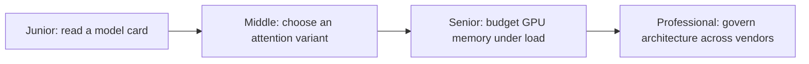
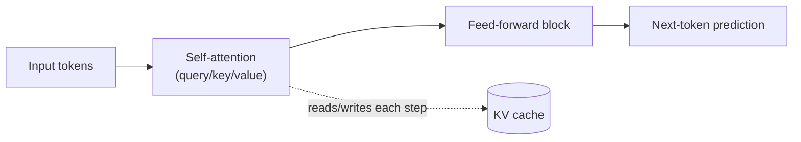

# Transformer Architecture

> The transformer block — self-attention plus a feed-forward layer, stacked and repeated — is the mechanism that decides what an LLM can attend to, how fast it responds, and how much memory serving it costs.

The second diagram is the thread that runs through all four levels: attention is the expensive, stateful part of a transformer, and the KV cache is what makes generating token-by-token affordable. Junior explains what attention computes. Middle chooses which attention variant fits a latency and cost budget. Senior reasons about the KV cache as a GPU memory budget under concurrent load. Professional governs how that budget and its assumptions survive vendor and version changes over time.

## Levels

| Level | Guide | You are done when... |
|---|---|---|
| Junior | [junior.md](junior.md) | You can read a model card's parameter count, context length, and architecture family and explain what each number means for capability and cost. |
| Middle | [middle.md](middle.md) | You can choose between dense/MoE and MHA/GQA/MQA/sliding-window variants for a stated latency or cost constraint, and justify it with the KV cache memory math. |
| Senior | [senior.md](senior.md) | You can budget GPU memory (weights + KV cache + activations) for concurrent requests and diagnose a throughput collapse under long-context load. |
| Professional | [professional.md](professional.md) | You can run a compatibility matrix and canary process across model vendors and versions so an architecture change doesn't silently break production. |

## Practice rule

Before trusting a model's advertised context length or latency, compute or measure the KV cache memory it implies at your real concurrency and sequence length. A spec-sheet number that ignores memory is a promise, not a capacity plan.

## Related

- [Tokenization](../tokenization/README.md) — tokens are the units self-attention operates over; you can't reason about attention cost without knowing how many tokens your input actually produces.
- [Context Window](../context-window/README.md) — the KV cache and attention pattern this topic covers are what determine whether an advertised context window is actually usable in production.
- [Choosing the Right Model](../ai-model/choosing-the-right-model/README.md) — model selection and versioning across vendors builds directly on the professional-level compatibility matrix in this topic.

---

*Part of [Engineer Knowledge](../../../README.md) → [AI Engineering](../../README.md) → [LLM Fundamentals](../README.md).*
