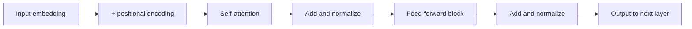

# Transformer Architecture — Junior

<!-- level-focus -->
At junior level, focus on this question:

> Given a model card, can you read its parameter count, context length, and architecture family, and explain in plain language what self-attention is doing that makes any of those numbers matter?

Use the smallest realistic scenario that exposes the decision and its failure behavior.

---

## Core Concept 1 — Tokens Become Vectors Before Anything Else Happens

Before a transformer can do any math, the input text is split into **tokens** (see the Tokenization topic for how that split happens) and each token is looked up in an **embedding table** — a big matrix that maps each token ID to a vector of numbers, typically a few thousand dimensions. That vector is the model's initial, context-free representation of the token: the embedding for "bank" starts out identical whether the sentence is about a river or a loan. Everything the transformer does afterward — attention, feed-forward layers — exists to turn that flat, context-free vector into a context-aware one.

## Core Concept 2 — Self-Attention in Plain Language

Self-attention answers one question for every token: **which other tokens in this sequence should I look at to understand myself better, and how much?**

Mechanically, each token's vector is projected three ways using three separate learned weight matrices:

- **Query (Q)** — "what am I looking for?"
- **Key (K)** — "what do I have to offer, as a label?"
- **Value (V)** — "what do I have to offer, as content?"

For every pair of tokens, the model compares one token's query against another token's key (a dot product) to get a raw compatibility score, turns all of a token's scores into probabilities that sum to 1 (via softmax) — these are the **attention weights** — and then builds that token's new representation as a weighted sum of every token's value vector, weighted by those attention weights.

Take the sentence: *"The trophy didn't fit in the suitcase because it was too big."* What does "it" refer to — the trophy or the suitcase? A human resolves this from meaning, not from distance in the sentence. Self-attention does the same thing structurally: when computing the new representation for "it," its query vector is compared against the keys of every other token, including "trophy" and "suitcase," regardless of how many words sit in between. If the learned weights make "it" attend strongly to "trophy," that relationship is captured directly — attention connects any two tokens in one step, not one step per word of distance.

## Core Concept 3 — Multi-Head Attention: Several Attention Computations in Parallel

One query/key/value projection can only capture one kind of relationship between tokens at a time. **Multi-head attention** runs several attention computations in parallel, each with its own separately learned Q, K, V projections (a "head"), so different heads can specialize — one head might learn to track subject-verb agreement, another might track which pronoun refers to which noun, another might track nearby words. The outputs of all heads are concatenated and passed through one more learned projection to combine them back into a single vector per token.

A model described as having "32 attention heads" and a "hidden dimension of 4096" is splitting that 4096-dimensional space into 32 smaller subspaces (128 dimensions each here), running attention independently in each, then merging the results. More heads is not automatically better — it's a capacity and cost trade-off tuned during model design, not something you control at inference time.

## Core Concept 4 — Why Position Has to Be Added on Purpose

Self-attention, as described above, has no notion of order built in — compare every token's query against every other token's key, and the result is exactly the same whether "dog bites man" or "man bites dog" is the input, because attention treats the sequence as a set, not a list. This property is called **permutation invariance**, and it's a problem, because word order changes meaning.

The fix is **positional encoding**: before (or as part of) attention, information about each token's position in the sequence is added to its embedding, so token 3 and token 30 carry different signals even if they're the same word. Some models use a fixed mathematical pattern (sine and cosine waves at different frequencies, from the original 2017 "Attention Is All You Need" transformer paper); many current models use **rotary position embeddings (RoPE)**, which rotate the query and key vectors by an angle that depends on position, so relative distance between tokens is encoded directly into the attention computation itself. The detail that matters at this level isn't which scheme a given model uses — it's that some positional signal is required, because attention alone cannot tell "first" from "last."

## Core Concept 5 — The Feed-Forward Block

After attention mixes information across tokens, each token's vector is passed — independently, with no cross-token mixing — through a small two-layer neural network called the **feed-forward block** (or MLP block): expand the vector to a larger dimension, apply a nonlinearity, then project back down to the original size. Where attention decides *which tokens to combine information from*, the feed-forward block processes *each token on its own*, transforming the combined representation further. A transformer block is these two pieces stacked with residual connections and normalization around each: attention, then feed-forward, repeated for however many layers the model has (32 layers is a common figure for a mid-size model).

Stack this block N times (N = the model's layer count) and you have the model's body. The very last layer's output is projected back to vocabulary size to predict the next token.

## Core Concept 6 — Three Architecture Families

Not every transformer uses attention the same way. Three families matter:

| Family | How attention is masked | Typical use | Examples |
|---|---|---|---|
| **Encoder-only** | Every token attends to every other token, both directions | Understanding a fixed input (classification, embeddings) — not generation | BERT |
| **Decoder-only** | Each token can only attend to itself and earlier tokens (**causal masking**) | Autoregressive text generation, one token at a time | GPT family, Llama, Claude, Gemini |
| **Encoder-decoder** | An encoder reads the full input bidirectionally; a decoder generates output attending back to the encoder's output plus its own earlier tokens | Sequence-to-sequence tasks with a distinct input and output (translation, summarization) | T5, the original 2017 transformer |

The middle-level guide covers why decoder-only architectures ended up dominating chat and completion products specifically. At junior level, the fact to hold onto is simpler: causal masking (decoder-only) is what makes a model able to generate text one token at a time without "seeing the future" — it's why an LLM producing a response can't secretly know how its own sentence is going to end before it writes it.

## Worked Example: Reading a Real Model Card

A model card typically states parameter count, context length, and architecture family. Take three real, publicly documented examples:

| Model | Parameters | Published context window | Family |
|---|---|---|---|
| Llama 3.1 (a size in the family) | 8B / 70B / 405B (three released sizes) | 128K tokens | Decoder-only |
| GPT-4o | Not publicly disclosed | 128K tokens | Decoder-only |
| Claude (recent generations) | Not publicly disclosed | 200K tokens | Decoder-only |

What each number tells you:

- **Parameter count** is a rough proxy for capacity and for two costs: the memory needed just to hold the weights (bigger models need more GPU memory before a single request is served), and the compute per token generated (bigger models are typically slower and more expensive per token, though architecture choices in the middle-level guide change this relationship). A jump from 8B to 405B parameters is roughly a 50x increase in weight memory — it is not a 50x increase in "quality," and the only way to know if it's worth it for your product is to measure the task you care about.
- **Context window** is the maximum number of tokens (input plus generated output, combined, for most vendors) the model can attend over in one request. A larger published context window means the model *can* accept more input — it does not by itself tell you whether the model uses that input well (see the Context Window topic) or what it costs in memory to actually use it at that length (see this topic's senior guide on KV cache).
- **Architecture family** (decoder-only, for all three of these) tells you the model generates autoregressively, one token at a time, attending only backward — which is why streaming a response token-by-token as it's generated is possible at all, and why the model cannot revise a token it already emitted without regenerating from that point.

None of these three numbers tells you accuracy on your specific task. They tell you what the model is structurally capable of and roughly what it costs to run — which is exactly the information you need before you spend any budget testing it.

## Common Mistakes

| Mistake | Why it hurts | How to fix |
|---|---|---|
| Assuming a bigger parameter count always means a better answer for your task | Parameter count is a capacity proxy, not a quality guarantee — a smaller model tuned for your task can outperform a larger general one | Treat parameter count as a cost signal first; verify quality with your own evaluation, not the model card alone |
| Assuming published context length means the model uses that entire window equally well | The model card states a maximum, not an effectiveness curve across it (covered in the Context Window topic) | Read context length as an upper bound on input size, not a guarantee of retrieval quality at that size |
| Thinking attention "reads left to right like a human" | Every token attends to every allowed token in one step, not sequentially — the sequential part is generation, not attention itself | Separate "how attention computes a representation" (parallel, all-at-once) from "how generation produces tokens" (one at a time) |
| Assuming positional encoding is optional or a minor detail | Without it, attention cannot distinguish "dog bites man" from "man bites dog" — word order is otherwise invisible | Remember permutation invariance: attention is a set operation until position is explicitly added |
| Confusing encoder-decoder with decoder-only because both "decode" | The words are similar but the masking and use case differ entirely | Anchor on causal masking: decoder-only masks the future everywhere; encoder-decoder only masks the future in its decoder half |

## Apply it

1. Find the published model card or documentation page for a model you actually use (any vendor). Write down its stated parameter count (or note if undisclosed), context window, and architecture family.
2. In your own words, write two sentences: one explaining what the parameter count implies about cost, one explaining what the context window implies about the largest input you could send it.
3. Sketch the transformer block diagram from Core Concept 5 from memory, then check it against the one in this guide. Note which step you forgot.
4. Take the sentence "The trophy didn't fit in the suitcase because it was too big" and identify, in your own reasoning (not the model's), which earlier word "it" should attend to strongly, and why distance in the sentence doesn't determine the answer.
5. Explain in one sentence why a decoder-only model can stream its response token-by-token as it generates, while explaining why that's a property of causal masking, not of the feed-forward block.

## Verify your work

- You can name the three projections (query, key, value) and what question each answers, without looking them up.
- You can explain, to someone who has never heard the term, why self-attention alone cannot tell word order apart.
- Given a model card, you can point at the parameter count and context length and state one cost or capability implication for each, not just repeat the number.
- You can correctly classify a model you've read about as encoder-only, decoder-only, or encoder-decoder from its stated use case (classification vs. chat vs. translation).
- You can draw the transformer block flowchart from Core Concept 5 without omitting the add-and-normalize steps.

## Review questions

- What does the query vector represent, and how is it different from the key vector?
- Why is self-attention described as "permutation invariant," and what problem does that create?
- What does multi-head attention let a model do that single-head attention cannot?
- What is the practical difference, in terms of masking, between an encoder-only and a decoder-only model?
- If two models have the same parameter count but different context windows, what does that difference tell you, and what does it not tell you?
